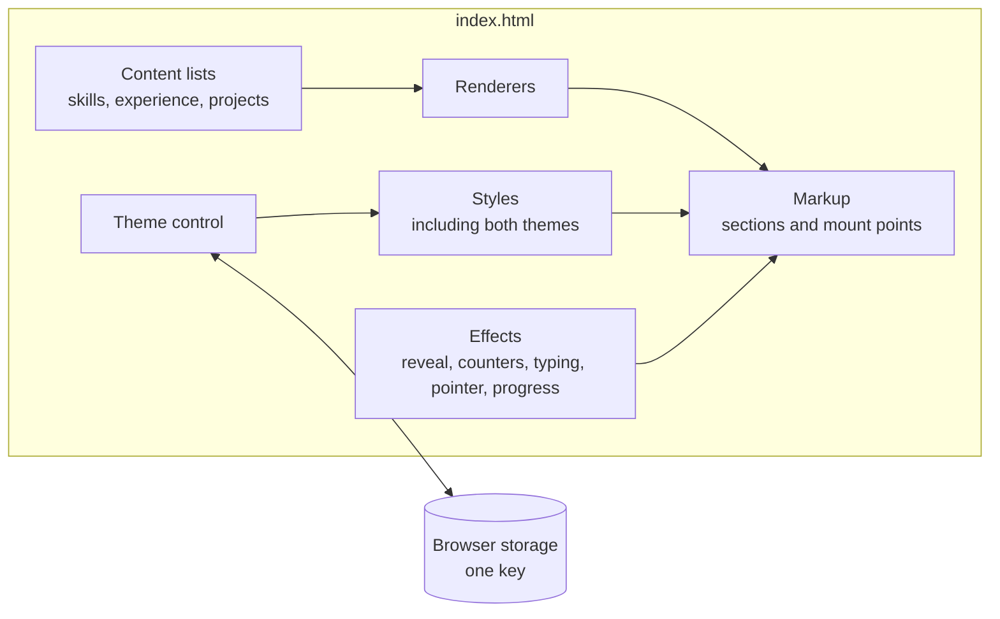
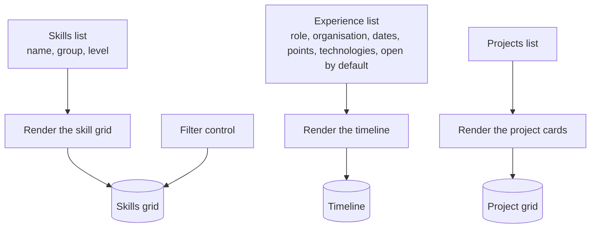
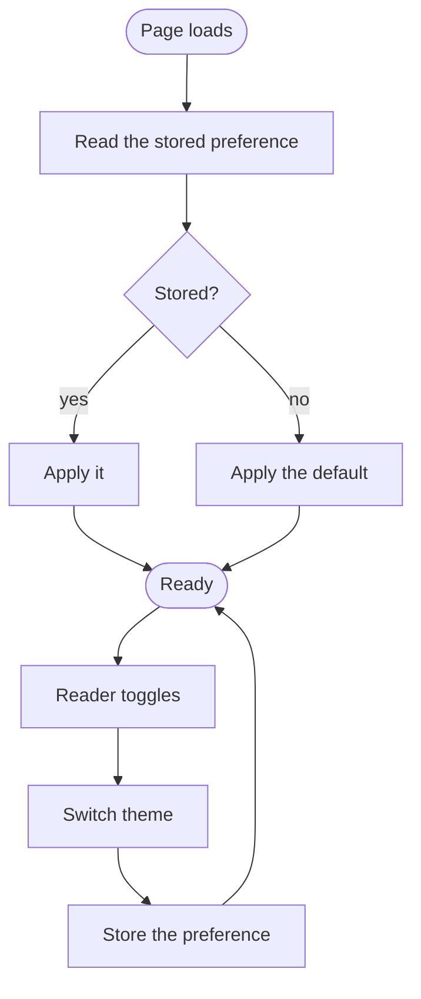
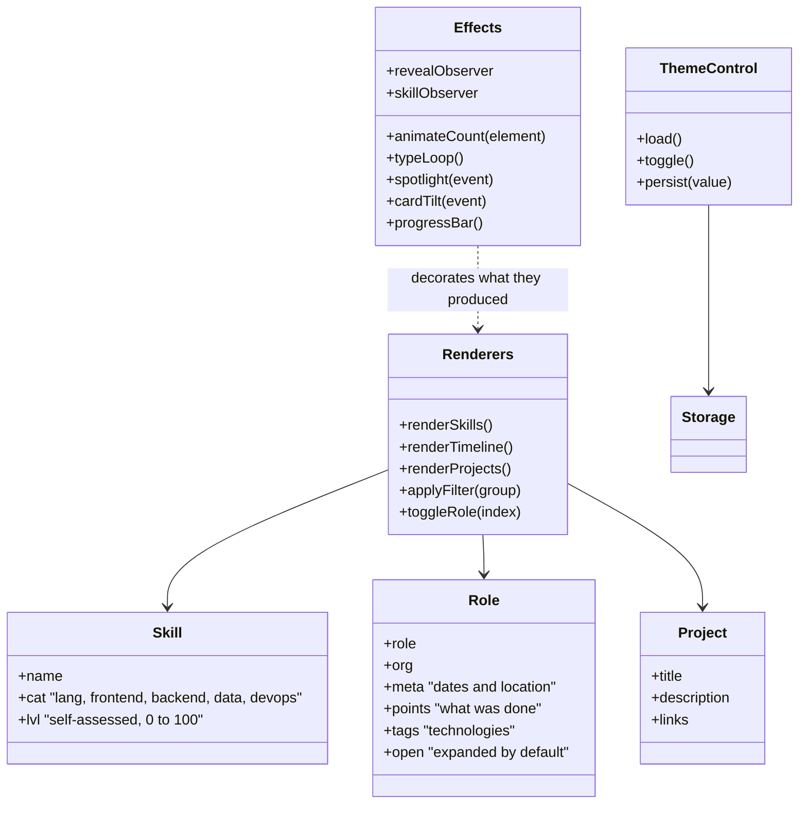
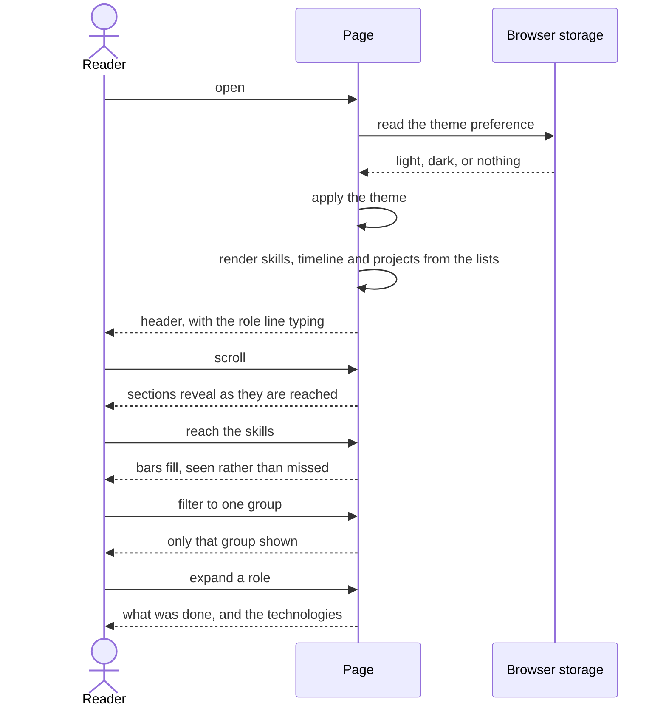

# Interactive Resume - Architecture

Internal document.

## Components

One file. Structure, style and behaviour in a single page, with no dependency, no build
step and no network call at runtime.

The single file is a deliberate choice and it is part of what the page is claiming. It also
has a cost: everything is in one place, so the discipline that keeps it readable is
convention rather than structure.

## Content and rendering

The content is not written into the markup. Three lists in the page hold it, and renderers
turn each into elements. Sections whose content is fixed - education, contact, the header -
are written directly.

This is the part that matters for maintenance. Updating the resume means editing a list,
not editing markup, which is what keeps it from becoming a thing that never gets updated.

## Effects

Every effect is decoration over content that is already present and readable. None of them
gate anything.

| Effect | Driven by | Behaviour |
| --- | --- | --- |
| Section reveal | Viewport observation | Sections appear as they are scrolled to |
| Skill bars | Viewport observation, separately | Bars fill when the skills section is reached, so the fill is seen rather than missed |
| Counters | Animation frames | Numbers count up when revealed |
| Typing line | Timer | The role line types through several descriptions in turn |
| Pointer effects | Pointer movement | A spotlight following the pointer, and a tilt on cards under it |
| Progress bar | Scroll position | How far through the page the reader is |

Two separate viewport observers exist rather than one. The skill bars need their own,
because filling them at the same moment the section is revealed means the reader arrives
after the fill has finished and sees only static bars.

## Theme

One storage key, holding one word. It is the only thing this page persists and the only
thing it knows about anyone.

## Structure diagram

No classes. The diagram describes the parts as they are, grouped by responsibility.

## Key sequence - a reader arriving

## Rules this architecture is meant to protect

- Content lives in lists, not in markup. Updating the resume must not mean editing HTML.
- No dependency, no build step, no network call. The page is part of the claim it makes.
- Every effect decorates content that is already there. Nothing is gated behind an
  animation.
- The skill bars get their own viewport observer, so the fill is seen rather than finished
  before the reader arrives.
- The most senior role is expanded by default.
- Exactly one thing is persisted: the theme. Nothing else about the reader is stored,
  anywhere, ever.
- Both themes are complete. Neither is an afterthought applied over the other.
