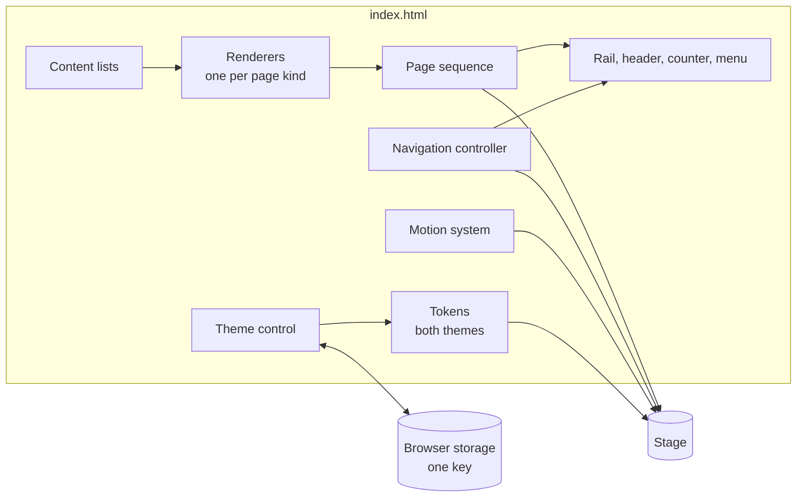
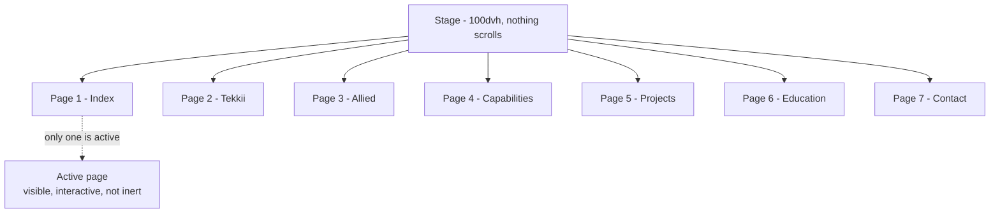
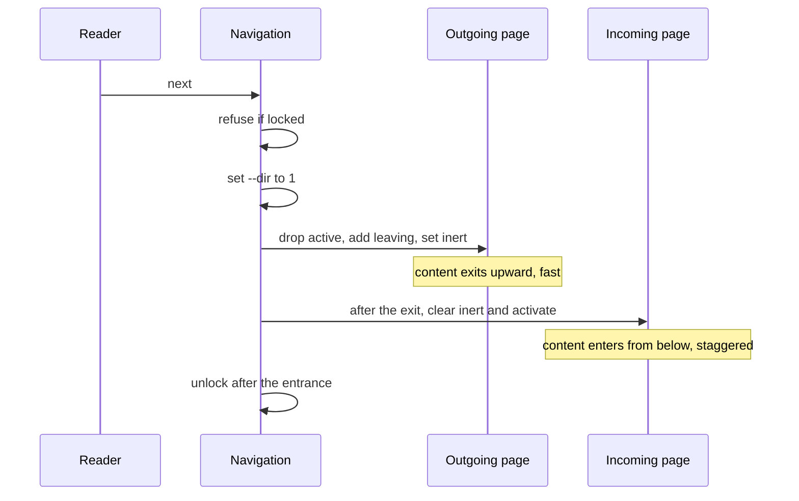
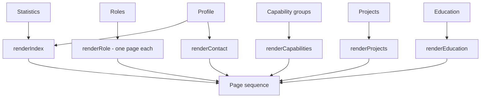
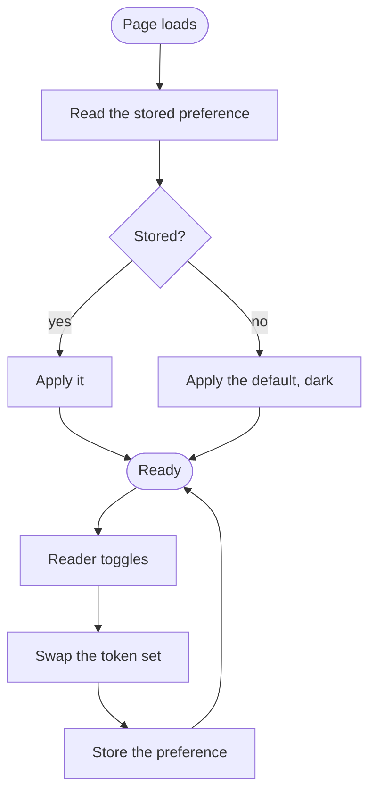

# Interactive Resume - Architecture

Internal document.

## Components

One file. Structure, style and behaviour in a single page, with no dependency, no build step
and no network call at runtime. Not a font, not a script, not an image. The background
texture is an inline SVG data URI and the icons are inline SVG.

The single file is a deliberate choice and part of what the page claims. Its cost is that
everything is in one place, so what keeps it readable is convention rather than structure.

## The stage

The defining constraint: **the document never scrolls.** `html` and `body` are
`overflow: hidden`, and the stage is exactly one viewport high.

Every page is absolutely positioned over the same space. Exactly one is active. The rest are
`visibility: hidden`, `pointer-events: none` and `inert`, so they are neither tabbable nor
read by assistive technology.

### Sections and pages are not the same thing

Sections are what the reader navigates. Pages are what fits on a screen. A section holds one
or more pages, and the section list is derived from the page list at load so the two cannot
drift apart.

| Section | Pages | Why |
| --- | --- | --- |
| Index | 1 | |
| Experience | 2 | The Tekkii role has six substantial bullets. It does not share a screen with a second role at a readable size, and cutting it was not acceptable |
| Capabilities | 1 | |
| Projects | 1 | |
| Education | 1 | |
| Contact | 1 | |

This is the mechanism that lets the no-scrollbar rule hold without losing content. **If
content grows, add a page. Never shrink the type to make it fit.**

### The safety valve

Each page's inner container is `overflow: auto` with the scrollbar hidden. This exists for a
very short viewport or a large accessibility zoom, and nothing else. The wheel handler only
surrenders to it while it has somewhere left to go, and takes over again at its ends. If a
page needs the valve on an ordinary laptop screen, that page is overfull and should be split.

## The motion system

Motion is the interface here, not decoration, so it is a system rather than a set of
one-off effects.

| Piece | Mechanism |
| --- | --- |
| Opt-in | An element animates because it carries `data-anim`. Nothing animates by default |
| Stagger | Each element carries an index in `--i`. Delay is computed from it in CSS, not scheduled in JavaScript |
| Direction | A single `--dir` variable on the root, set to 1 or -1 before each transition. Every enter and exit transform is multiplied by it |
| Masked type | Display lines sit in an overflow-hidden wrapper and translate in from beneath it |
| Exit | The outgoing page animates out faster than the incoming animates in, and in the opposite direction |
| Lock | Navigation is refused while a transition is running, so input cannot outrun the animation |

Direction being one root variable is what makes forward and backward genuinely different
animations rather than the same animation played twice. It is also the only orientation cue
the page gives.

## Input

All of these resolve to the same two operations, next and previous.

| Input | Handling |
| --- | --- |
| Arrows, page keys, space | Direct |
| Home, End | First and last page |
| Digits | Jump to a section by ordinal |
| Wheel | Accumulated and thresholded, so a trackpad's many small events read as one intent. Reset on a pause |
| Touch | Horizontal or vertical swipe past a threshold, within a time limit |
| Rail, header, menu, arrows | Direct |
| Address hash | Read at load, written on every change |

## Content and rendering

The content is not written into the markup. Lists at the top of the script hold it and one
renderer per page kind turns each into elements.

Updating the resume means editing a list. That is what keeps it from becoming a thing that
never gets updated.

## Theme

One storage key holding one word, wrapped so that a browser refusing storage falls back to
the default rather than failing. It is the only thing this page persists and the only thing
it knows about anyone.

## Degradation

A page whose interface is motion has to be honest about the cases where the motion is not
available or not wanted.

| Condition | Behaviour |
| --- | --- |
| Reduced motion requested | Transitions and delays are reduced to nothing rather than shortened. The pointer reticle, the halo and the grain are removed. Navigation still works identically |
| No pointer, or touch only | The reticle and the halo are never started |
| Printing | The stage collapses to a document. Every page becomes static and stacked, in order, with the rail, header, counter, background, ghost numerals and role tabs removed and every capability group expanded |
| No JavaScript | The stage is empty. This is the one genuine failure mode and it is recorded as such |
| Storage refused | The default theme is used and nothing throws |

## Rules this architecture is meant to protect

- The document never scrolls and never zooms. Both were considered and rejected as
  navigation models.
- If content does not fit, add a page. Do not shrink the type and do not cut the content.
- Content lives in lists, not in markup.
- No dependency, no build step, no network call. The page is part of the claim it makes.
- Direction is a first-class idea. Forward and backward are different animations.
- Exactly one page is interactive at a time, and the others are inert rather than merely
  invisible.
- Exactly one thing is persisted: the theme.
- Both themes are complete. Neither is an afterthought applied over the other.
- Every technology named as a tag on a role is named in that role's own bullets, so the two
  cannot contradict each other.
