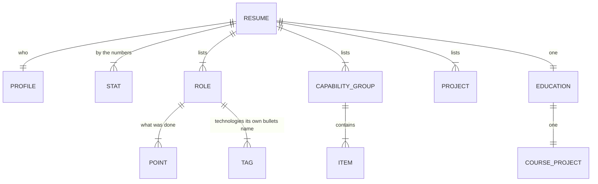

# Interactive Resume - Data model

## Store

There is no database. The content is written into the page as lists, and the only thing
persisted about the reader is which theme they chose.

| Data | Where it lives | Lifetime |
| --- | --- | --- |
| Profile, statistics, roles, capabilities, projects, education | Lists at the top of the script | Until the page is edited |
| The page sequence | Derived from the same lists | Until the page is edited |
| Theme preference | Browser storage, one key | Until the reader clears their browser |
| Current page | The address hash, and memory | The visit |
| Anything else about the reader | Nowhere. Nothing is collected | Not applicable |

Treating the source as the store is the right call at this size. There is one author, the
content changes a few times a year, and a content system for a resume would take longer to
maintain than the resume.

## Content lists

### Profile

| Field | Type | Notes |
| --- | --- | --- |
| `first`, `last` | string | Split because the display type sets them on two lines with different weights |
| `title` | string | |
| `location` | string | |
| `email`, `phone`, `phoneHref` | string | The href is separate because the displayed number is formatted for reading |
| `github`, `githubHref` | string | Same reason |
| `summary` | string | Condensed from the resume's professional summary to fit one screen alongside the name and the numbers. The claims are unchanged |

### Statistic

| Field | Type | Notes |
| --- | --- | --- |
| `n` | number | Counted up on arrival. Must be a plain number for that to work |
| `suffix` | string | Rendered separately and in the accent colour, so the number itself animates cleanly |
| `label` | string | |

Every statistic must be traceable to a line in the resume. The four present are five years,
four hundred institutions, six applications and eighty percent. Nothing here may be an
estimate invented for the page.

### Role

| Field | Type | Notes |
| --- | --- | --- |
| `org` | string | Set as the display type on the role page |
| `title` | string | The job title |
| `dates` | string | One free-text line |
| `place` | string | |
| `scope` | string | A short phrase characterising the role, shown alongside the dates |
| `points` | list of strings | What was done. May contain `<strong>` and nothing else |
| `tags` | list of strings | Technologies |

**Each role becomes its own page.** Adding a third role adds a page to the Experience
section automatically; nothing else needs changing.

`points` is the one place markup is allowed inside content, limited to `<strong>` for the
figures and names worth pulling out of a dense sentence. It is inserted without escaping, so
it must never hold anything from outside this file.

`tags` is drawn only from technologies that the same role's own bullets name. This is a rule
rather than a convention, and it is what stops the tags and the prose from contradicting
each other, which was the most likely inconsistency in the previous version of this page.

Dates are one free-text line rather than structured values. Nothing sorts, filters or
computes durations from them, and the order in the list is the order on the page.

### Capability group

| Field | Type | Notes |
| --- | --- | --- |
| `name` | string | Rendered as a column heading, and as a control on a narrow screen |
| `items` | list of strings | |

The four groups are the resume's own: Languages, Web Development, Databases, and
Architecture and Delivery. They are a fixed set, and the layout is built for four columns.
Adding a fifth is a deliberate change to both.

**These are not all technologies.** Architecture and Delivery holds practices - requirements
gathering, stakeholder communication, Agile and Scrum. Any design that renders capabilities
as logos, icons or proficiency meters will misrepresent that group, which is why they are
rendered as plain text in a list.

There is no proficiency level on a capability, deliberately. The previous version of this
page carried self-assessed percentages that were invented for it and supported by nothing.
They are gone and they should not come back.

### Project

| Field | Type | Notes |
| --- | --- | --- |
| `name` | string | |
| `desc` | string | |
| `tech` | string | One line, shown in the card footer |
| `href` | string | Relative for the sibling apps in this repository, absolute for anything else |
| `ext` | boolean | Opens in a new tab, and changes the card's verb from Open to Visit |

The grid is built for six. A seventh card leaves a hole in the last row on a wide screen.

### Education

| Field | Type | Notes |
| --- | --- | --- |
| `school`, `degree`, `field`, `years` | string | `degree` and `field` are split because they are set on two lines with different weights |
| `project.name`, `project.text` | string | The course project |

## The page sequence

The sequence is a list, and each entry names a section and a renderer.

| Field | Notes |
| --- | --- |
| `section` | The section this page belongs to. Consecutive pages naming the same section are grouped into one |
| `render` | Returns the page's markup as a string |
| `wide` | Widens the measure for the grid-based pages |

Sections are derived from this list at load, so the rail, the header, the menu, the digit
shortcuts and the counter all come from one source and cannot disagree with each other.

## What is stored between visits

| Key | Value |
| --- | --- |
| One key | `light` or `dark` |

The only thing this page stores about anyone. It is a display preference, it identifies
nobody, it is read once on load, and a browser that refuses storage gets the default theme
rather than an error.

The page number lives in the address hash. That is not storage; it is so a reader can send
someone a link to one page.

## Constraints worth stating

- Nothing validates the lists. A malformed entry renders as whatever it is.
- Order on the page is order in the list.
- The date line is free text and nothing can compute from it.
- Only `points` may contain markup, and only `<strong>`. Everything else is escaped.
- There is no versioning. Editing the page is the only way content changes, and the record
  of what it said before is the repository history.
- Content is bounded by the screen. A list that grows past what a page holds is a signal to
  add a page, not to reduce the type size.

## What is deliberately not stored

- Anything about the reader beyond the theme. No analytics, no visit count, no source, no
  identifiers.
- Anything a reader typed. There is no input on the page.
- Any tailored version of the resume for a particular application.
- Any proficiency score against a capability.
