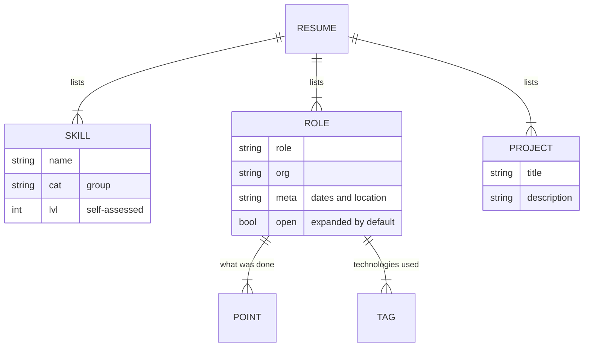

# Interactive Resume - Data model

## Store

There is no database. The content is written into the page as lists, and the only thing
persisted about the reader is which theme they chose.

| Data | Where it lives | Lifetime |
| --- | --- | --- |
| Skills, experience, projects | Lists in the page source | Until the page is edited |
| Education, contact, header | Written directly in the markup | Until the page is edited |
| Theme preference | Browser storage, one key | Until the reader clears their browser |
| Anything else about the reader | Nowhere. Nothing is collected | Not applicable |

Treating the source as the store is the right call at this size. There is one author, the
content changes a few times a year, and a content system for a resume would take longer to
maintain than the resume.

## Content lists

### Skill

| Field | Type | Notes |
| --- | --- | --- |
| `name` | string | As it would be written on a job posting |
| `cat` | string | One of: languages, front end, back end, data, operations. Drives the filter |
| `lvl` | number | Self-assessed, on a scale to one hundred. Drives the bar width |

The level is a self-assessment. It is useful for showing relative depth across the list -
what is strongest, what is known but shallow - and it measures nothing. It is not a test
score, it is not comparable between people, and nothing in the page claims otherwise. If it
were ever presented as a score it would be dishonest, which is why it appears as a bar in a
list rather than as a number on its own.

The groups are a fixed set. A skill that fits none of them is either miscategorised or the
group list needs extending, and extending it is a deliberate change because the filter is
built from it.

### Role

| Field | Type | Notes |
| --- | --- | --- |
| `role` | string | The job title |
| `org` | string | The organisation |
| `meta` | string | Dates and location, as one line |
| `points` | list of strings | What was done. Each is a full sentence describing an outcome |
| `tags` | list of strings | Technologies used, which should correspond to entries in the skills list |
| `open` | boolean | Whether it starts expanded. The most senior role is the one that does |

Dates are one free-text line rather than structured start and end values. Nothing sorts,
filters or computes durations from them, and the order in the list is the order on the
page. If anything ever needs to sort by date or show a duration, this is the first thing to
change.

`tags` and the skills list are related by convention only. Nothing checks that a technology
tagged on a role appears in the skills list, and a mismatch between the two is the most
likely inconsistency in the page.

### Project

| Field | Type | Notes |
| --- | --- | --- |
| `title` | string | |
| `description` | string | |
| links | | Out to the work itself where there is somewhere to point |

## Theme preference

| Key | Value |
| --- | --- |
| One key | `light` or `dark` |

The only thing this page stores about anyone. It is a display preference, it identifies
nobody, and it is read once on load.

## Constraints worth stating

- Nothing validates the lists. A skill with a missing group renders and cannot be filtered
  to.
- Order on the page is order in the list.
- Technologies tagged on roles are not checked against the skills list.
- The date line is free text and nothing can compute from it.
- There is no versioning. Editing the page is the only way content changes, and there is no
  record of what it said before, beyond the repository history.

## What is deliberately not stored

- Anything about the reader beyond the theme. No analytics, no visit count, no source, no
  identifiers.
- Anything a reader typed. There is no form on the page.
- Any tailored version of the resume for a particular application.
