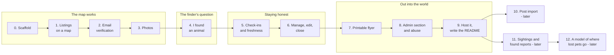

# roamer - Build plan

## Objective

**A map someone could actually use to get a lost dog home.** An owner posts in a few
minutes, a finder learns in one screen whether anyone nearby is missing the animal in front
of them, and every listing says how recently its owner confirmed it.

**It starts as a demo.** The hosted copy is filled with made-up listings and every flow
works: a visitor can post, verify, get a check-in, mark an animal home, search and print a
flyer. What makes it a demo rather than a service is that nothing reaches a real person -
emails land in a demo inbox on the site instead of being sent, and everything a visitor
posts is wiped on a schedule. Going live for real is a later decision and a configuration
change, not a rebuild.

Finished, for the first version, when six things are true:

1. A person who is not the author can post a lost animal, verify it through the demo inbox,
   and see it on the map.
2. A person who is not the author can stand somewhere, say "I found an animal", and get the
   nearest listings with photos and a number to call.
3. A listing whose owner goes quiet loses its badge and then leaves the default map, without
   anyone doing anything by hand.
4. Any listing prints as a flyer whose code opens the current listing.
5. The admin can see every listing in every state and approve, hide, edit or delete any of
   them, from the admin section.
6. It is hosted on the existing server as a demo, at a link that can go on an application,
   and opens on a map that already has listings on it.

There are no dates in this plan. Stages are ordered by what each one needs from the one
before it.

## Order of work

| Stage | Goal | Done when |
| --- | --- | --- |
| 0 | Scaffold | FastAPI, Docker Compose with PostgreSQL and Mailpit, Alembic, the `cube` and `earthdistance` extensions created, `/health` green from PowerShell, a CI workflow running pytest against a real database |
| 1 | Listings on a map | A listing can be created through the form and the API, and shows as a pin on a Leaflet map. Clicking it opens the listing page. A seed script puts a dozen clearly fictional listings on the map. No verification yet - this stage is about the shape |
| 2 | Email verification | A new listing is held until its email link is used. The verify page has a button, not an action-on-open link. The outbox and the worker exist and Mailpit shows the email. The verified badge is computed, not stored |
| 3 | Photos | Upload, reject bad types and sizes, apply orientation, strip metadata, resize. A test proves a photo with GPS data in it comes out with none |
| 4 | I found an animal, and search circles | **Search circles** on every listing's map: the published distance within which most lost animals of that kind are found, drawn around the last-seen point and labelled with the study it comes from. A must. Plus `outdoor_access` on the form, because it changes the circle for cats. Then: Browser location or a typed address gives the nearest active listings, with distance, from the indexed distance query. Address search goes through the server, cached, at most one provider request a second |
| 5 | Check-ins and freshness | The worker sends check-ins on interval. Answers move `last_confirmed_at`. The badge lapses and listings leave the default map on the configured schedule, and a test drives the clock through all three states |
| 6 | Manage, edit, close | Manage link by email, a short session, edit, still lost, home, withdraw. Withdraw deletes. Every change is an event row. **Marking an animal home asks, optionally, where it was found and how** - the pair a future model needs |
| 7 | Printable flyer | A print stylesheet and a QR code to `/l/{code}`, generated on the server with no outside service. A phone camera opens it. The flyer carries the search circle, as "most dogs are found inside this circle" |
| 8 | Admin section and abuse | Report button, a Help page with a contact form to the admin, rate limits, honeypot field. A password-protected admin section with full control of the map: dashboard, a map of every listing in every state, listings table, approval queue, reports, edit, hide, delete, block an address, settings, activity log |
| 9 | Demo mode, host it, write the README | `ROAMER_DEMO=1`: a banner on every page, the demo inbox in place of sending, seeded listings restored and visitor posts wiped on a schedule. A `roamer` profile on the shared server at `roamer.<domain>`, and a README with what it is, a screenshot, how to run it, and what it deliberately does not do |
| 10 | Post import | Later. See the open question below. Not started before stage 9 is done |
| 11 | Sightings and found reports | Later. Sightings are also data: the path between the lost point and the found point |
| 12 | A model of where lost pets go | Later, and only once real reunions exist. A harness compares the search circles (the baseline) with a model on reunions it has not seen. Nothing is shown to users as a prediction until it beats the circles |

**Stages 0 to 3 are done.** The scaffold runs from one `docker compose up` and is tested in
CI against a real database. The map shows twelve made-up Kansas City listings. A person can
post one with photos and a flyer, gets an email, and the listing goes on the map with a
verified badge only when the link is used. Photos are stored upright with every byte of
metadata removed. 91 tests. Stage 4 - search circles and the finder's search - is next.

### Why the map comes before verification

Stage 1 puts unverified listings on a map, which the finished site will never do. That is on
purpose. The map, the listing page and the data shape are where the design is most likely to
be wrong, and they are the parts worth looking at early. Verification is well understood and
goes in at stage 2, before anything is hosted.

### Why the finder's search comes before check-ins

The finder's question is the reason the site exists. If "I found an animal" does not work
well, nothing about freshness matters. It comes as early as it can - right after there are
photos to show in the results.

### Roamer is a data collector for a future model

Decided by the author on 2026-10-08. The research behind it: no public dataset pairs
where an animal went missing with where it was found. King County's lost-and-found feed
has both kinds of report but never links them; Austin's 174,000 shelter intakes record
only where a stray was picked up; the platforms that hold the pairs do not publish them.
So a model of where lost pets go cannot be trained today, and roamer is built to collect
the data that would make one possible.

What that means in practice:

1. **Search circles first (stage 4), as the honest baseline.** A published base rate,
   drawn and labelled as one - not a prediction. Figures come from reading the papers
   themselves (Huang et al. 2018 for cats, Lord et al. 2007 for dogs), not from summaries.
2. **Every listing records what a model would need**, as fields on the form rather than
   guessed later: species, size, age, last-seen point and time, and whether the animal
   normally goes outdoors. Temperament and approach advice are already there.
3. **Every reunion records the other half (stage 6)**: where it was found, when, and how
   (came home, neighbour, flyer, roamer, shelter, microchip, social media). Optional, and
   the form says what it is for.
4. **Sightings (stage 11) record the path in between.**
5. **The admin can export the pairs (stage 8)** for model work, never the contact
   details.
6. **Demo and test data never enters the dataset.** Seeded listings are flagged and
   excluded; so is anything posted while the site runs in demo mode.
7. **The model (stage 12) is measured before it is shown**, the mailman way: baseline
   against model, on held-out reunions, results written down including the failures.

While roamer is a demo with made-up listings, no real pairs accumulate. The collection is
built and tested now so that it is already there if the site goes live.

### Why import waits

It is the feature with the hardest constraints and the least certain answer (see open
questions), and the site is useful without it. Starting it before the core is hosted is how
the core does not get hosted.

## Decisions settled by the author

| Decision | Reason |
| --- | --- |
| A website, not a mobile app | Stated in the brief. Built desktop-first, and it still has to work in a phone browser, because a finder is standing in the street holding a dog |
| A big map with pins where each animal was last seen | The brief. The pin is the flyer, put in the place it belongs |
| Flyer information and contact details on each listing | The brief. What is on the paper is what is on the site |
| A database server behind it | The brief. Listings are shared, current data from many people; this cannot be a single-file localStorage app like the static ones in this repo |
| Owners verify by email and get a verified badge | The brief. The badge exists so a finder can tell a current listing from an abandoned one |
| Owners keep the listing current: still lost, still looking, found | The brief. A listing nobody updates is the problem with lost-pet posts today |
| Pulling in social media posts automatically is a later feature | The brief. And the owner still has to come and claim it to get the badge |
| Search circles on every listing - a must | The author's favourite of the three options from the dataset research. A published distance base rate around the last-seen point tells a searcher and a flyer-hanger where to concentrate, and it is honest because it says where the number comes from |
| roamer is a data collector for a future model | No public dataset pairs lost and found locations. The site records both halves of every reunion, so a model becomes possible later; see "Roamer is a data collector" above |
| It starts as a demo with made-up listings and a functioning preview | A public demo carries none of a real service's duties - real phone numbers, answering reports, a privacy notice - and still shows every flow working |
| Python, FastAPI, server-rendered pages, PostgreSQL, Docker Compose | Same stack as mailman and herder. The deploy, CI and test patterns already exist, so the effort goes into the app |
| Leaflet and OpenStreetMap data, not Google Maps; drawn in OpenFreeMap's muted Positron style | No key and no billing account, matching the rest of the repo. The muted style is the author's request: the standard colours overwhelmed the pins |
| `cube` and `earthdistance`, not PostGIS | The shared server's database image does not include PostGIS. These ship with PostgreSQL and do the one spatial query the app needs, with an index |
| An admin section with full control of the map | The author asked for it: list, hide, approve and anything else needed to control what the map shows. One admin, the author |
| Visitors never get the admin section, but are told an admin exists and can reach one | The author's call. An open admin lets one visitor empty the map for the next. A Help page says what the admin does and has a contact form, so a visitor with a problem has somewhere to go. The admin section is shown to reviewers in the README with screenshots and a recording |
| Every flow works in the demo ("functioning preview") | Confirmed: a visitor can post, verify, get a check-in, close a listing, search and print, not just look |

## Decisions proposed, waiting for the author's confirmation

These are the design's recommendations. Each is used by the documents as written, and each
can be overturned - if it is, the row moves to the context log with what replaced it.

| Decision | Reason |
| --- | --- |
| "Verified" means the email was confirmed and the owner answered recently | It is all a website can check. The site says plainly that it does not prove ownership |
| The badge and staleness are computed, not stored | A stored flag is right the day it is set and wrong later, which is the exact failure the badge is for |
| No accounts, no passwords. Email links only | One fewer thing to build and secure, and an owner in a panic does not want to choose a password |
| A listing is not public until its email is verified | Keeps anonymous spam off the map from the first day |
| Every email link opens a page with a button | Mail link scanners open links before people do. A link that acted on open would close listings by itself |
| The phone number is shown publicly by default, and can be turned off | It is on the paper flyer already. A finder calling is the whole point |
| No reward field, and a scam warning on every listing | Fake finders demanding money are the most common lost-pet scam. A reward amount on the page is the number they ask for |
| Photos lose all metadata on upload, and the original is not kept | A photo taken at home carries the home's coordinates |
| Withdrawing a listing deletes it | The owner asked for it to be gone |
| A report never hides a listing by itself | Otherwise one hostile person can take down a real owner's listing |
| Approval is a switch, off in the demo | With it on, a demo visitor's listing would sit in a queue nobody is watching and the flow would look broken. The admin turns it on to show the queue, and a real service would likely run with it on |
| The admin logs in with a password checked against a hash in configuration, no admin table | One person. No user table of credentials to leak, and the shared token of the first draft ends up in URLs and logs |
| An admin edit never counts as the owner confirming | The badge says the owner answered recently. If the admin could move that date the badge would be a lie |
| Blocking an address is silent | The blocked address gets the same response as anyone else, so it learns nothing to work around |
| Admin actions are logged in their own table, which outlives the listings and the demo reset | "Why did this listing disappear" has to have an answer after the listing is gone |
| Email goes through an outbox table and a worker | A listing posted while mail is down still gets its email later, and a failed send is visible |
| Development email goes to Mailpit | Runs with nothing signed up for, and the links can be clicked |
| In the hosted demo, email goes to a demo inbox on the site, not to the address typed in | A visitor can try verification and check-ins end to end without giving a real address, no mail relay is needed, and the demo can never email a stranger. The outbox already holds every message, so the demo inbox is a page that reads it |
| The demo restores its seeded listings and wipes visitor posts on a schedule | A demo left running collects junk. A daily reset keeps it looking as it was designed to, and means nothing a visitor typed is kept |
| The demo's check-in clock is fast | A visitor will not wait seven days to see a check-in. In demo mode the intervals are minutes, and a "send check-in now" button on the manage page shows it at once |
| A `roamer` profile on the existing server | One host, no second bill |

## Open questions

| Question | Blocks | Notes |
| --- | --- | --- |
| How do posts from social media get in? | Stage 10 | Facebook does not offer an API for reading group posts - it was withdrawn in 2024 - and scraping is against its terms and is actively blocked. Nextdoor and similar sites are the same. The realistic version is a person pasting a post (text and photo) into roamer, and an extractor filling in the form from it, built the mailman way: a heuristic baseline, then a model trained or run locally, measured by a harness. No hosted model and no key. To be re-checked against the sites' current terms when the stage starts |
| How does an owner prove an imported listing is theirs? | Stage 10 | An email address does not connect a person to a Facebook post. Options: the owner edits the original post to include a code roamer gives them; the owner calls from the number in the post; or the admin decides. The first is the strongest and the cheapest to build |
| Which mail relay sends real email? | Going live for real - not the demo | Self-hosted mail from a cloud server lands in spam, and many hosts block the port. Options: a mailbox the author already has, through its SMTP with an app password; or a transactional mail service's free tier. Either is SMTP, so the code does not change. This is not a language model key, so the no-keys rule does not cover it, but it is still an account and a credential |
| How often to check in, and when to lapse and go stale? | Stage 5 | A starting guess: check in every 7 days, lose the badge after 3 more days without an answer, leave the default map after 30. Real lost-pet searches often run for weeks, so stale must not be too quick |
| Should finders be able to message an owner through the site? | After stage 9 | Hides the phone number, which some owners will want. Also builds a relay that scammers would use. Not in the first version |
| Should a found-animal report be part of the first version? | Stage 11 | The brief is about lost animals. A finder who has a dog and finds no matching listing currently has nowhere to post it. Likely the most useful later feature |
| Should owners be able to mark where they put up flyers? | Later | Useful to the owner for coordinating with helpers. Private to the owner. Not part of the finder's map |
| How long are reunited listings kept? | Stage 6 | Long enough for the owner to see "home" on the page and for the reunion to count in any figures. A starting guess is 30 days |
| Does the map need a pin cluster plugin? | Stage 1 | Probably. One area with twenty pins is unreadable without it |

## Open questions about the admin

| Question | Blocks | Notes |
| --- | --- | --- |
| Bulk actions in the admin table? | After stage 8 | Hide or delete many at once. Not needed at demo scale |

## Risks

| Risk | Effect if it happens | Response |
| --- | --- | --- |
| The badge is read as "this person owns the dog" | A scammer with a verified email gets trusted with someone else's animal | The badge's wording is narrow, there is a line under it saying what it does not mean, and every listing tells finders to ask for proof at the handover |
| Scammers use listings to target owners | Owners lose money to fake finders | No reward field, a scam warning on every page, the email address never shown, and the phone can be hidden |
| The admin login is guessed or stolen | Someone else controls the map | A long password, failed logins slowed and logged, a short session, SameSite cookies and CSRF tokens, and the admin pages out of search engines. The activity log shows what was done |
| Spam or fake listings | The map stops being trustworthy | Nothing is public until an email is verified, rate limits, the report button, one admin |
| The free map and geocoder policies are broken | The site gets blocked by OpenStreetMap | Server-side geocoding with a cache and a rate limit, an identifying user agent, attribution on the map. If traffic ever grows past the tile policy, a tile provider is a configuration change |
| Real email ends up in spam | Owners never get the verify link and give up | Does not arise in the demo, which sends nothing. When it goes live: a real relay with proper sender records on the domain, tested to several providers, and the page after posting tells the owner to check spam |
| A demo visitor types a real phone number or posts something abusive | Real details or abuse on a public page until the next reset | The banner and the form say not to use real details, visitor posts are wiped daily, and the report button and hide still work in the demo |
| Exact last-seen pins expose owners' homes | A privacy harm the site caused | The form says the pin is where the animal was last seen, the approximate option draws a circle, and photo metadata is stripped |
| The import feature eats the project | A half-built scraper and no hosted site | Import does not start until stage 9 is done |
| Scraping temptation | A ban, or a project that breaks the moment the site changes its markup, in a public portfolio | Not built. Import is a person pasting a post |
| It works on a desktop and not in the street | The finder, the person the site exists for, cannot use it | Every stage that touches a page is checked at phone width before it is done |
| Stale listings pile up | The map looks busy and is mostly wrong | Staleness is automatic and off the default view. That is stage 5's whole job |
