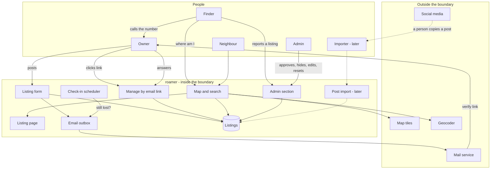
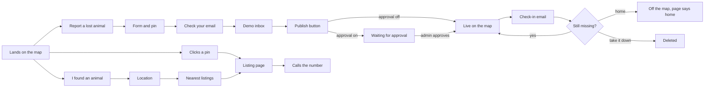

# roamer - Interaction and system boundary

## Actors

| Actor | Type | What they want |
| --- | --- | --- |
| Owner | Human, the public | To get the animal in front of as many people near the last sighting as possible, fast, and to be called by anyone who sees it. Frightened, often in a hurry, often posting from a phone in the street |
| Finder | Human, the public | Has an animal in hand, or has just seen one, and wants to know in a minute or two whether somebody nearby is missing it. Owes the site nothing and will leave if it is slow or asks them to sign up |
| Neighbour | Human, the public | Browses the map for their area, shares a listing, keeps an eye out. Never posts |
| Admin | Human, the author | Full control of the map: see every listing in every state, approve, hide, edit, delete, deal with reports, block an address, and reset the demo. One person, behind a login |
| Importer | Human, later | A volunteer who brings a public lost-pet post onto the map so that finders see it. Not the owner. Only exists once post import is built |
| Demo visitor | Human, the public | Someone looking at the portfolio. Wants to see the whole thing work in a few minutes without giving a real email address. Plays every role above except Admin |
| Mail service | External system | Delivers the confirmation and check-in emails. Not used by the demo, which shows its emails in a demo inbox on the site |
| Map tiles | External system | OpenStreetMap's tile server. Draws the map. No key |
| Geocoder | External system | Turns a typed address into a point. OpenStreetMap's Nominatim, under its usage policy |
| Social media sites | External, later | Where lost-pet posts already live. The system does not read them by itself - see the plan for why |

The Owner and Finder are strangers to each other and to the site. Neither has an account.
The only identity the system holds is an owner's email address, and the only thing it
proves is that the owner can read mail sent to it.

## Interaction diagram

The finder's last arrow goes straight to the owner, outside the system. That is deliberate.
The site's job ends when the finder has the right number.

## What the system is in the business of

- Putting a lost animal's details on a map, in the place they matter, within minutes of the
  owner deciding to post.
- Answering one question for a finder quickly: is anyone near here missing this animal.
- Saying how current every listing is. A listing nobody has confirmed for a month is
  labelled as such rather than shown as if it were posted this morning.
- Keeping the owner's email address private and the photo's hidden location data out.
- Making an owner's next action one click: still lost, found, take it down.
- Being plain about what verified means, and not letting the badge claim more than the
  system checked.
- Taking a bad listing down quickly when someone reports it.

## What the system does not care about

- Who owns the animal. It cannot know, and it does not pretend to. The handover is between
  two people.
- What happens after the phone call. Arranging a meeting, checking a microchip, returning
  the animal - all outside.
- Money in any form. Rewards, donations, fees. Anything shaped like a payment is a scam
  vector, so there is no field for it.
- Accounts, passwords, profiles or followers. An owner is an email address with listings
  attached.
- Messaging. The finder calls the number. A message relay is a possible later addition, not
  a first-version feature.
- Native mobile apps, push notifications, or app stores.
- Breed identification, photo matching or any automatic judgement about whether two animals
  are the same one. A person looking at a photo is better at that than anything this
  project would ship.
- Reading social media on its own. The first version takes posts only from the owner. How
  outside posts might get in later is an open question, and scraping a site against its
  terms is not one of the answers.
- Scale. One server, one database, listings in the hundreds for one area.
- Multiple admins, roles or permissions. There is one admin, and the admin section is all or nothing.

## Main use cases

| ID | Actor | Goal | Trigger | Result |
| --- | --- | --- | --- | --- |
| UC-1 | Owner | Post a lost animal | Fills in the form | A listing is saved but not shown. A verification email is sent |
| UC-2 | Owner | Verify the listing | Clicks the email link | The listing is live on the map with a verified badge |
| UC-3 | Finder | Find out who is missing this animal | Opens "I found an animal" and gives a location | Nearby active listings, nearest and most recent first, each with photo, description, last seen time and how recently confirmed |
| UC-4 | Neighbour | Look at the area | Opens the map | Pins for every active listing in view, filterable by species and how recently missing |
| UC-5 | Finder or neighbour | See the whole listing | Clicks a pin or opens a shared link | The listing page: photos, flyer, description, last seen time and place, contact number, verified state, the scam warning |
| UC-6 | Owner | Confirm still lost | Answers the check-in email | `last_confirmed_at` moves to now. The badge stays |
| UC-7 | Owner | Report the animal is home | Answers the check-in, or opens the manage page | The listing comes off the map. Its page says the animal is home |
| UC-8 | Owner | Edit the listing | Asks for a manage link by email | The owner can change details, photos and the pin |
| UC-9 | Owner | Take the listing down | Manage page | The listing and its photos are removed |
| UC-10 | Owner | Put up flyers | Prints the listing's flyer | A printable page with the details and a code that opens the listing |
| UC-11 | Anyone | Flag a listing | "Report this listing" | A report waits for the admin. The listing stays up until the admin acts |
| UC-11a | Anyone | Get help from a person | "Help", then "Contact the admin" | A message waits in the admin section. The visitor is told an admin exists and will read it, and never sees the admin section |
| UC-12 | Admin | Deal with a bad listing | A report, or noticing one | The listing is hidden with a reason, or the report is dismissed. Either is recorded |
| UC-12a | Admin | Approve a new listing | Approval is switched on and a verified listing is waiting | Approved: it goes on the map. Rejected: it is deleted and the owner gets the reason by email |
| UC-12b | Admin | See everything | Opens the admin map or the listings table | Every listing in every state - waiting, live, quiet, stale, hidden, home - with filters, and actions on each |
| UC-12c | Admin | Fix or remove a listing | A wrong pin, a typo, a bad photo, a duplicate | Edited, photo removed, or deleted outright. Recorded in the listing's history as the admin's change |
| UC-12d | Admin | Stop a repeat abuser | The same address posting junk | The address is blocked. Its listings are hidden and it cannot post again |
| UC-12e | Admin | Control the demo | The demo looks wrong, or a reviewer is about to look | Reset now to the made-up listings, switch approval on or off, set where the map opens |
| UC-13 | System | Notice a silent owner | A listing's last confirmation is older than the check-in interval | A check-in email is sent. If it goes unanswered, the badge lapses, and later the listing leaves the default map |

Later, not in the first version:

| ID | Actor | Goal | Result |
| --- | --- | --- | --- |
| UC-14 | Importer | Bring a public post onto the map | An unclaimed listing, labelled as coming from a post and not verified, linked to the original |
| UC-15 | Owner | Claim an imported listing | After proving it is theirs, the listing becomes an owner listing and can be verified |
| UC-16 | Finder | Report a sighting | A sighting waits for the owner to accept it, then shows on the listing's map |
| UC-17 | Finder | Report a found animal | A found listing on the map for owners to search |

## User journeys

What each person sees, screen by screen, in the hosted demo. The real service is the same
except where a step says "demo".

### J1 - A demo visitor arrives

1. Opens the link. A map of the demo area fills the screen with about a dozen pins already
   on it. A banner across the top: this is a demo, the listings are made up, do not enter
   real details, everything resets daily.
2. Clicks a pin. A popup: photo, name, "last seen 2 days ago", the verified badge, and
   "View listing".
3. The listing page: photos, description, how to approach the animal, where and when it was
   last seen on a small map, the contact number, "confirmed still lost 1 day ago", the scam
   warning, and buttons for "Print flyer" and "Report this listing".
4. From here the visitor can try J2 as an owner and J3 as a finder. A "Help" link in the
   footer of every page leads to J8.

### J2 - An owner posts a lost animal

1. "Report a lost animal" on the map page.
2. The form, in the order a flyer reads: species, name, photos, what it looks like, how to
   approach it, when it was last seen. Then a map to drop the pin where it was last seen,
   with an address search and a choice of exact point or approximate area. Then the name and
   number to call, whether to show the number, and an email address.
3. Submit. A page says "Check your email to publish your listing". **Demo:** a button "Open
   the demo inbox", already filled in with the address typed.
4. The inbox has "Confirm your listing for Biscuit". The link opens a page with one button,
   "Publish my listing".
5. **Approval off** (the demo default): the listing page opens with "Your listing is live",
   the verified badge, and links to print a flyer and to manage the listing. **Approval on:**
   a page says it is waiting for a check by the site, and an email follows when it is
   approved or turned down, with the reason.
6. A check-in arrives - days later for real, minutes later in the demo, or at once from
   "Send check-in now" on the manage page: "Is Biscuit still missing?" with three choices.
   Each opens a page with a button to confirm the choice.
7. **Still missing:** the badge stays, and the page says "confirmed still lost just now".
   **Home:** the pin leaves the map, and the listing page says Biscuit is home. **Take it
   down:** the listing and its photos are deleted.
8. If the owner never answers: a few days later the badge goes and the page says "not
   confirmed for 4 days". After longer, the pin leaves the default map.

### J3 - A finder has an animal

1. "I found an animal" on the map page.
2. "Use my location" - the browser asks permission - or type an address and press Search.
3. Results, nearest first: photo, name, distance, when last seen, and either the verified
   badge or "not confirmed for N days". A small map beside them shows the finder's point and
   the pins. A species filter narrows it.
4. Opens the one that matches, compares the photo and the marks, calls the number.
5. The listing reminds the finder to ask for proof at the handover - a photo of the owner
   with the animal, a vet record, the microchip number - and that nobody genuine asks a
   finder for money.
6. **No match:** the page says what to do next - check for a tag, have a vet or shelter scan
   for a microchip, call the local shelter. Found-animal listings come later.

### J4 - An owner comes back to change something

1. "Manage my listing" in the footer. Type the email address.
2. The same answer whether or not the address is known: "If there is a listing for that
   address, a link is on its way". **Demo:** the demo inbox button again.
3. The link opens a page with a button, then the manage page: every listing for that
   address.
4. Edit details, move the pin, add or remove photos, save. Saving counts as confirming the
   animal is still missing.
5. Or mark it home, reopen it if the animal got out again, or withdraw it, which deletes it
   after one "are you sure".

### J5 - Putting up flyers

1. "Print flyer" on a listing page.
2. A print layout: the main photo large, name, "LOST", where and when last seen, how to
   approach, the number, and a QR code.
3. The browser's print dialog, to paper or PDF. A phone camera pointed at the code opens
   the current listing - so a flyer on a pole shows "home" once the animal is back.

### J6 - Someone reports a listing

1. "Report this listing" on a listing page.
2. A reason - scam, not actually lost, wrong details, abusive, other - and a box for more.
3. "Thanks. The site's admin will look at it." The listing stays up until the admin acts.

### J8 - Someone needs help from a person

1. "Help" in the footer of any page.
2. A short page: this site has an admin, who reviews reports, takes down scams and wrong
   listings, fixes details an owner cannot, and helps an owner who has lost access to their
   email. Then the common answers - how to manage a listing, what verified means, what to do
   if someone asks for money. **Demo:** a line saying the admin reads messages but this is a
   demo, so do not send anything personal.
3. "Contact the admin": a message, which listing it is about if any, and an optional email
   address for a reply.
4. "Sent. The admin will read it." There is no way in from here to the admin section; the
   visitor only learns that a person is behind the site and how to reach them.

### J7 - The admin runs the map

1. `/admin`. A login page: password only. Wrong passwords are slowed down.
2. **Dashboard.** Counts at the top - waiting for approval, open reports, help messages, live, gone quiet,
   stale, hidden, home - each a link to that list. The latest activity underneath.
3. **Admin map.** Every listing in every state, coloured by state, with filters. Clicking a
   pin opens the admin panel for that listing: open it, edit, approve, hide or unhide with a
   reason, mark home, delete, see its full history.
4. **Approval queue** (when approval is on). Each waiting listing with its photos, details
   and pin. Approve, or reject with a reason that is emailed to the owner.
5. **Messages.** Reports about listings, each beside the listing it is about - hide the
   listing with a reason, or dismiss. Help messages from the contact form - mark handled. A
   reply, when there is a reply address, is written from the admin's own mail, outside the
   site.
6. **Listings table.** Every listing, searchable by name, code, area or email, filterable by
   state, species and source, sortable by date. The same actions as the panel.
7. **Owners.** Look up an email address, see its listings, block it - which hides its
   listings and stops it posting - or unblock it.
8. **Settings.** Approval on or off. Where the map opens: centre and zoom, set by moving the
   map and pressing "Use this view". The check-in timings and whether this is the demo are
   shown, not edited, because they come from configuration.
9. **Demo.** "Reset demo now" - back to the made-up listings, everything else deleted. Every
   message in the demo inbox, for any address.
10. **Activity log.** Every admin action, newest first, with what it was done to and why.
11. Log out.

## Constraints that come from the actors

- The finder will not make an account and will not wait. "I found an animal" has to answer
  in one screen with no sign-in, or it has failed.
- The owner is upset and in a hurry. The form asks for what a flyer asks for and nothing
  more, and a listing can be posted from a phone browser even though the site is built
  desktop-first.
- The owner will stop answering emails, sometimes because the dog came home and they forgot
  the site existed. Silence has to make the listing less prominent over time, not leave it
  claiming to be current forever.
- Email link scanners open links before people do. Mail filters at many providers visit
  every link in a message to check it. A link that marks a dog as found when it is merely
  opened would close listings nobody asked to close. Every link in an email opens a page
  with a button; the button makes the change.
- Lost-pet scammers read lost-pet listings. Fake finders ask owners for money or for a
  verification code sent to the owner's phone. The site cannot stop that, but every listing
  carries a short warning, and there is no reward field to give them a number to ask for.
- The admin is one person. A report must not take a listing down by itself, or one
  hostile person can remove a real owner's listing; it waits for a person.
- The map provider and the geocoder are free services with usage policies. The geocoder
  allows about one request a second and forbids search-as-you-type, so address search runs
  on submit, through the server, with results cached.
