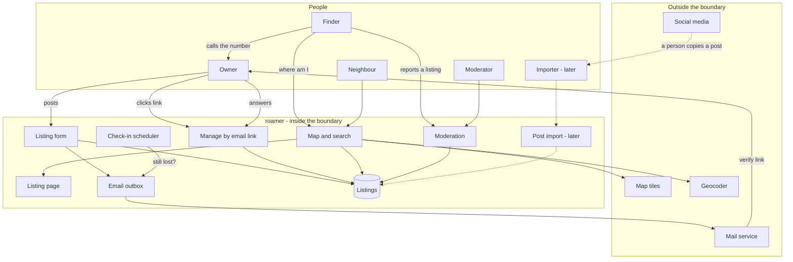

# roamer - Interaction and system boundary

## Actors

| Actor | Type | What they want |
| --- | --- | --- |
| Owner | Human, the public | To get the animal in front of as many people near the last sighting as possible, fast, and to be called by anyone who sees it. Frightened, often in a hurry, often posting from a phone in the street |
| Finder | Human, the public | Has an animal in hand, or has just seen one, and wants to know in a minute or two whether somebody nearby is missing it. Owes the site nothing and will leave if it is slow or asks them to sign up |
| Neighbour | Human, the public | Browses the map for their area, shares a listing, keeps an eye out. Never posts |
| Moderator | Human, the author | To take down a fake, abusive or scam listing quickly, and to see what has been reported |
| Importer | Human, later | A volunteer who brings a public lost-pet post onto the map so that finders see it. Not the owner. Only exists once post import is built |
| Mail service | External system | Delivers the confirmation and check-in emails |
| Map tiles | External system | OpenStreetMap's tile server. Draws the map. No key |
| Geocoder | External system | Turns a typed address into a point. OpenStreetMap's Nominatim, under its usage policy |
| Social media sites | External, later | Where lost-pet posts already live. The system does not read them by itself - see the plan for why |

The Owner and Finder are strangers to each other and to the site. Neither has an account.
The only identity the system holds is an owner's email address, and the only thing it
proves is that the owner can read mail sent to it.

## Interaction diagram

The finder's last arrow goes straight to the owner, outside the system. That is deliberate.
The site's job ends when the finder has the right number.

## What the system is in the business of

- Putting a lost animal's details on a map, in the place they matter, within minutes of the
  owner deciding to post.
- Answering one question for a finder quickly: is anyone near here missing this animal.
- Saying how current every listing is. A listing nobody has confirmed for a month is
  labelled as such rather than shown as if it were posted this morning.
- Keeping the owner's email address private and the photo's hidden location data out.
- Making an owner's next action one click: still lost, found, take it down.
- Being plain about what verified means, and not letting the badge claim more than the
  system checked.
- Taking a bad listing down quickly when someone reports it.

## What the system does not care about

- Who owns the animal. It cannot know, and it does not pretend to. The handover is between
  two people.
- What happens after the phone call. Arranging a meeting, checking a microchip, returning
  the animal - all outside.
- Money in any form. Rewards, donations, fees. Anything shaped like a payment is a scam
  vector, so there is no field for it.
- Accounts, passwords, profiles or followers. An owner is an email address with listings
  attached.
- Messaging. The finder calls the number. A message relay is a possible later addition, not
  a first-version feature.
- Native mobile apps, push notifications, or app stores.
- Breed identification, photo matching or any automatic judgement about whether two animals
  are the same one. A person looking at a photo is better at that than anything this
  project would ship.
- Reading social media on its own. The first version takes posts only from the owner. How
  outside posts might get in later is an open question, and scraping a site against its
  terms is not one of the answers.
- Scale. One server, one database, listings in the hundreds for one area.
- Multiple moderators, roles or permissions. There is one moderator.

## Main use cases

| ID | Actor | Goal | Trigger | Result |
| --- | --- | --- | --- | --- |
| UC-1 | Owner | Post a lost animal | Fills in the form | A listing is saved but not shown. A verification email is sent |
| UC-2 | Owner | Verify the listing | Clicks the email link | The listing is live on the map with a verified badge |
| UC-3 | Finder | Find out who is missing this animal | Opens "I found an animal" and gives a location | Nearby active listings, nearest and most recent first, each with photo, description, last seen time and how recently confirmed |
| UC-4 | Neighbour | Look at the area | Opens the map | Pins for every active listing in view, filterable by species and how recently missing |
| UC-5 | Finder or neighbour | See the whole listing | Clicks a pin or opens a shared link | The listing page: photos, flyer, description, last seen time and place, contact number, verified state, the scam warning |
| UC-6 | Owner | Confirm still lost | Answers the check-in email | `last_confirmed_at` moves to now. The badge stays |
| UC-7 | Owner | Report the animal is home | Answers the check-in, or opens the manage page | The listing comes off the map. Its page says the animal is home |
| UC-8 | Owner | Edit the listing | Asks for a manage link by email | The owner can change details, photos and the pin |
| UC-9 | Owner | Take the listing down | Manage page | The listing and its photos are removed |
| UC-10 | Owner | Put up flyers | Prints the listing's flyer | A printable page with the details and a code that opens the listing |
| UC-11 | Anyone | Flag a listing | "Report this listing" | A report waits for the moderator. The listing stays up until the moderator acts |
| UC-12 | Moderator | Deal with a bad listing | A report, or noticing one | The listing is hidden with a reason, or the report is dismissed. Either is recorded |
| UC-13 | System | Notice a silent owner | A listing's last confirmation is older than the check-in interval | A check-in email is sent. If it goes unanswered, the badge lapses, and later the listing leaves the default map |

Later, not in the first version:

| ID | Actor | Goal | Result |
| --- | --- | --- | --- |
| UC-14 | Importer | Bring a public post onto the map | An unclaimed listing, labelled as coming from a post and not verified, linked to the original |
| UC-15 | Owner | Claim an imported listing | After proving it is theirs, the listing becomes an owner listing and can be verified |
| UC-16 | Finder | Report a sighting | A sighting waits for the owner to accept it, then shows on the listing's map |
| UC-17 | Finder | Report a found animal | A found listing on the map for owners to search |

## Constraints that come from the actors

- The finder will not make an account and will not wait. "I found an animal" has to answer
  in one screen with no sign-in, or it has failed.
- The owner is upset and in a hurry. The form asks for what a flyer asks for and nothing
  more, and a listing can be posted from a phone browser even though the site is built
  desktop-first.
- The owner will stop answering emails, sometimes because the dog came home and they forgot
  the site existed. Silence has to make the listing less prominent over time, not leave it
  claiming to be current forever.
- Email link scanners open links before people do. Mail filters at many providers visit
  every link in a message to check it. A link that marks a dog as found when it is merely
  opened would close listings nobody asked to close. Every link in an email opens a page
  with a button; the button makes the change.
- Lost-pet scammers read lost-pet listings. Fake finders ask owners for money or for a
  verification code sent to the owner's phone. The site cannot stop that, but every listing
  carries a short warning, and there is no reward field to give them a number to ask for.
- The moderator is one person. A report must not take a listing down by itself, or one
  hostile person can remove a real owner's listing; it waits for a person.
- The map provider and the geocoder are free services with usage policies. The geocoder
  allows about one request a second and forbids search-as-you-type, so address search runs
  on submit, through the server, with results cached.
