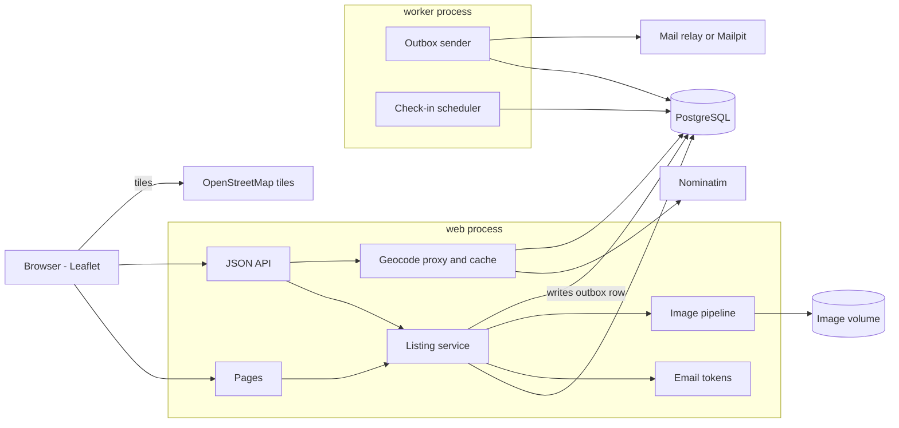
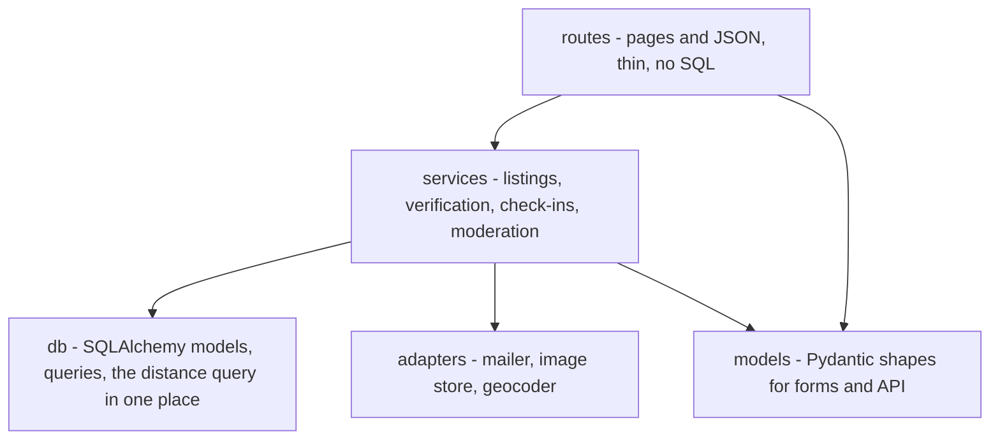
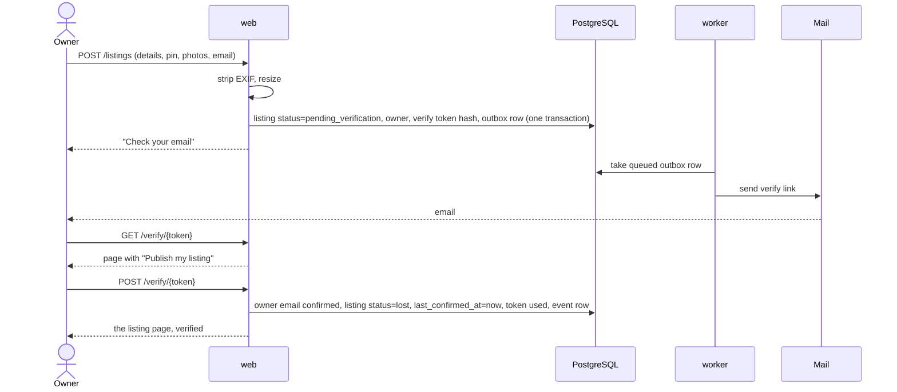
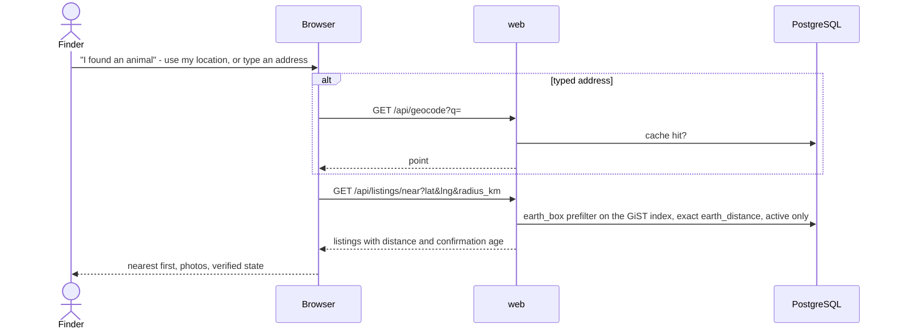
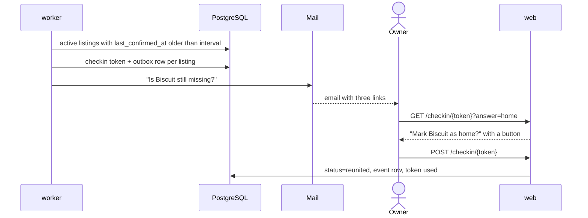

# roamer - Architecture

Internal document. Credentials are referred to by environment variable only.

Nothing here is built yet. This is the design the build starts from, and where it turns out
to be wrong it is changed here first.

## Stack

| Part | Choice | Why | Rejected |
| --- | --- | --- | --- |
| Server | Python, FastAPI | The same stack as mailman and herder, so the deploy, the tests and the CI pattern already exist. The OpenAPI page comes free | Node and Express - a second backend stack in the repo for no gain; Laravel - the repo's old ignore rules mention it, nothing current uses it |
| Pages | Server-rendered Jinja templates, plain JavaScript where a page needs it | No build step, runs from PowerShell, deploys as one process. A map, a form and a list do not need a framework | React or a single-page app - a Node build for three screens |
| Map | Leaflet with OpenStreetMap tiles, loaded from a CDN | Free, no key, no account. Leaflet is small and does markers, clustering and popups | Google Maps - needs a billing account and a key. Mapbox - needs a key |
| Address search | OpenStreetMap Nominatim, called from the server, cached | Free and keyless. Calling it from the server lets the cache and the rate limit live in one place | Calling it from the browser - every visitor counts against one public policy limit with no cache |
| Database | PostgreSQL 16 | A real database is part of what this shows, and the server already runs one | SQLite - fine for a demo, but the deploy story is a shared Postgres |
| Distance queries | PostgreSQL's `cube` and `earthdistance` extensions, with a GiST index | Ship with PostgreSQL itself, so they work on the shared server's existing image. "Listings within 5 km of here, nearest first" is the only spatial question the app asks, and these answer it with an index | PostGIS - the right tool in general, but the shared server runs pgvector's image, which does not include it. Swapping the database image under mailman and herder for one app is a bad trade. If a query ever needs polygons, revisit. Plain latitude and longitude columns with arithmetic and no index - works at a hundred rows and teaches nothing |
| Migrations | Alembic | A schema hand-built once cannot be rebuilt on another machine | Creating tables on startup |
| Images | Pillow | Strips EXIF, normalises orientation, resizes. Runs in process | An image service |
| Storage for images | A mounted volume, S3-shaped keys behind one interface | Same pattern as mailman. The move to object storage is a client swap | Bytes in the database |
| Email in development | Mailpit container | Catches every message and shows it in a browser. No account, no key, nothing leaves the machine | Printing emails to the log - the links in them cannot be clicked |
| Email in production | SMTP to a relay, credentials from the environment | Every mail service speaks SMTP, so the relay is a configuration choice and not a code one | A provider's own SDK - ties the code to one company |
| Background work | One worker process running a loop: send queued email, run check-ins | Two small jobs. A broker earns its place when there are many | Celery and Redis; cron on the host - invisible to Docker Compose |
| Tests | pytest, against a real PostgreSQL in CI | The same pattern as the other server projects | |
| Run | Docker Compose: `db`, `mailpit`, `web`, `worker` | One command up, from PowerShell | |

No part of roamer uses a hosted language model, now or later. The later post-import feature
that needs text extraction follows mailman's pattern: a heuristic extractor first, then a
locally trained or locally run model, compared by a harness.

## Components

The web process never sends email itself. It writes a row to the outbox in the same
transaction as the change that caused it, and the worker sends it. A listing created while
the mail relay is down still gets its verification email when the relay comes back, and a
failed send is a row with an error on it rather than a log line nobody reads.

## Layers

Routes do not touch the database. The distance query lives in one function, so moving to
PostGIS later is one function, not a search through the code.

The mailer, the image store and the geocoder are each an interface with two
implementations: the real one, and one for tests that records what it was asked to do. The
tests never send mail or call Nominatim.

## Pages and API

Pages:

| Path | What |
| --- | --- |
| `GET /` | The map. Pins for active listings in view, filters for species and how recently missing |
| `GET /found` | "I found an animal". A location in, the nearest listings out |
| `GET /listings/new`, `POST /listings` | The listing form |
| `GET /l/{code}` | The listing page. A short code, so it fits a printed flyer and a QR code |
| `GET /l/{code}/flyer` | Printable flyer with a QR code to the listing page |
| `POST /l/{code}/report` | Flag a listing for the moderator |
| `GET /verify/{token}`, `POST /verify/{token}` | Confirm an email address and publish |
| `GET /manage`, `POST /manage` | Ask for a manage link by email |
| `GET /manage/{token}` | Exchange a manage link for a short session, then redirect |
| `GET /l/{code}/edit`, `POST /l/{code}/edit` | Edit, under that session |
| `POST /l/{code}/status` | Still lost, home, or withdrawn, under that session |
| `GET /checkin/{token}`, `POST /checkin/{token}` | The check-in email's links |
| `GET /admin` | Moderator: open reports, hidden listings |
| `GET /health` | Liveness and database reachability |

JSON, used by the map page:

| Path | What |
| --- | --- |
| `GET /api/listings?bbox=&species=&since=` | Active listings inside the map view. Only what a pin and its popup need |
| `GET /api/listings/near?lat=&lng=&radius_km=&species=` | Nearest active listings to a point, with the distance |
| `GET /api/geocode?q=` | Server-side address search. Cached, rate limited to the provider's policy |

## Email links and why every one is a GET then a POST

Every link in an email - verify, manage, check-in - opens a page with a button, and the
button makes the change. A link that changed something when opened would be clicked by the
mail provider's link scanner before the owner ever saw it, and a check-in link that said
"found" would close a lost dog's listing on the scanner's behalf.

Tokens are 32 random bytes, sent once, stored only as a SHA-256 hash. Each has a purpose,
an expiry and a used-at time. A verify token lasts a day, a manage link an hour, a check-in
token until the next check-in replaces it. A used or expired token shows a page that offers
to send a new one.

## The verified badge

The badge is computed when a listing is read, never stored:

    verified = owner email confirmed
           and listing is an owner listing (not an unclaimed import)
           and last_confirmed_at is within CHECKIN_INTERVAL + CHECKIN_GRACE

A stored `is_verified` column would be true on the day it was set and quietly wrong a month
later, which is the exact failure the badge exists to prevent.

## Check-ins

The worker runs every few minutes. Any active listing whose `last_confirmed_at` is older
than `CHECKIN_INTERVAL` and has no check-in outstanding gets one email with three choices.
Answering any of them moves `last_confirmed_at`. Then:

| Silent for | What the listing shows |
| --- | --- |
| Less than interval + grace | Verified, "confirmed still lost N days ago" |
| Longer | No badge, "not confirmed for N days" |
| Longer than `STALE_AFTER` | Off the default map. Still reachable by its link and by a filter that includes stale listings |

The intervals are configuration. Starting values are an open question in the plan.

## Images

On upload: reject anything that is not a JPEG, PNG or WebP, or is over the size limit.
Apply the EXIF orientation, then drop all metadata, then resize to a display size and a
thumbnail. The original is not kept, because the original is the thing with the location
inside it. Stored as `listings/{listing_id}/{image_id}-{size}.jpg`.

## Abuse

- An owner listing is not public until its email is verified. Nothing anonymous reaches the
  map.
- Rate limits on posting, on asking for manage links, and on reports, per IP address and
  per email address.
- A hidden form field that people never fill in and simple bots always do.
- A report never hides a listing by itself. The moderator acts.
- IP addresses are stored only as a salted hash, only on reports and rate-limit counters,
  and expire.

A CAPTCHA is the next step if this is not enough. Every free one needs a site key, which is
a small thing but still an account, so it waits for evidence it is needed.

## Key sequences

### Post and verify

### A finder searches

### A check-in

## Configuration

| Variable | What |
| --- | --- |
| `DATABASE_URL` | PostgreSQL |
| `ROAMER_BASE_URL` | Used to build the links in emails and on flyers |
| `SMTP_HOST`, `SMTP_PORT`, `SMTP_USER`, `SMTP_PASSWORD`, `MAIL_FROM` | The relay. Mailpit in development, with no credentials |
| `IMAGE_DIR` | The image volume |
| `CHECKIN_INTERVAL`, `CHECKIN_GRACE`, `STALE_AFTER` | The freshness rules |
| `TOKEN_SALT` | For hashing IP addresses on reports and rate limits |
| `NOMINATIM_URL`, `NOMINATIM_USER_AGENT` | Nominatim's policy requires an identifying user agent |
| `ROAMER_ADMIN_TOKEN` | The moderator's login, for now. One person |

## Deployment

A `roamer` profile in `deploy/docker-compose.prod.yml`, on the same server as mailman: the
`web` and `worker` containers, a Caddy block for `roamer.<domain>`, and a database and login
created by `deploy/initdb/` the same way as the others. If the app login is not allowed to
create the `cube` and `earthdistance` extensions, they are created in `initdb` as the
superuser, the way herder's vector extension is. That is checked at stage 0, not assumed.

The shared server is the only host. No second bill.
