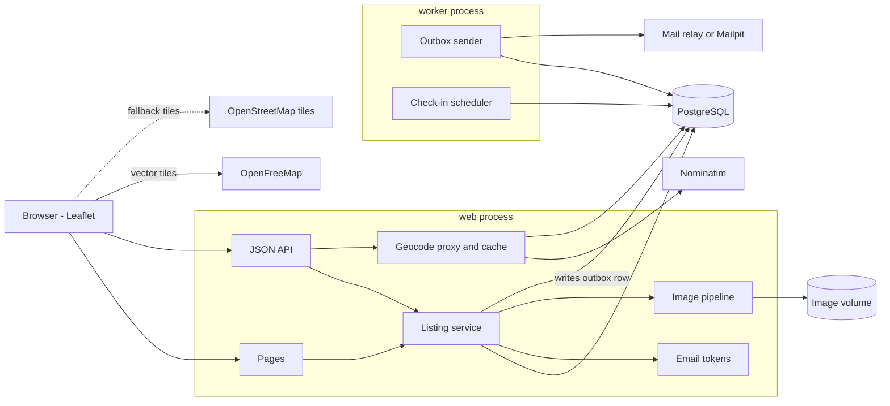
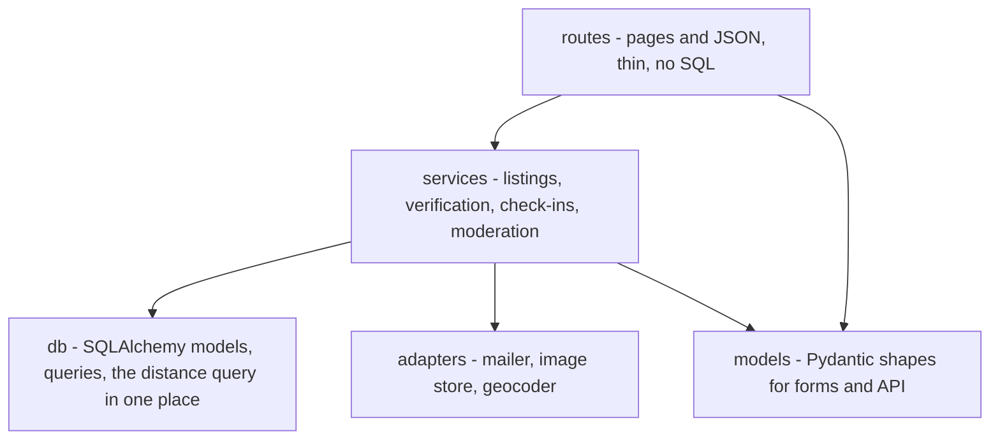
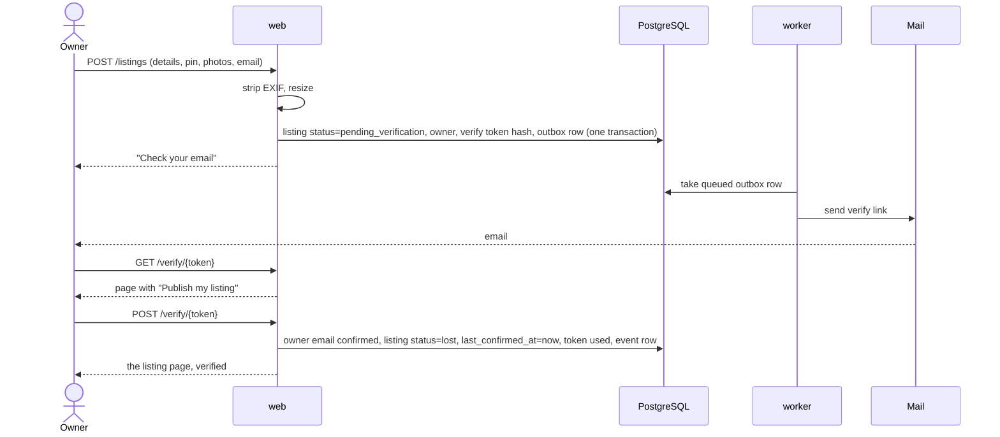
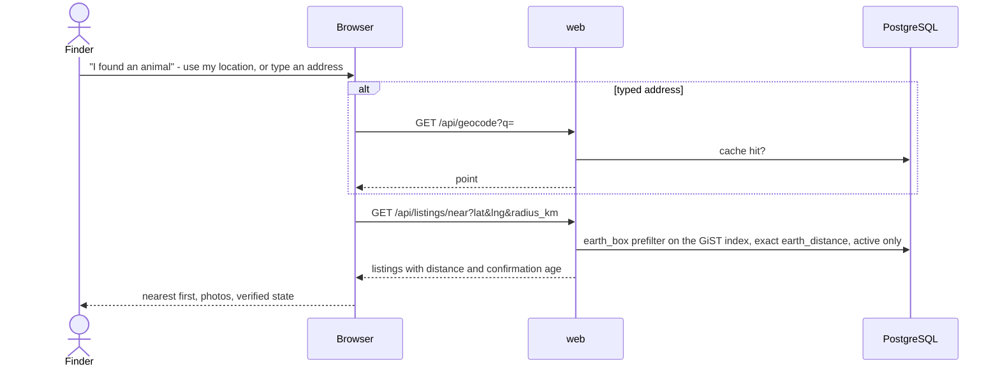
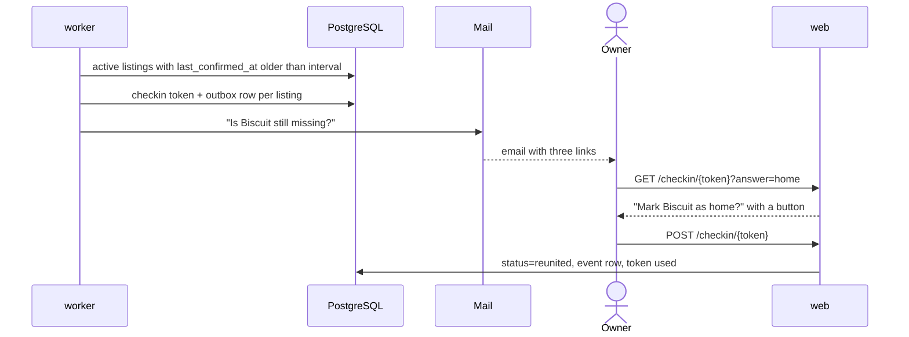

# roamer - Architecture

Internal document. Credentials are referred to by environment variable only.

Nothing here is built yet. This is the design the build starts from, and where it turns out
to be wrong it is changed here first.

## Stack

| Part | Choice | Why | Rejected |
| --- | --- | --- | --- |
| Server | Python, FastAPI | The same stack as mailman and herder, so the deploy, the tests and the CI pattern already exist. The OpenAPI page comes free | Node and Express - a second backend stack in the repo for no gain; Laravel - the repo's old ignore rules mention it, nothing current uses it |
| Pages | Server-rendered Jinja templates, plain JavaScript where a page needs it | No build step, runs from PowerShell, deploys as one process. A map, a form and a list do not need a framework | React or a single-page app - a Node build for three screens |
| Map | Leaflet, with OpenFreeMap's Positron base map drawn by MapLibre GL; OpenStreetMap's own tiles, greyed out, as the fallback | The author asked for a muted map - mostly white and grey, like Google's - because the standard OpenStreetMap colours overwhelm the pins. Positron is that, and OpenFreeMap serves it with no key, no account and no request limit, commercial use allowed. Leaflet stays for markers, clustering and popups | Google Maps - billing account and key. Mapbox - key. CARTO's Positron raster tiles - now need a key: a tile fetched without one is an "API KEY REQUIRED" watermark (checked). OpenStreetMap tiles alone - the colours the author did not want |
| Address search | OpenStreetMap Nominatim, called from the server, cached | Free and keyless. Calling it from the server lets the cache and the rate limit live in one place | Calling it from the browser - every visitor counts against one public policy limit with no cache |
| Database | PostgreSQL 16 | A real database is part of what this shows, and the server already runs one | SQLite - fine for a demo, but the deploy story is a shared Postgres |
| Distance queries | PostgreSQL's `cube` and `earthdistance` extensions, with a GiST index | Ship with PostgreSQL itself, so they work on the shared server's existing image. "Listings within 5 km of here, nearest first" is the only spatial question the app asks, and these answer it with an index | PostGIS - the right tool in general, but the shared server runs pgvector's image, which does not include it. Swapping the database image under mailman and herder for one app is a bad trade. If a query ever needs polygons, revisit. Plain latitude and longitude columns with arithmetic and no index - works at a hundred rows and teaches nothing |
| Migrations | Alembic | A schema hand-built once cannot be rebuilt on another machine | Creating tables on startup |
| Images | Pillow | Strips EXIF, normalises orientation, resizes. Runs in process | An image service |
| Storage for images | A mounted volume, S3-shaped keys behind one interface | Same pattern as mailman. The move to object storage is a client swap | Bytes in the database |
| Email in development | Mailpit container | Catches every message and shows it in a browser. No account, no key, nothing leaves the machine | Printing emails to the log - the links in them cannot be clicked |
| Email in production | SMTP to a relay, credentials from the environment | Every mail service speaks SMTP, so the relay is a configuration choice and not a code one | A provider's own SDK - ties the code to one company |
| Background work | One worker process running a loop: send queued email, run check-ins | Two small jobs. A broker earns its place when there are many | Celery and Redis; cron on the host - invisible to Docker Compose |
| Tests | pytest, against a real PostgreSQL in CI | The same pattern as the other server projects | |
| Run | Docker Compose: `db`, `mailpit`, `web`, `worker` | One command up, from PowerShell | |

No part of roamer uses a hosted language model, now or later. The later post-import feature
that needs text extraction follows mailman's pattern: a heuristic extractor first, then a
locally trained or locally run model, compared by a harness.

## Components

The web process never sends email itself. It writes a row to the outbox in the same
transaction as the change that caused it, and the worker sends it. A listing created while
the mail relay is down still gets its verification email when the relay comes back, and a
failed send is a row with an error on it rather than a log line nobody reads.

## Layers

Routes do not touch the database. The distance query lives in one function, so moving to
PostGIS later is one function, not a search through the code.

The mailer, the image store and the geocoder are each an interface with two
implementations: the real one, and one for tests that records what it was asked to do. The
tests never send mail or call Nominatim.

## Pages and API

Pages:

| Path | What |
| --- | --- |
| `GET /` | The map. Pins for active listings in view, filters for species and how recently missing |
| `GET /found` | "I found an animal". A location in, the nearest listings out |
| `GET /listings/new`, `POST /listings` | The listing form |
| `GET /l/{code}` | The listing page. A short code, so it fits a printed flyer and a QR code |
| `GET /l/{code}/flyer` | Printable flyer with a QR code to the listing page |
| `GET /help`, `POST /help` | Who the admin is and what they do, common answers, and the contact form |
| `POST /l/{code}/report` | Flag a listing for the admin |
| `GET /verify/{token}`, `POST /verify/{token}` | Confirm an email address and publish |
| `GET /manage`, `POST /manage` | Ask for a manage link by email |
| `GET /manage/{token}` | Exchange a manage link for a short session, then redirect |
| `GET /l/{code}/edit`, `POST /l/{code}/edit` | Edit, under that session |
| `POST /l/{code}/status` | Still lost, home, or withdrawn, under that session |
| `GET /checkin/{token}`, `POST /checkin/{token}` | The check-in email's links |
| `GET /admin/login`, `POST /admin/login`, `POST /admin/logout` | The admin's login |
| `GET /admin` | Dashboard: counts by state, latest activity |
| `GET /admin/map` | Every listing in every state, coloured by state, with an action panel per pin |
| `GET /admin/listings` | Searchable, filterable table of every listing |
| `GET /admin/approvals` | Listings waiting for approval |
| `GET /admin/messages` | Open reports beside their listings, and help messages |
| `POST /admin/l/{code}/{action}` | `approve`, `reject`, `hide`, `unhide`, `home`, `delete`, `photo-remove`. Reason required where the data model says so |
| `GET /admin/l/{code}/edit`, `POST` | Edit any listing |
| `GET /admin/owners`, `POST /admin/owners/block`, `POST /admin/owners/unblock` | Look up an address, block, unblock |
| `GET /admin/settings`, `POST` | Approval on or off, where the map opens |
| `POST /admin/demo/reset` | Demo only. Reset now |
| `GET /admin/activity` | The admin action log |
| `GET /demo/inbox` | Demo mode only. The emails the site would have sent to an address |
| `GET /health` | Liveness and database reachability |

JSON, used by the map page:

| Path | What |
| --- | --- |
| `GET /api/listings?bbox=&species=&since=` | Active listings inside the map view. Only what a pin and its popup need |
| `GET /api/listings/near?lat=&lng=&radius_km=&species=` | Nearest active listings to a point, with the distance |
| `GET /api/geocode?q=` | Server-side address search. Cached, rate limited to the provider's policy |

## Front end

One stylesheet and four small scripts in `roamer/static/`, no framework and no build:
`common.js` (the base map, pin icons, relative times), `map.js`, `form.js`,
`listing.js`. Leaflet 1.9.4, markercluster 1.5.3 and MapLibre GL 5.24.0 come from cdnjs,
and maplibre-gl-leaflet 0.1.4 from jsdelivr (it is not on cdnjs), all with `integrity`
hashes computed from the files served, so a changed file is refused rather than run.

The base map is OpenFreeMap's Positron style: vector tiles drawn by MapLibre GL inside
Leaflet. MapLibre is held at 5.x because 6.x is published only as an ES module, which the
Leaflet bridge cannot load from a plain script tag. If MapLibre does not load or the
browser has no WebGL, `common.js` falls back to OpenStreetMap's raster tiles with a CSS
greyscale filter, so the map is never blank. Two ordering rules come with the vector
layer: the map's view is set before the layer is added (the layer reads the centre as it
is added and throws on a map with none), and `maxZoom` is set on the map itself
(markercluster requires it, and only the raster layer used to supply it). Cluster bubbles
are drawn in the site's dark ink rather than markercluster's green, yellow and orange.

Pins are `divIcon`s - a dot coloured by species - so they cluster and need no image
files. Anything a stranger typed reaches the page through Jinja's autoescaping or, in
the map's popups, `textContent`; never `innerHTML`.

The form needs JavaScript: the pin is placed on a map, and the `datetime-local` value,
which has no time zone, is converted to UTC in the browser before posting. The server
refuses a time with no zone rather than guess whose evening it was.

Where the map opens is configuration (`map_center_lat`, `map_center_lng`, `map_zoom`,
Kansas City by default) until stage 8 moves it into the admin's settings.

## Email links and why every one is a GET then a POST

Every link in an email - verify, manage, check-in - opens a page with a button, and the
button makes the change. A link that changed something when opened would be clicked by the
mail provider's link scanner before the owner ever saw it, and a check-in link that said
"found" would close a lost dog's listing on the scanner's behalf.

Tokens are 32 random bytes, sent once, stored only as a SHA-256 hash. Each has a purpose,
an expiry and a used-at time. A verify token lasts a day, a manage link an hour, a check-in
token until the next check-in replaces it. A used or expired token shows a page that offers
to send a new one.

## The verified badge

The badge is computed when a listing is read, never stored:

    verified = owner email confirmed
           and listing is an owner listing (not an unclaimed import)
           and last_confirmed_at is within CHECKIN_INTERVAL + CHECKIN_GRACE

A stored `is_verified` column would be true on the day it was set and quietly wrong a month
later, which is the exact failure the badge exists to prevent.

## Check-ins

`roamer/checkins.py`, run by the worker every cycle before it sends email. An active,
verified listing whose `last_confirmed_at` is older than `CHECKIN_INTERVAL_DAYS` (7), and
whose owner was not asked within that interval, gets one email with three links: still
missing, home, take it down. Asked again each interval while silent, so a missed email is
followed by a reminder; a new check-in retires the previous one's links. Never asked: stale
listings (emailing a silent owner forever is spam), seeded demo listings, owners who never
confirmed. Each link opens a page with the three answers and a button for each - the clicked
one highlighted - and only the button acts. Still missing moves `last_confirmed_at`; home
marks the listing `reunited` and asks, optionally, where, when and how it was found (the
found columns, never shown); take it down deletes through `delete_listings`. Check-in links
are single use; changing an answer later is the manage page's job (stage 6). Then:

| Silent for | What the listing shows |
| --- | --- |
| Less than interval + grace | Verified, "confirmed still lost N days ago" |
| Longer | No badge, "not confirmed for N days" |
| Longer than `STALE_AFTER_DAYS` (30) | Off the default map and the finder's default search, and the emails stop. Still reachable by its link, and by the "include listings nobody has confirmed" checkbox on each (`include_stale` in the API) |

Both `is_verified` and `is_stale` are computed from `last_confirmed_at` when a listing is read,
and the SQL filter is their twin; nothing about freshness is stored. All the intervals are
configuration: `CHECKIN_INTERVAL_DAYS`, `CHECKIN_GRACE_DAYS`, `STALE_AFTER_DAYS`,
`CHECKIN_TOKEN_DAYS`.

## Images

`roamer/images.py`. On upload the bytes are opened with Pillow; what the file name or content
type claims is ignored. Anything that is not a JPEG, PNG or WebP, is over 10 MB (read to one
byte past the limit, no further), or is over 40 megapixels is refused with a reason shown
beside the field.

Then: apply the EXIF orientation, flatten transparency onto white, and rebuild the image from
its raw pixels (`Image.frombytes`), which leaves nothing for an encoder to carry across - no
EXIF, no GPS block, no maker notes, no XMP, ICC profile or comment. Save a 1600 px display JPEG
and a 400 px thumbnail. The original is never written anywhere, because the original is the
thing with the location inside it. Stored as `listings/{listing_id}/{photo_id}-display.jpg`
and `-thumb.jpg`, S3-shaped, behind an `ImageStore` interface: `LocalImageStore` on a volume
(refusing any key that would escape its root), `MemoryImageStore` for tests. Served at
`/media/` by StaticFiles; keys are random UUIDs.

The file input lists `image/jpeg,image/png,image/webp` rather than `image/*`. Given a list
without HEIC, an iPhone converts its HEIC photos to JPEG as they are picked; Pillow cannot
read HEIC without a plugin.

Files are written before the database commit and deleted if the commit fails. Every way a
listing is removed goes through `listings.delete_listings`, which removes its files too, so
no path leaves photos behind.

Photos come in through the HTML form only. The JSON `POST /api/listings` takes no files;
an API upload endpoint can come later if anything needs it.

## Search circles

`roamer/circles.py`. Two rings around the last-seen point: where a published share of lost
animals of that kind were found. A base rate, drawn and labelled as one - every page names
the study, its sample, and says it is not a prediction. They are also the baseline any
future model must beat (stage 12).

| Animal | Outer ring | Inner ring | Source |
| --- | --- | --- | --- |
| Cat, indoor-only | 137 m (75%) | 39 m (half) | Huang et al. 2018, 164 cats |
| Cat, goes outside on its own | 1,609 m (75%) | 300 m (half) | Huang et al. 2018, 150 cats |
| Cat, lives outdoors | 1,609 m (75%) | 300 m (half) | as above - the outdoor-only group was 15 cats, too few to use alone, and its 75th percentile was the same 1,609 m |
| Cat, not known | 500 m (75%) | 50 m (half) | Huang et al. 2018, 477 cats found alive |
| Dog, any | 1,609 m (70%) | 122 m (42%) | Kremer 2021, 10,000 dogs |
| Other | none | none | no study |

Sources, read in the papers themselves:

- Huang L, Coradini M, Rand J, Morton J, Albrecht K, Wasson B, Robertson D. Search Methods
  Used to Locate Missing Cats and Locations Where Missing Cats Are Found. *Animals*
  2018;8(1):5. https://doi.org/10.3390/ani8010005. Online questionnaire, 1,044 cats; distance
  from the point of escape for the 477 found alive. Self-selected and retrospective, which
  the paper itself flags.
- Kremer T. A New Web-Based Tool for RTO-Focused Animal Shelter Data Analysis. *Frontiers in
  Veterinary Science* 2021;8:669428. https://doi.org/10.3389/fvets.2021.669428. Dallas
  Animal Services, fiscal 2019: 10,000 stray dogs returned to owners with a known home
  address; straight-line distance from home to where found. "70% of dogs are not found
  beyond 1 mile away", "42% go <400 ft". One city, dogs that reached a shelter.

Lord et al. 2007 (JAVMA 230:211) was the planned dog source; its abstract reports recovery
rates and methods but no distances, so it is not used for the circle.

Both studies measured from home or the point of escape; roamer's pin is where the animal was
last seen. Usually the same place, sometimes not, and the note under the map says which point
the rings are drawn around. No circle is drawn once an animal is home.

## The finder's search

`listings.nearest()` is the one spatial query: `earth_box` around the point, which the GiST
index `listings_active_earth` can search, then exact `earth_distance` to trim the box to the
circle, nearest first then most recent. At most 50 km and 50 results. The indexed expression
and the query's are identical, or the planner could not use the index; a test checks the plan.

`GET /api/geocode` (`roamer/geocode.py`) turns a typed address into places: Nominatim, with
an identifying User-Agent, at most one request a second across the process, an in-memory
LRU cache of 500 queries (failures are not cached), results biased to roughly 50 km around
the map's default centre. Called on submit only, never as the finder types - the usage policy
forbids search-as-you-type. A `Geocoder` protocol lets tests use a fake.

The `/found` page: "Use my location" (the browser's geolocation) or an address, then the
nearest active listings as cards and pins, filterable by species and distance. When nothing
matches, it says what to do next: tag, microchip scan, the local shelter.

## The admin section

One admin, the author, with full control of the map. Server-rendered like the rest, under
`/admin`, sharing the listing service rather than having its own queries - an admin hide and
an owner withdraw go through the same code that owns the status rules.

**Login.** A password, checked against an Argon2 hash in `ROAMER_ADMIN_PASSWORD_HASH`. No
username, no admin table, no "forgot password" - the author resets it by changing the
configuration. A successful login sets a signed, HttpOnly, SameSite=Strict session cookie
that expires after a few hours. Failed logins are slowed down per IP address and logged.
Every admin form carries a CSRF token. Every `/admin` route except the login page refuses
without the session, and is excluded from search engines.

**Rejected:** the shared `ROAMER_ADMIN_TOKEN` the first draft had - a token is easy to
paste into a URL, where it ends up in browser history, server logs and screenshots. And admin accounts in the database - one
person does not need a user table, and one more table of credentials is one more thing to
leak.

**Approval.** `settings.approval_required` decides whether a verified listing goes straight
on the map or into the approval queue. It is read at the moment of verification. Off in the
demo by default, so a visitor's own listing goes live and the flow can be seen end to end;
the admin can switch it on to show the queue.

**What the admin can do to a listing**, every one written to `listing_events` with actor
`admin` and to `admin_actions`:

| Action | Effect |
| --- | --- |
| Approve | `awaiting_approval` to `lost`, on the map, owner emailed |
| Reject | Deleted, owner emailed the reason |
| Hide, unhide | `hidden_at` set or cleared. `status` untouched, so unhiding restores the listing exactly |
| Edit | Any field, the pin, the photos. Does not move `last_confirmed_at` - only the owner can confirm the animal is still missing |
| Mark home | `reunited`, as if the owner had said so. For when the owner phones instead of clicking |
| Remove a photo | One photo deleted from the volume |
| Delete | Gone, like an owner withdraw, with the reason kept in `admin_actions` |

**What the admin can do beyond listings:** dismiss reports, mark help messages handled, block and unblock an email
address, change the two settings, reset the demo, and read the demo inbox for every address.

**Visitors never reach it.** The admin section is the author's alone, in the demo too. What
visitors get is the Help page: that an admin exists, what they can do, and a form to reach
them. Reviewers see the admin section through the README's screenshots and recording.

**What the admin cannot do:** read an owner's email from a public page (only the admin
pages show it), confirm a listing on the owner's behalf, or change configuration such as
check-in timings or the demo switch.

## Demo mode

roamer starts as a demo. `ROAMER_DEMO=1` changes four things and nothing else, so the same
code runs the demo and, later, the real service:

| What | Demo | Real |
| --- | --- | --- |
| Email | The mailer is a no-op. `GET /demo/inbox?to=` lists outbox messages for the address the visitor typed, with working links | SMTP to a relay |
| Check-in clock | Minutes, plus a "send check-in now" button on the manage page | Days |
| Data | Seeded listings carry `seeded = true`. A reset job in the worker restores them and deletes every other listing and its photos, daily | Nothing reset |
| Pages | A banner: a demo, made-up listings, do not enter real details | No banner |

The demo inbox is safe to be public because nothing real is ever in it: the reset clears
it, and the banner tells visitors not to use a real address. It only exists when the switch
is on.

## Abuse

- An owner listing is not public until its email is verified. Nothing anonymous reaches the
  map.
- Rate limits on posting, on asking for manage links, and on messages to the admin, per IP address and
  per email address.
- A hidden form field that people never fill in and simple bots always do.
- A report never hides a listing by itself. The admin acts.
- IP addresses are stored only as a salted hash, only on messages and rate-limit counters,
  and expire.

A CAPTCHA is the next step if this is not enough. Every free one needs a site key, which is
a small thing but still an account, so it waits for evidence it is needed.

## Key sequences

### Post and verify

### A finder searches

### A check-in

## Configuration

| Variable | What |
| --- | --- |
| `DATABASE_URL` | PostgreSQL |
| `ROAMER_BASE_URL` | Used to build the links in emails and on flyers |
| `SMTP_HOST`, `SMTP_PORT`, `SMTP_USER`, `SMTP_PASSWORD`, `SMTP_STARTTLS`, `MAIL_FROM` | The relay. Mailpit in development, with no credentials |
| `MAIL_VIEWER_URL` | Development only: where caught mail can be read. Shown on the "check your email" page when set |
| `VERIFY_TOKEN_HOURS`, `UNVERIFIED_RETENTION_DAYS` | 24 and 7: how long a verify link works, and how long an unpublished listing is kept |
| `WORKER_INTERVAL_SECONDS`, `OUTBOX_MAX_ATTEMPTS` | 5 and 5: how often the worker looks for work, and how many tries before an email is `failed` |
| `IMAGE_DIR` | Where photos are written. `./data/images` by default, which in development is the git-ignored `roamer/data/images` |
| `CHECKIN_INTERVAL_DAYS`, `CHECKIN_GRACE_DAYS`, `STALE_AFTER` | The freshness rules. 7 and 3 days for the badge, read already; `STALE_AFTER` arrives with stage 5 |
| `TOKEN_SALT` | For hashing IP addresses on messages and rate limits |
| `NOMINATIM_URL`, `NOMINATIM_USER_AGENT` | Nominatim's policy requires an identifying user agent |
| `ROAMER_ADMIN_PASSWORD_HASH` | Argon2 hash of the admin's password. One person |
| `ROAMER_SESSION_SECRET` | Signs the admin session cookie and the owner's manage session |
| `ROAMER_DEMO` | `1` for the demo: demo inbox instead of sending, fast check-ins, daily reset, banner |
| `DEMO_RESET_AT` | Time of day the demo resets |

## Deployment

A `roamer` profile in `deploy/docker-compose.prod.yml`, on the same server as mailman: the
`web` and `worker` containers, a Caddy block for `roamer.<domain>`, and a database and login
created by `deploy/initdb/` the same way as the others.

**`earthdistance` has to be created by the superuser.** Checked at stage 0 against
PostgreSQL 16, with a login that owns its database and is not a superuser - exactly what
`initdb` gives each app. `citext` and `cube` are marked trusted and that login creates them
itself. `earthdistance` is not: "permission denied to create extension, must be
superuser". So `initdb` creates it as the superuser in roamer's database, the way it
creates herder's vector extension, and the migration's `IF NOT EXISTS` then finds it
already there. Locally and in CI the compose login is the superuser, so neither notices.

`initdb` only runs when the database volume is first created, and on the live server it
already has been. Switching roamer on there follows "Switching on another app" in
DEPLOYMENT-GUIDE.md, plus one superuser `CREATE EXTENSION earthdistance` in roamer's
database - if it is forgotten, the migration fails on first start with that same message.

The hosted copy runs with `ROAMER_DEMO=1`, so it needs no mail relay and no mail
credentials. The shared server is the only host. No second bill.
