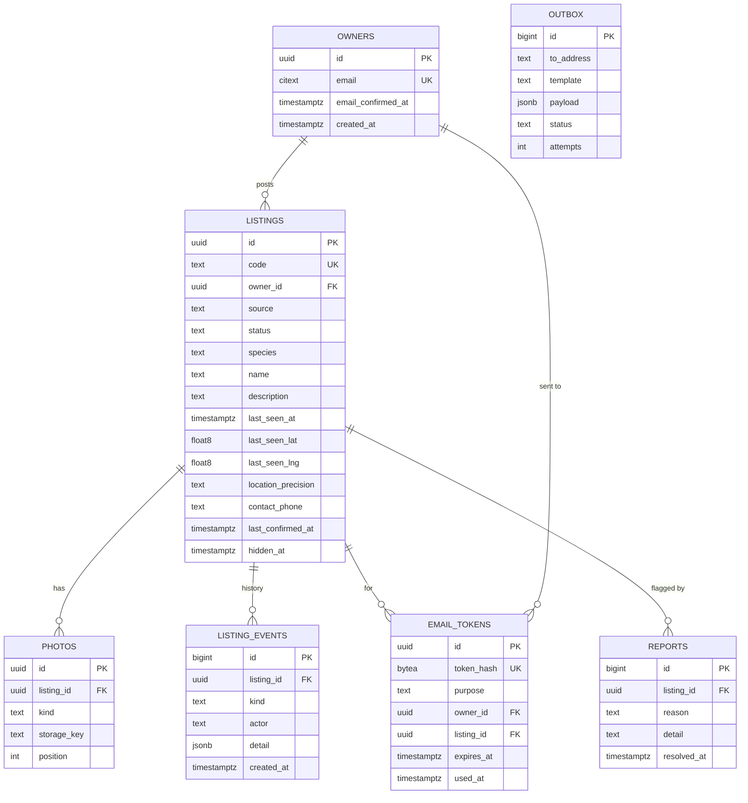
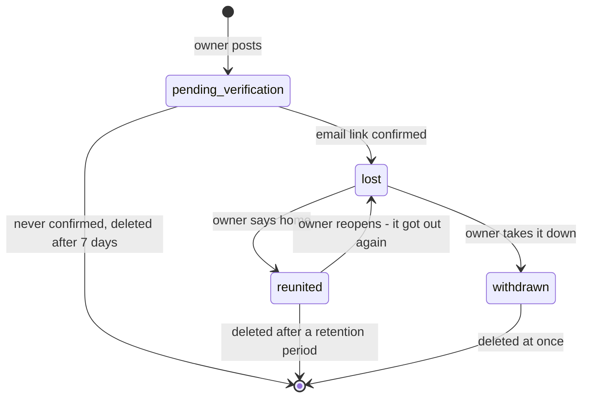

# roamer - Data model

PostgreSQL. Seven tables in the first version, two more planned for the later stages. The
shape matters more than the exact columns, and nothing here exists yet.

## `owners`

An email address that has posted a listing. That is the whole of an owner.

| Column | Type | Notes |
| --- | --- | --- |
| `id` | uuid | Primary key |
| `email` | citext | Unique. Case-insensitive, because `Sam@Example.com` and `sam@example.com` are one person |
| `email_confirmed_at` | timestamptz | Null until the first verify link is used. Set once |
| `created_at` | timestamptz | |

No name, no password, no phone. The phone belongs to the listing, because it is what is
printed on the flyer, and one owner can lose two animals with a different person to call
for each.

## `listings`

| Column | Type | Notes |
| --- | --- | --- |
| `id` | uuid | Primary key |
| `code` | text | Unique, short, unambiguous characters only. Used in `/l/{code}` and the flyer's QR code |
| `owner_id` | uuid | References `owners`. Null only for an unclaimed import (later) |
| `source` | text | `owner` or `import` (later) |
| `status` | text | See the status flow below |
| `species` | text | `dog`, `cat`, `other` |
| `name` | text | The animal's name. Optional - a found animal has none |
| `sex` | text | `male`, `female`, `unknown` |
| `breed` | text | Free text. People do not agree on breeds and a list would be wrong for half of them |
| `colours` | text | Free text |
| `size` | text | `small`, `medium`, `large` |
| `age_text` | text | Free text. "About 3", "puppy", "old" |
| `description` | text | Anything else: collar, marks, temperament |
| `approach_advice` | text | "Do not chase, she runs" - what a finder should do. Lost dogs often flee from strangers and this is often the most useful line on a flyer |
| `last_seen_at` | timestamptz | When |
| `last_seen_lat`, `last_seen_lng` | float8 | Where. The point the owner chose |
| `location_precision` | text | `exact` or `approximate`. Approximate is shown as a circle, and the query point is the circle's centre |
| `area_label` | text | "Near Elm Park". Filled from the geocoder or typed by the owner |
| `contact_name` | text | Who to ask for |
| `contact_phone` | text | Shown on the listing unless `show_phone` is false |
| `show_phone` | boolean | Default true |
| `last_confirmed_at` | timestamptz | Set at verification, and by every check-in answer and every owner edit |
| `hidden_at`, `hidden_reason` | timestamptz, text | Moderation. Separate from `status` on purpose - see below |
| `created_at`, `updated_at` | timestamptz | |

Index: GiST on `ll_to_earth(last_seen_lat, last_seen_lng)`, partial on `status = 'lost'
and hidden_at is null`. The map and the finder search only ever look at active listings, so
the index holds only those.

No reward column. See [00-plan.md](00-plan.md).

### Status flow

`stale` is not a status. Whether a listing has gone quiet is worked out from
`last_confirmed_at` when it is read, the same way the verified badge is. Storing it would
need a job to move it there and another to move it back when the owner answers, and two
jobs that have to agree is two ways to be wrong.

`hidden_at` is not a status either. A moderator hiding a listing is a different fact from
an owner's dog coming home, and a listing hidden by mistake must come back in exactly the
state it was in.

`withdrawn` means delete. The owner asked for it to be gone, so the row, its photos and its
events are removed, and only the moderation record survives if there was one.

## `photos`

| Column | Type | Notes |
| --- | --- | --- |
| `id` | uuid | Primary key |
| `listing_id` | uuid | References `listings`, cascade delete |
| `kind` | text | `photo` or `flyer` - a picture of the animal, or the owner's own printed flyer |
| `storage_key` | text | Base key. Sizes are derived from it |
| `width`, `height` | int | Of the display size |
| `position` | int | Order on the listing. The first photo is the pin's popup and the flyer's main image |
| `created_at` | timestamptz | |

The file itself is on the image volume. Its metadata was stripped before it was written,
and the original upload was never kept.

## `listing_events`

Append-only history of a listing. Never updated.

| Column | Type | Notes |
| --- | --- | --- |
| `id` | bigint | Primary key |
| `listing_id` | uuid | References `listings`, cascade delete |
| `kind` | text | `created`, `verified`, `edited`, `confirmed`, `reunited`, `reopened`, `hidden`, `unhidden`, `claimed` (later) |
| `actor` | text | `owner`, `moderator`, `system` |
| `detail` | jsonb | What changed. For `edited`, the field names - not the old values, which may be the very thing the owner wanted gone |
| `created_at` | timestamptz | |

This is what lets the listing page say "posted 9 days ago, confirmed still lost 2 days ago",
and what makes "why did this listing disappear" answerable.

## `email_tokens`

| Column | Type | Notes |
| --- | --- | --- |
| `id` | uuid | Primary key |
| `token_hash` | bytea | SHA-256 of the token. Unique. The token itself is never stored |
| `purpose` | text | `verify`, `manage`, `checkin` |
| `owner_id` | uuid | References `owners` |
| `listing_id` | uuid | References `listings`. Null for a manage link that covers all of an owner's listings |
| `expires_at` | timestamptz | |
| `used_at` | timestamptz | Single use. A second use is refused and offers a new link |
| `created_at` | timestamptz | |

## `outbox`

Email waiting to be sent, and the record of what was.

| Column | Type | Notes |
| --- | --- | --- |
| `id` | bigint | Primary key |
| `to_address` | citext | |
| `template` | text | `verify`, `manage`, `checkin`, `report_received` |
| `payload` | jsonb | What the template needs. The raw token is in here until sent, then removed |
| `status` | text | `queued`, `sent`, `failed` |
| `attempts` | int | |
| `last_error` | text | |
| `created_at`, `sent_at` | timestamptz | |

Written in the same transaction as the change that caused it. Sent rows are cleared after a
retention period.

## `reports`

| Column | Type | Notes |
| --- | --- | --- |
| `id` | bigint | Primary key |
| `listing_id` | uuid | References `listings` |
| `reason` | text | `scam`, `not_lost`, `wrong_details`, `abusive`, `other` |
| `detail` | text | Free text from the reporter |
| `reporter_hash` | bytea | Salted hash of the IP address. For rate limiting, never shown |
| `created_at` | timestamptz | |
| `resolved_at`, `resolution` | timestamptz, text | `hidden` or `dismissed`, set by the moderator |

## Later: `imported_posts`

When post import is built. A post copied in by an importer is a **claim**, kept apart from
the listing it produces, the way mailman keeps a model's extraction apart from the accepted
invoice.

| Column | Type | Notes |
| --- | --- | --- |
| `id` | uuid | |
| `source_url` | text | Link to the original post |
| `source_site` | text | |
| `raw_text` | text | Exactly what was pasted |
| `extracted` | jsonb | What the extractor made of it |
| `extractor`, `extractor_version` | text | Which extractor, so a harness can compare them |
| `listing_id` | uuid | The unclaimed listing it produced, if any |
| `created_at` | timestamptz | |

## Later: `sightings`

| Column | Type | Notes |
| --- | --- | --- |
| `id` | bigint | |
| `listing_id` | uuid | |
| `seen_at` | timestamptz | |
| `lat`, `lng` | float8 | |
| `note` | text | |
| `status` | text | `pending`, `accepted`, `dismissed`. Shown only after the owner accepts it |
| `created_at` | timestamptz | |

## What is deliberately not stored

- Passwords. There are none.
- An owner's email anywhere it could be read by a page.
- The original uploaded image, or any of its metadata.
- Raw IP addresses.
- A `verified` or `stale` flag. Both are computed from timestamps when read.
- Reward amounts, payment details, or anything shaped like money.
- The token in any email link, except in the outbox until the message is sent.
