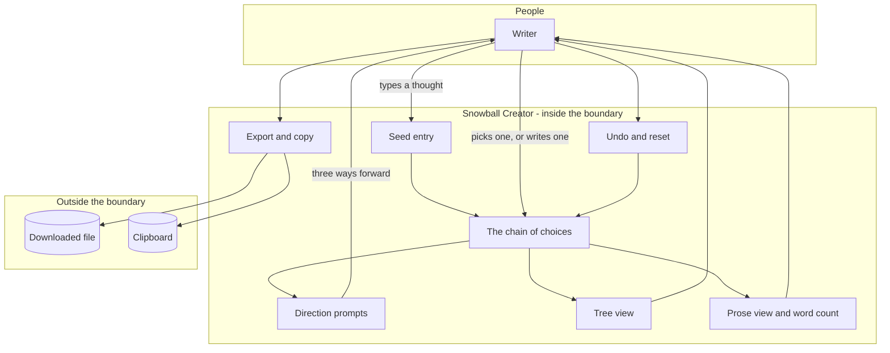

# Snowball Creator - Interaction and system boundary

## Actors

| Actor | Type | What they want |
| --- | --- | --- |
| Writer | Human | A next move, repeatedly, until there is enough material to work with |
| File system | External | Receives the exported text file |
| Clipboard | External | Receives the copied text |

One actor, one session, one browser tab. There is nothing else on the diagram because
there is nothing else.

## Interaction diagram

The loop in the middle is the app. Choice extends the chain, the chain triggers the next
set of directions, and the writer chooses again.

## What the system is in the business of

- Removing the blank page by always offering a next move.
- Making the shape of a train of thought visible while it is being had.
- Turning a list of choices into something that reads as prose rather than as a list.
- Being instant. Every interaction is local and immediate, because a pause is where the
  writer goes and does something else.
- Letting the writer leave with their work, in a plain format, in one action.

## What the system does not care about

- Generating content. It offers the shape of a move, never the substance of one.
- Understanding what the writer wrote. The prompts do not read the text and never have.
- Keeping anything. There is no persistence and none is planned in the current design.
- Formatting, styling or publishing. The output is plain text.
- Multiple branches. The tree is a picture of one path, not an editable structure.
- Anyone other than the writer. No accounts, no sharing, no collaboration.
- Anything about the writer at all. Nothing typed here leaves the page.

## Main use cases

| ID | Actor | Goal | Trigger | Result |
| --- | --- | --- | --- | --- |
| UC-1 | Writer | Begin | Type a seed and start | The seed becomes the first link, and directions are offered |
| UC-2 | Writer | Take an offered direction | Select one of the options | The chain extends, the tree grows a level, the prose lengthens |
| UC-3 | Writer | Go somewhere the options do not offer | Use the custom option | The typed text extends the chain the same way |
| UC-4 | Writer | Undo a bad move | Undo | The last link is removed and the previous state returns |
| UC-5 | Writer | Start again | Reset | Everything is cleared back to a blank seed |
| UC-6 | Writer | Judge how much they have | Watch the word count | A running count alongside the prose |
| UC-7 | Writer | Keep the result | Export | A text file is downloaded |
| UC-8 | Writer | Move the result elsewhere | Copy | The prose is on the clipboard |
| UC-9 | Writer | Work without the mouse | Keyboard shortcuts | Undo, reset, export, copy and option selection are all reachable |

## Constraints that come from the actors

- Nothing may block. A writer interrupted mid-thought loses the thought.
- The custom option must always be available. A fixed prompt list will fail to fit, often,
  and the app must not be a dead end when it does.
- Undo must be immediate and must not ask for confirmation.
- Reset destroys unexported work and should say so before doing it.
- The exported format must be plain text, because the next thing the writer does with it is
  paste it into something else.
