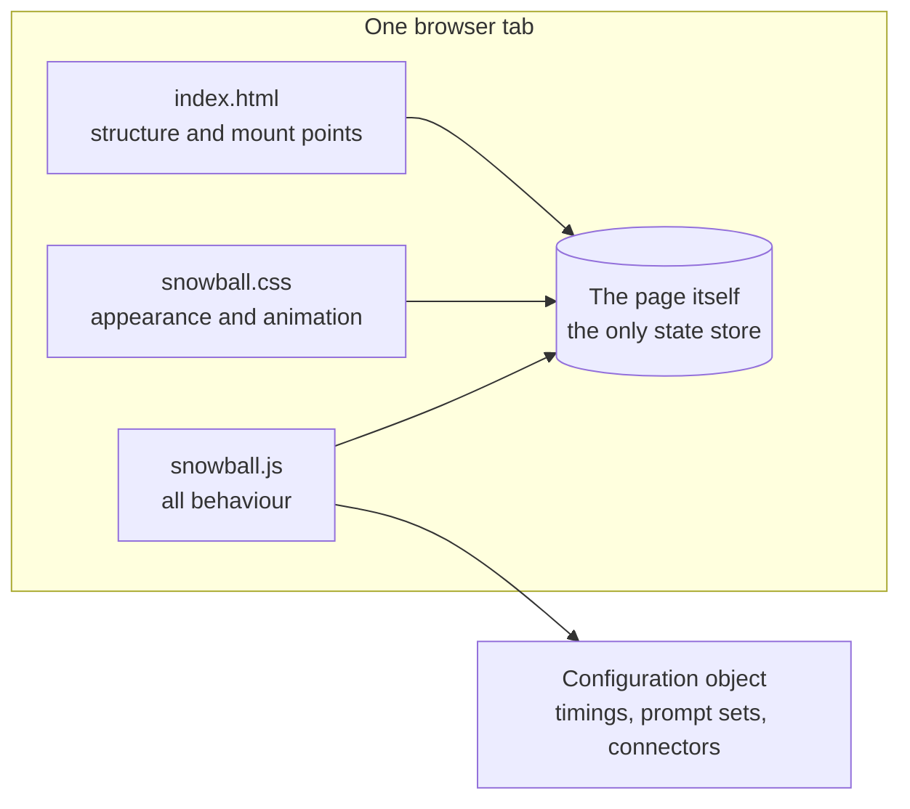
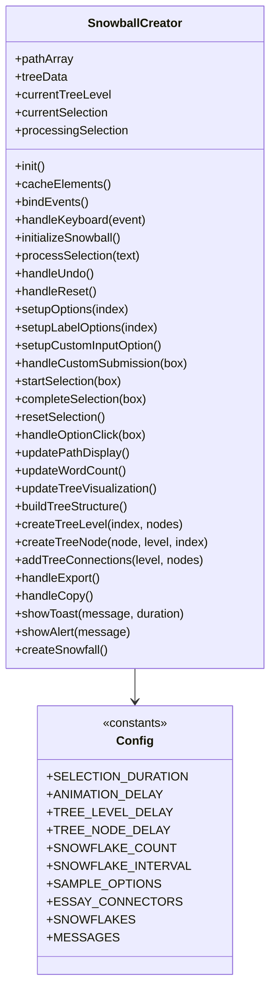
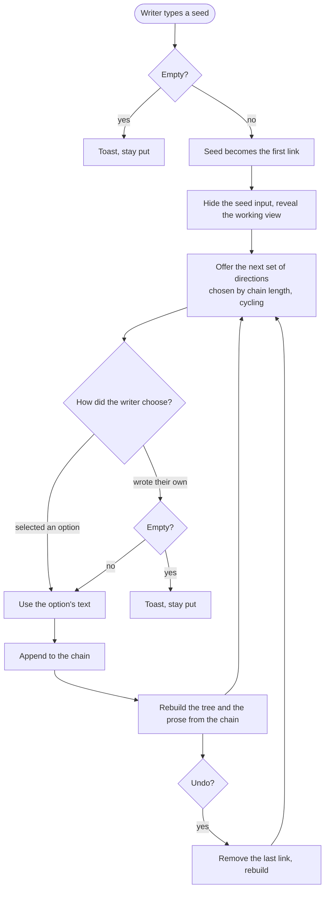
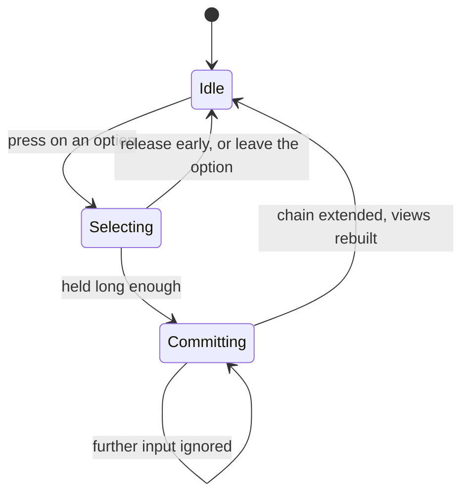
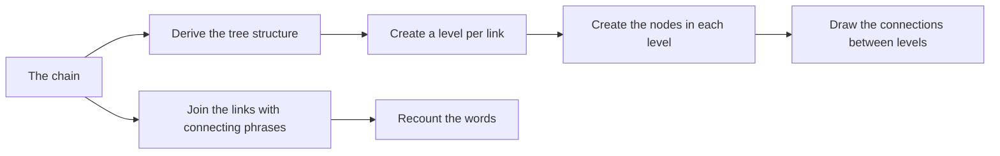

# Snowball Creator - Architecture

Internal document.

## Components

One page, three files, no server, no build step, no network call at runtime.

| Component | Responsibility |
| --- | --- |
| Structure file | The mount points the behaviour writes into |
| Style file | Everything visual, including all animation. No animation is driven from code |
| Behaviour file | One class holding all state and all interaction |
| Configuration object | Every timing, the prompt sets, the connecting phrases, the toast messages |

The split is by kind rather than by feature, which is right at this size. Everything that
can be tuned without touching logic lives in the configuration object at the top of the
behaviour file, which is also where the prompt sets and connecting phrases are.

## State

The application holds four things and nothing else:

| State | Meaning |
| --- | --- |
| The chain | The ordered list of choices made so far. This is the document |
| Tree data | The derived structure the tree view is drawn from |
| Current level | Which level of the tree is being drawn |
| Selection state | Which option is being held, and whether a selection is already being processed |

The chain is the only state that matters. The tree view and the prose view are both
functions of it, recomputed whenever it changes, which is why undo is a single operation
on a list rather than an unwinding of two separate displays.

There is no persistence. Nothing is written to browser storage and nothing is sent
anywhere. Closing the tab discards the chain.

## Class diagram

One class. At this size that is the right call, and the method groups above are the seams
along which it would split if it ever needed to: input handling, chain management, option
presentation, selection mechanics, rendering, and output.

The class caches its element references once at startup rather than looking them up on
every render. The render path runs on every choice, so the lookups would be repeated
constantly for no reason.

## The main loop

Which set of directions is offered is a function of how far along the chain is. The sets
cycle, so a long chain sees them again. Nothing about the offer depends on what the writer
has actually written, and no part of the code inspects the text.

## Selection mechanics

Options are not a plain click. A selection is begun on press and completed after it has
been held; releasing early cancels it.

The processing flag exists because the commit is not instantaneous and a second input
arriving during it would extend the chain twice from one intention.

Keyboard selection bypasses the hold entirely. The number keys commit immediately, which
is the right behaviour for a keyboard and would be wrong for a pointer.

## Rendering

Both views are rebuilt from the chain rather than mutated in place.

Nodes are revealed with a staggered delay per level and per node, so a rebuilt tree appears
to grow rather than to blink into existence. The delays are configuration values, and the
animation itself is defined in the style file. No animation is driven from code.

## Rules this architecture is meant to protect

- The chain is the single source of truth. Every view is derived from it and nothing is
  updated independently.
- No animation is driven from code. If something moves, it moves in the style file.
- Every timing, prompt set, connecting phrase and message lives in the configuration
  object, not scattered through the logic.
- Element references are cached once. The render path must not perform lookups.
- The custom option is always available. The prompt sets are general and will not always
  fit.
- No network call, no storage, no build step. The page runs from a file.
- Nothing the writer types is inspected, stored, or sent anywhere.
