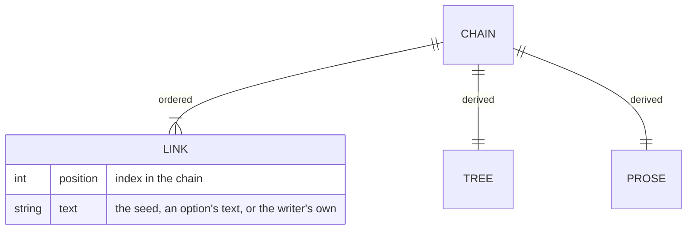

# Snowball Creator - Data model

## Store

There is none. This is the honest answer and it is worth stating clearly rather than
leaving as an omission.

Nothing is written to browser storage, no cookie is set, no file is read, and no request is
made. All state lives in memory for the lifetime of the page. Closing the tab, refreshing,
or navigating away destroys the work.

The only way anything survives is the writer exporting or copying it, and that is a
deliberate action they have to remember to take.

| Data | Where it lives | Lifetime |
| --- | --- | --- |
| The chain of choices | In memory | Until the page is closed or reset |
| Derived tree structure | In memory | Rebuilt on every change |
| Derived prose and word count | In memory | Rebuilt on every change |
| Prompt sets and connecting phrases | Constants in the source | Fixed |
| Exported text | A file the writer downloaded | Theirs |

## The chain

The document. An ordered list, where the first entry is the seed the writer typed and each
later entry is either the text of an option they selected or text they wrote themselves.

There is no record of which links were chosen from the offered options and which were
typed. Once a link is in the chain the two are indistinguishable, and nothing downstream
needs to tell them apart.

## Derived views

Neither is stored. Both are recomputed from the chain whenever it changes.

### Tree

One level per link, with the nodes in each level and the connections drawn between them.
It is a picture of a single path. The tree shape suggests branching, and there is none: at
no point can the writer return to an earlier link and take a different fork while keeping
both. The visual metaphor is ahead of the data.

### Prose

The links joined by connecting phrases drawn from a fixed list, with a running word count.
The connectors are chosen to vary the rhythm; they carry no meaning and are not related to
the content on either side of them.

## Fixed content in the source

| Constant | Contents | Notes |
| --- | --- | --- |
| Prompt sets | Several sets of three general directions | Cycled by chain position. Nothing about the choice depends on what the writer wrote |
| Connecting phrases | A list of joining clauses | Used to stitch the chain into prose |
| Timings | Selection hold duration, animation and stagger delays | All in one place, tunable without touching logic |
| Messages | The text shown when input is empty | |
| Decorative glyphs | The characters used in the background effect | |

## Export format

Plain text. No structure, no metadata, no way to read it back in. It is the prose as
displayed, written to a file.

Plain text is right for what happens next, which is pasting into something else. It is
wrong if the writer ever wants to resume a chain, and that trade is recorded in the plan.

## Constraints worth stating

- The chain is append-only apart from undo, which removes the last link.
- Reset empties the chain, and there is no recovery.
- Nothing validates the content of a link beyond rejecting an empty one.
- The word count is over the rendered prose, including the connecting phrases, so it is
  slightly higher than the writer's own word count.

## What is deliberately not stored

- Anything about the writer.
- Anything at all after the tab closes.
- Which links were chosen from options and which were typed.
- Any history of resets, undos, or abandoned chains.
