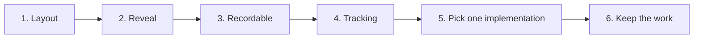

# Breakdown Takes - Build plan

## Objective

A backing visual for narrated story videos: describe a story as connected beats, and get a
tree that lays itself out and reveals itself at a pace you can talk over.

Done, for version one, when a full take can be recorded without touching anything the
recorder would capture, and without a retake caused by the tool.

## Order of work

| Stage | Goal | Done when | Status |
| --- | --- | --- | --- |
| 1 | Structure becomes a picture | Beats laid out automatically from their parent links, coloured by role, with a legend, and nothing positioned by hand | Done |
| 2 | Reveal in time | Beats appear one at a time at a chosen pace, with play, pause, step and reset | Done |
| 3 | Recordable | The controls stay out of the recording, a malformed story is rejected before anything is drawn, and going back to the editor keeps the story | Done |
| 4 | A record of what was made | A tracking row appended to a spreadsheet, with a download fallback | Done |
| 5 | One implementation, not two | Only one version of the app remains | **Not done. This is the current work** |
| 6 | Stop losing stories | Closing the tab does not destroy the description | Not started |

### Stage 5 in detail

There are two versions of this app: a self-contained page in plain JavaScript, and the same
app as a React component. The plain page is the one that gets used, and it is the only one
with the tracking export. They have already drifted.

Two implementations of one app is a cost with no benefit. A fix to one does not reach the
other, nothing signals the divergence, and a reader has to work out which is live before
changing anything.

The plain page should survive. It runs from a file with nothing installed, which is the
standing constraint across this repository, and the React version has no host here to run
in. Either delete the component, or move it somewhere it is clearly marked as an
alternative rather than a sibling.

## Decisions already made

| Decision | Reason |
| --- | --- |
| The layout is computed, never dragged | The picture should be a consequence of the story's structure. If it were positioned by hand it would be an illustration, not a diagram |
| Positions are percentages, not pixels | The same layout works at any board size and survives a resize |
| Vertical position is depth in the parent chain | Makes the vertical axis the passage of the story, which is what the narrator is walking through |
| Six fixed roles | A story grammar. A beat that fits none of them is usually two beats |
| Role colours defined once | They drive both the nodes and the legend, and they must agree |
| Reveal is a visible count, not a queue of animations | Step, reset and reveal-all become one number with different values, rather than three code paths |
| Validation runs before anything is drawn | A half-drawn tree in a recording wastes the take |
| The controls hide themselves during playback | Otherwise they are in the video |
| Going back to the editor preserves the description | Recording is iterative; the story gets edited between takes |
| The tool does not record | Screen recorders exist and are better at it. This tool is the thing on screen |
| A worked example loads on open | The story format has to be learned, and reading one is faster than reading a description of one |
| No server, no build step, no network call | The standing constraint across this repository |

## Open questions

| Question | Blocks | Notes |
| --- | --- | --- |
| Delete the React version, or keep it somewhere marked? | Stage 5 | Keeping two live implementations is the thing to stop, either way |
| Should stories survive a closed tab? | Stage 6 | They do not today. Browser storage would fix it without a server |
| Is the tracking file an archive or a log? | Stage 6 | It already contains every story in full, because the description is one of its columns. Either treat it as the archive or take that column out |
| Should the pace be per beat rather than global? | Later | A long beat needs longer than a short one, and a single pace makes the narrator rush or wait |
| Should validation be stricter? | Stage 6 | Cycles and missing parents are structural rules the layout depends on. Confirm each one is actually caught rather than assumed |

## Risks

| Risk | Effect if it happens | Response |
| --- | --- | --- |
| A fix lands in one implementation only | The two versions drift further and the wrong one gets edited next time | Stage 5 |
| A story is lost by closing the tab | Rewriting a described story is slow and annoying | Stage 6 |
| A malformed story draws partially | A wasted take, discovered during editing | Validation runs first. Confirm it covers cycles and missing parents |
| Controls appear in a recording | The take is unusable | They auto-hide. Confirm on every path into playback |
| One pace for every beat | The narrator rushes the long ones or waits through the short ones | Per-beat pacing, if it proves to matter in practice |
| The tracking file is treated as a backup it was not designed to be | A lost story is assumed recoverable when nothing guarantees it | Decide what the file is for and say so |
