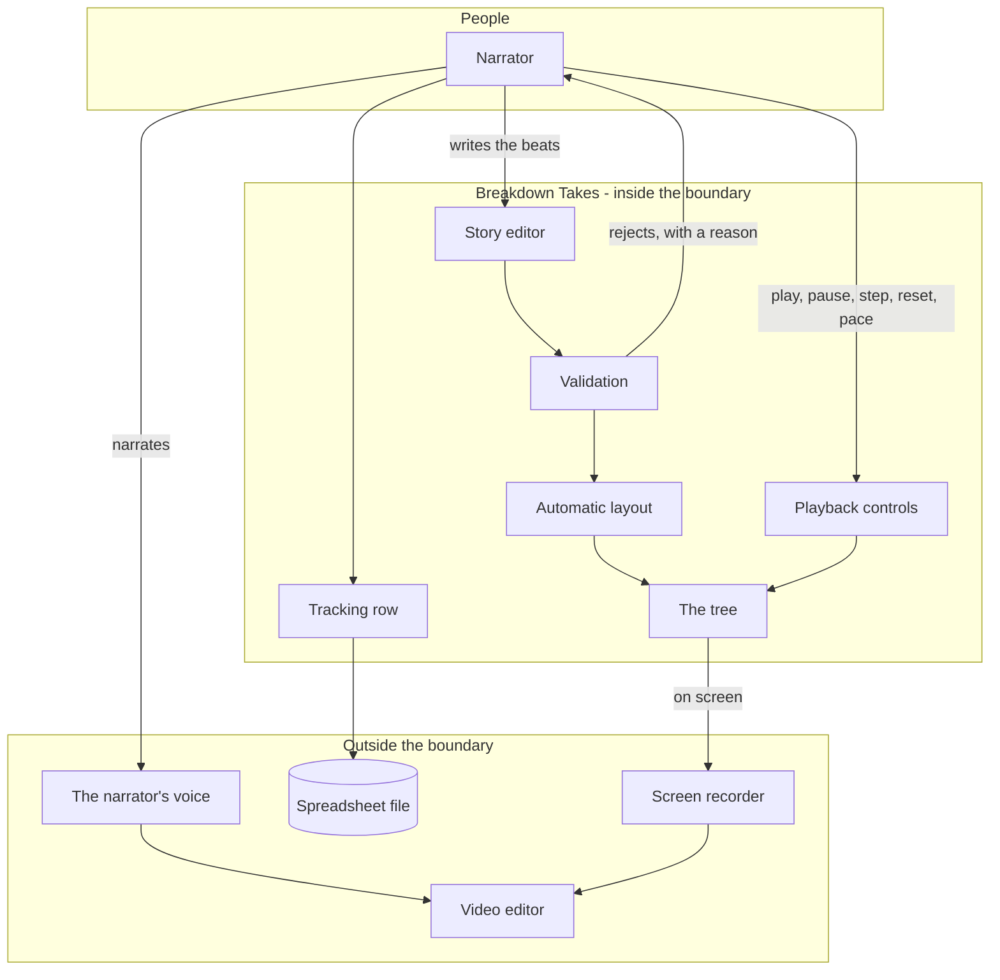

# Breakdown Takes - Interaction and system boundary

## Actors

| Actor | Type | What they want |
| --- | --- | --- |
| Narrator | Human | A visual that keeps pace with what they are saying, and does not need editing afterwards |
| Screen recorder | External system | Captures the page. Knows nothing about this tool and is not controlled by it |
| Video editor | External system | Where the recording ends up. Also outside |
| Spreadsheet file | External | Receives one row per story produced |

## Interaction diagram

Note that the recorder is outside the boundary and there is no arrow from the tool to it.
The tool does not start, stop, or know about recording. It is a thing that looks right when
something else points a camera at it.

## What the system is in the business of

- Turning a described structure into a picture, automatically, with no manual positioning.
- Revealing that picture at a pace a person can talk over.
- Giving the narrator control while they are talking: pause, step, reset, without touching
  the story.
- Refusing a malformed story before drawing anything, and saying what is wrong with it.
- Looking finished on screen, because the screen is the product.

## What the system does not care about

- Story content. It never generates, suggests, or judges a word of it.
- Recording, audio, subtitles, or rendering a video. Those belong to other tools that are
  better at them.
- Where stories come from. Nothing is fetched, scraped or linked.
- Manual layout. Dragging beats around would mean the layout is not derived from the
  structure, and the layout being derived from the structure is the feature.
- Persisting stories. Only the tracking row leaves the page.
- Publishing, uploading or scheduling anything.
- Anyone other than the narrator. One person, one tab.

## Main use cases

| ID | Actor | Goal | Trigger | Result |
| --- | --- | --- | --- | --- |
| UC-1 | Narrator | Start from something working | Open the page | A complete worked example is already loaded |
| UC-2 | Narrator | Turn a story into a tree | Generate | Beats laid out automatically from how they connect, coloured by role, with a legend |
| UC-3 | Narrator | Find out what is wrong with their story | Generate a malformed one | An explanation, and nothing drawn |
| UC-4 | Narrator | Check the layout before recording | Reveal everything at once | The full tree, no animation |
| UC-5 | Narrator | Set the pace | Choose a speed | Beats appear at that interval during playback |
| UC-6 | Narrator | Record a take | Reset, start the recorder, play | Beats appear one at a time while they narrate |
| UC-7 | Narrator | Recover mid-take | Pause or step | The reveal stops or advances one beat, under their control |
| UC-8 | Narrator | Fix the story | Go back to the editor | The description is still there, editable |
| UC-9 | Narrator | Keep a record | Save a tracking row | A row appended to their spreadsheet, or downloaded if appending is unavailable |

## Constraints that come from the actors

- The controls must not appear in the recording, or they are in the video. They hide
  themselves.
- Playback must be steady. An uneven reveal is unusable as a backing visual, because the
  narration is timed against it.
- Validation must fail before anything is drawn. A half-drawn tree in a recording means the
  take is wasted.
- The pace has to be settable, because narration speed varies by person and by story.
- Going back to the editor must not lose the story. Recording is iterative and the story
  gets edited between takes.
