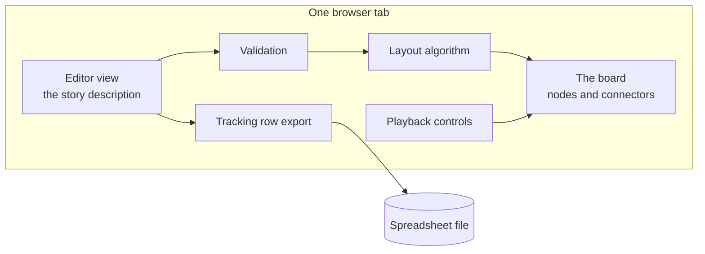
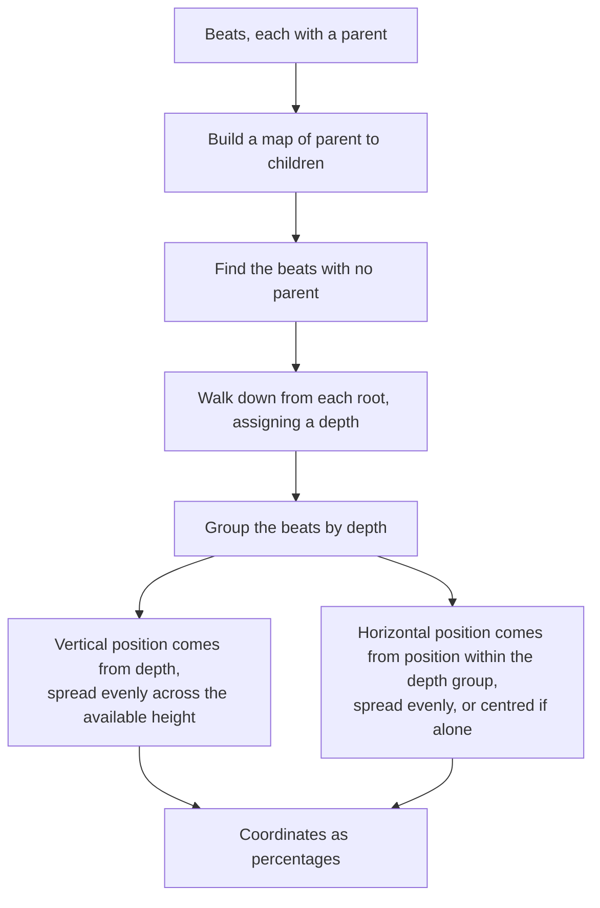
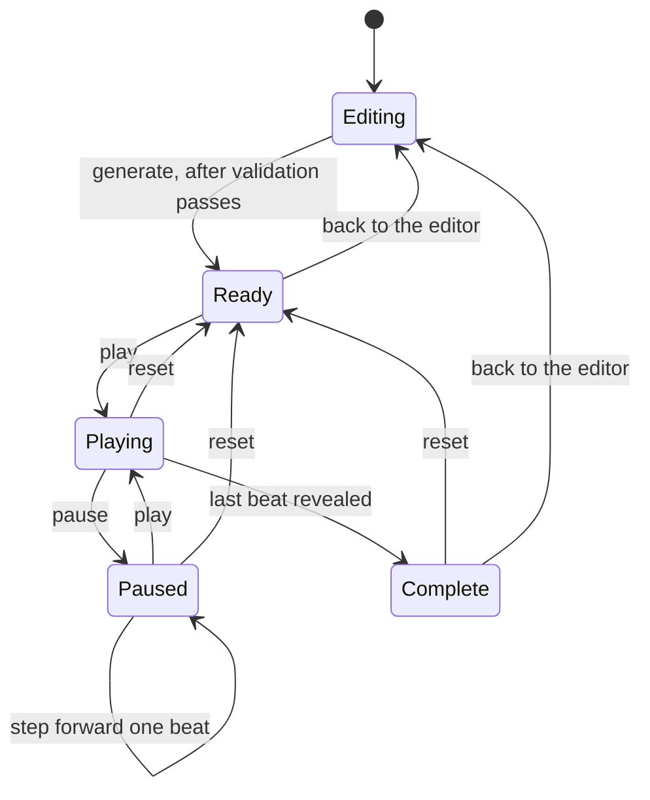
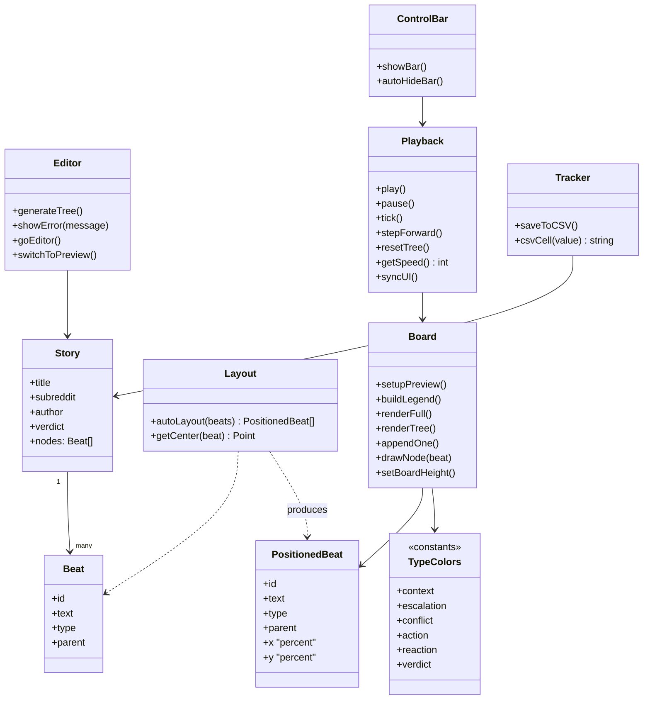
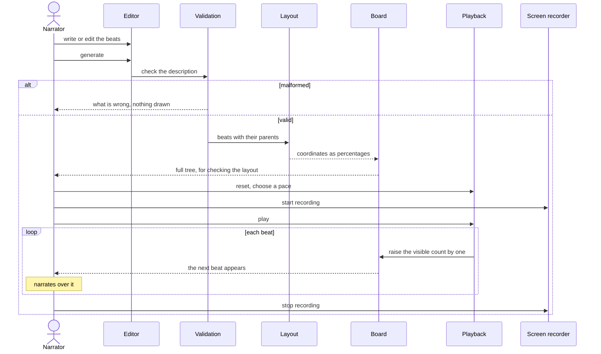

# Breakdown Takes - Architecture

Internal document.

## Two implementations

There are two versions of this app in the folder, and knowing which is which matters before
editing either.

| File | What it is | Status |
| --- | --- | --- |
| `breakdown-takes.html` | A single self-contained page in plain JavaScript. Opens from the file system, no build step, no dependencies | The working version. This is what gets used |
| `breakdown-takes-generator.jsx` | The same app as a React component | A parallel implementation. Needs a React host, which the repository does not provide |

They share the layout algorithm, the role colours and the worked example, and they have
drifted apart in the details. The plain page has the tracking-row export; the component
does not.

Two implementations of one app is a maintenance cost with no benefit. A fix applied to one
does not reach the other, and nothing signals the divergence. The plan lists choosing one
as an open item, with the plain page the obvious survivor since it satisfies the repository's
standing constraint of running from a file with nothing installed.

The rest of this document describes the plain page.

## Components

The app has exactly two views and moves between them explicitly. The editor holds the
description; the board holds the drawing. Going back to the editor preserves the
description, because recording is iterative and the story gets edited between takes.

## The layout algorithm

The only interesting logic in the app. It turns a list of beats and their parent links into
coordinates, with nothing positioned by hand.

Positions are percentages rather than pixels, so the same layout works at any board size
and the drawing survives a window resize without being recomputed from the story.

The consequences worth knowing:

- Depth is derived from the parent chain, so the vertical axis is the passage of the story.
- Beats that share a depth sit side by side, so a branch reads as two things happening at
  once.
- A beat pointing at a parent that does not exist is never reached by the walk and will not
  be laid out. This is why validation runs first.

## Reveal and playback

The board draws a prefix of the beats: everything up to a visible count. Playback advances
that count on a timer.

Reveal being a count rather than a queue of animations is what makes step, reset and reveal-all
trivial: each is just a different value for one number, and the board is redrawn from it.

The control bar hides itself while playback runs. If it did not, it would be in the
recording, and the recording is the product.

## Class diagram

The plain page is functions over shared state rather than classes. The diagram describes
the structure as it is, grouped by responsibility, so the seams are visible.

## Key sequence - recording a take

## Rules this architecture is meant to protect

- Nothing is positioned by hand. If a layout looks wrong, the algorithm is wrong or the
  story structure is wrong.
- Validation runs before anything is drawn. A half-drawn tree wastes a take.
- Positions are percentages. Resizing must not require recomputing the layout from the
  story.
- The visible count is the only playback state. Step, reset and reveal-all are values for
  one number, not separate code paths.
- Controls hide themselves during playback, because they would otherwise be in the video.
- Going back to the editor preserves the description.
- Role colours are defined once and drive both the nodes and the legend.
- The page runs from a file with no build step and no network call.
