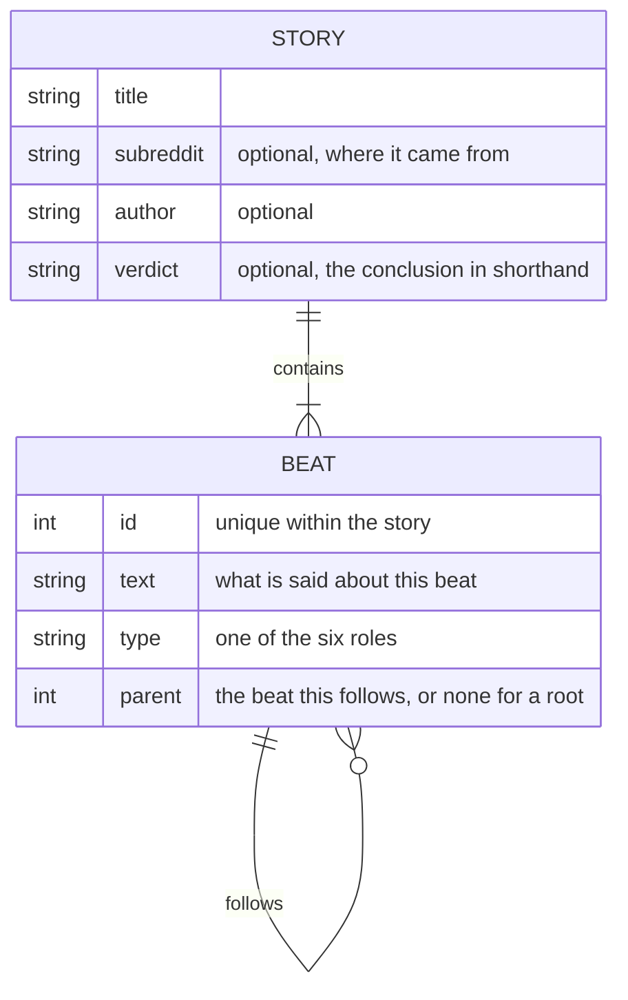

# Breakdown Takes - Data model

## Store

There is no database and no browser storage. The story lives in the editor for as long as
the tab is open, and the only thing that leaves the page is one tracking row per story.

| Data | Where it lives | Lifetime |
| --- | --- | --- |
| The story description | The editor field | Until the tab is closed |
| Positioned beats | In memory | Recomputed whenever the story is generated |
| Visible count | In memory | Playback state, reset freely |
| Tracking rows | A spreadsheet file the narrator picked | Theirs |
| The recording | Wherever the screen recorder put it | Outside this system entirely |

Closing the tab loses the story. The tracking row happens to contain the full description,
which makes it an accidental archive rather than a designed one; that is noted in the plan.

## The story

A single document supplied by the narrator, describing one story.

### Story fields

| Field | Required | Notes |
| --- | --- | --- |
| `title` | Yes | Shown above the tree |
| `subreddit` | No | Where the story came from |
| `author` | No | Who told it |
| `verdict` | No | The conclusion in shorthand, shown as a header rather than as a beat |
| `nodes` | Yes | The beats |

### Beat fields

| Field | Required | Notes |
| --- | --- | --- |
| `id` | Yes | Unique within the story. Referenced by other beats as their parent |
| `text` | Yes | One or two sentences. This is what the narrator talks over |
| `type` | Yes | One of the six roles, which sets the colour |
| `parent` | Yes | The identifier of the beat this follows, or none for a root |

### The six roles

| Role | Marks |
| --- | --- |
| `context` | The setup |
| `escalation` | Stakes rise |
| `conflict` | The disagreement itself |
| `action` | Someone does something |
| `reaction` | How the others responded |
| `verdict` | The conclusion |

Each role has one colour, defined once and used for both the node and the legend entry.

### Structural rules

These are properties the layout depends on, and a story that breaks them cannot be drawn:

- Every identifier is unique within the story.
- Every parent reference points at a beat that exists. A beat pointing at a missing parent
  is never reached by the layout walk and simply does not appear.
- At least one beat has no parent. With no root, nothing is drawn at all.
- The parent links form a tree. A cycle sends the depth walk round forever.

Validation exists to catch these before anything is drawn, because a half-drawn tree in a
recording wastes the take.

## Positioned beats

Produced by the layout, held in memory, never stored. Each is a beat with two extra values:

| Field | Meaning |
| --- | --- |
| `x` | Horizontal position as a percentage of board width |
| `y` | Vertical position as a percentage of board height |

Percentages rather than pixels, so the same layout works at any board size and survives a
resize.

## Tracking row

One row per story, appended to a spreadsheet file the narrator chooses. Where the browser
cannot write to a picked file, the row downloads on its own instead.

| Column | Contents |
| --- | --- |
| Date | When the row was written |
| Title | The story title |
| Source | Where it came from |
| Author | Who told it |
| Verdict | The conclusion in shorthand |
| Beat count | How many beats the story had |
| Notes | Left empty, for the narrator to fill in |
| Description | The full story description as supplied |

The last column means the tracking file holds every story ever produced, in full. That is
useful and it is not what the column was for. Either the file is the archive, in which case
it should be treated as one, or it is a log, in which case the description does not belong
in it. The plan carries this as an open question.

## What is deliberately not stored

- Stories, between sessions. There is no save and no load.
- Anything about the narrator.
- Any recording, audio, or rendered video. Those belong to other tools.
- Any content fetched from anywhere. Nothing is scraped or linked.
