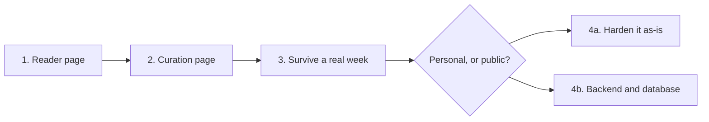

# tektak - Build plan

## Objective

A text-only drama digest that a curator can keep current in ten to fifteen minutes a day
and a reader can finish. Version one is done: two pages, no server, no cost.

What remains is deciding whether it stays a personal tool or becomes something other people
read, because those two futures need different things and almost nothing in common.

## Order of work

| Stage | Goal | Done when | Status |
| --- | --- | --- | --- |
| 1 | Something worth reading | Stories, hashtags and sources render, and the page looks published before anything is curated | Done |
| 2 | Something worth curating with | Forms for all three content types, a review list, delete, and clear everything | Done |
| 3 | Survive a real week of use | Curated daily for a week without the workflow being annoying enough to abandon | Not confirmed |
| 4a | Harden the personal version | Backup that is not copying values out of the browser by hand, timestamps, and the duplication between the two pages reduced | Not started |
| 4b | Make it publishable | A backend, a database, real access control on curation | Not started, and not started on purpose |

### The fork at stage 4

Everything unresolved about this app comes down to one question: is this read by one person
or by other people?

**If it stays personal**, the current architecture is correct and the work is small:
backup, timestamps, and removing the duplication between the two pages. No server, no cost,
no accounts.

**If other people read it**, the current architecture fails on four counts at once. The
content lives in one browser, so nobody else can see it. Curation has no access control, so
anyone who finds the page can rewrite the site. There is no backup, so one cleared browser
loses everything. And a single curator on a single machine is the whole publishing
pipeline.

Those four are not four bugs. They are one consequence of the free-static constraint, and
the only fix is to drop the constraint. This decision should be made before any more work
goes into the current version, because half of stage 4a is wasted if the answer is 4b.

## Decisions already made

| Decision | Reason |
| --- | --- |
| Text only, no video | It is the entire product. A video embed makes it the thing it was built to avoid |
| Manual curation, nothing automated | No API access, no cost, and a person writing two sentences is better than a summary of a summary |
| Two static files, no server | Free to host and instantly deployable, which is the standing constraint across this repository |
| Local storage as the only store | Follows from having no server |
| Sample content embedded in the reader page | A curation-driven site with nothing curated looks broken. It should look published on the first visit |
| The fallback is per section, not global | Simpler to implement. It does mean real stories can appear beside sample hashtags |
| Engagement figures stored as typed text | They are estimates, they are shorthand, and nothing sorts or sums them |
| A fixed category list | A story that fits none of them is a story this site is not about |
| Curation lives on a separate page that is never linked | The only access control available without a server |
| The site is finite | No infinite scroll, no recommendations, no notifications. Finishing is a feature |

## Open questions

| Question | Blocks | Notes |
| --- | --- | --- |
| Personal tool or public site? | All of stage 4 | Everything else waits on this |
| How is the content backed up? | 4a | Currently: copy values out of the browser's developer tools by hand. That is not a backup, it is a description of one |
| Should stories carry a timestamp? | 4a | A news site that cannot say how old a story is has a real problem. Nothing currently records when anything was published |
| Should the two pages share their storage code? | 4a | They duplicate the keys and the field names. A change to one silently breaks the other |
| Should the sample fallback be all-or-nothing? | 4a | Mixing curated stories with sample hashtags is a bit odd on a real visit |
| Is ten to fifteen minutes a day realistic? | 3 | Stated as the design budget but not yet tested against an actual week |

## Risks

| Risk | Effect if it happens | Response |
| --- | --- | --- |
| The browser's site data is cleared | The entire published site is gone, with no warning and no recovery | This is the single largest risk and there is currently no mitigation. It is the first item in 4a |
| The curation page is found by someone else | They can rewrite or delete everything | It is not linked, which is obscurity rather than security. A real fix needs a server |
| Curation stops | The site freezes with stale content and no indication it is stale | Timestamps at least make staleness visible |
| A field is added to one page and not the other | The reader page silently renders nothing where a value should be | Reduce the duplication rather than remember to update both |
| Sample content is mistaken for real | A reader trusts fabricated stories | Sample entries should be identifiable as such |
| The site is judged as a portfolio piece on its architecture | The single-browser store looks like an oversight rather than a constraint | It is documented here. If the constraint is dropped, the architecture changes with it |
