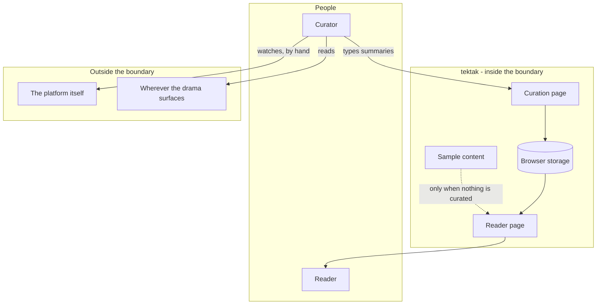

# tektak - Interaction and system boundary

## Actors

| Actor | Type | What they want |
| --- | --- | --- |
| Reader | Human | To know what happened, in text, and then to stop reading |
| Curator | Human | To publish a few short summaries a day without any tooling getting in the way |
| The platform being written about | External system | Nothing. It is a subject, not a participant |

The Reader and the Curator are the two sides of the product and they never meet. There is
no submission, no comment, no reply. The curator publishes and the reader reads.

## Interaction diagram

Note what is not on that diagram: any arrow from the platform into the system. Nothing is
fetched, scraped, embedded or synchronised. The only path from the platform into tektak
runs through a person typing.

## What the system is in the business of

- Presenting a small, finite amount of text that can be finished.
- Making curation fast enough that it actually happens daily.
- Looking published from the first visit, before anyone has curated anything.
- Costing nothing to host and nothing to run.
- Being honest that it is one person's summary.

## What the system does not care about

- Video, in any form. No embeds, no thumbnails, no links to clips.
- Engagement. There is nothing to like, share, comment on or react to.
- Personalisation. Every reader sees the same page.
- Freshness beyond what a person has time to type. There is no live anything.
- Being right. It reports what is being said, not what is true.
- Accounts, sessions, identity, or knowing anything at all about the reader.
- Reach or growth mechanics. No notifications, no email, no follow.
- Multi-device or multi-curator anything. One browser, one curator.

The last one is a real limit rather than a philosophical position, and it is the first
thing that would have to change if the site were ever meant to be read by other people.

## Main use cases

| ID | Actor | Goal | Trigger | Result |
| --- | --- | --- | --- | --- |
| UC-1 | Reader | Catch up | Open the reader page | The current stories, hashtags and sources, in text, ending |
| UC-2 | Reader | Visit an empty site | Nothing has been curated | Sample content, so the site never looks broken |
| UC-3 | Curator | Publish a story | Submit the story form | The story is stored and appears on the reader page |
| UC-4 | Curator | Update what is trending | Submit the hashtag form | The trending list changes |
| UC-5 | Curator | Feature an account | Submit the account form | The sources list changes |
| UC-6 | Curator | Take something down | Delete an entry | It is removed from the reader page |
| UC-7 | Curator | Start fresh | Clear everything | Storage is emptied and the sample content returns |
| UC-8 | Curator | Keep a backup | Copy the stored values out of the browser by hand | A copy exists somewhere that is not one browser profile |

Use case eight is a manual workaround, not a feature, and it is the honest description of
the current backup story.

## Constraints that come from the actors

- Curation has to fit in ten to fifteen minutes a day or it stops happening. Every field
  on the forms costs against that budget.
- The reader page must look complete on a first visit, before any curation exists.
- The curation page has no access control. Anyone who can open it can change what is
  published, which is why it must not be linked from the reader page.
- Everything lives in one browser profile. Clearing site data destroys the content, and
  nothing warns anyone before that happens.
