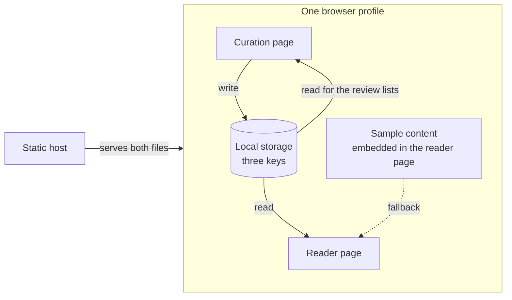
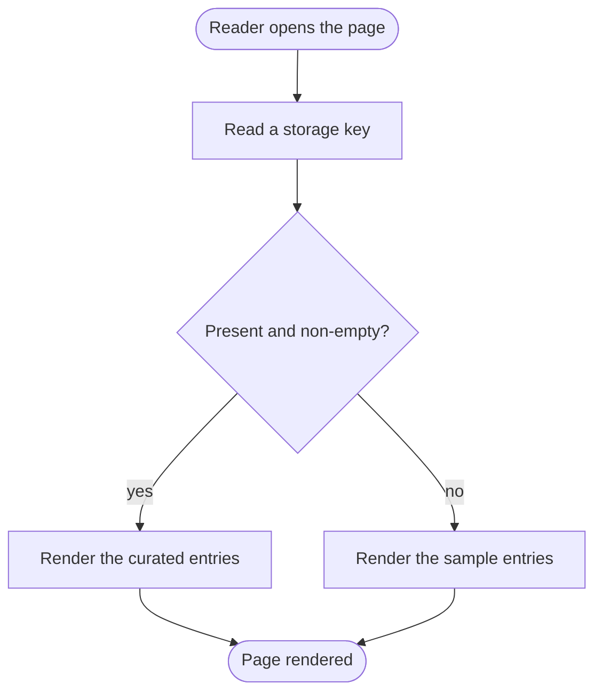
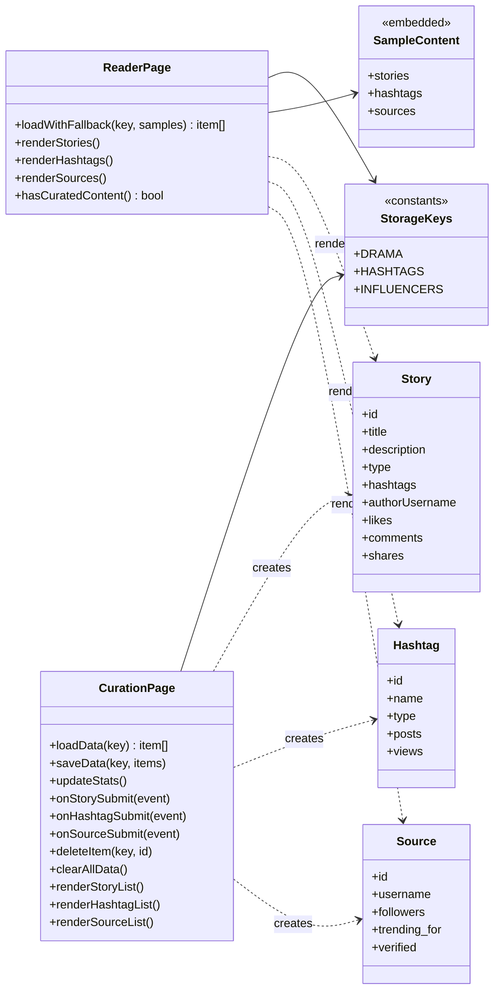
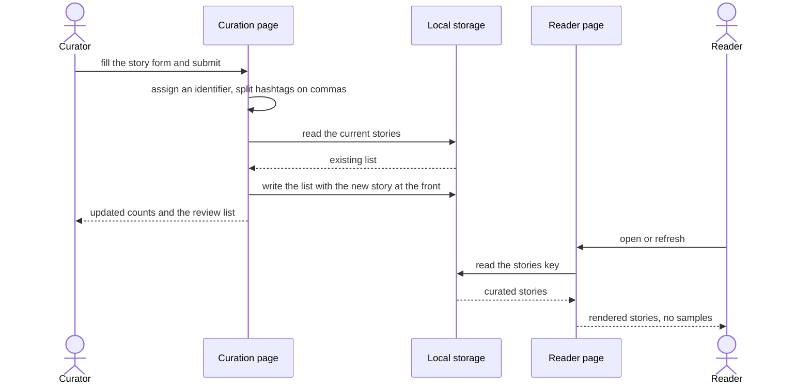

# tektak - Architecture

Internal document.

## Components

Two static pages and the browser's own storage. There is no server, no build step and no
network call at runtime.

| Component | Runs where | Responsibility |
| --- | --- | --- |
| Reader page | Browser | Reads storage, falls back to samples, renders three sections |
| Curation page | Browser | Forms that write to storage, lists that let entries be removed |
| Local storage | Browser profile | The only durable state |
| Sample content | Embedded in the reader page | What is shown when nothing has been curated |

The two pages share no code. They are independent files that happen to agree on three
storage keys and the shape of what goes in them. That agreement is entirely by convention
and is the main fragility in the design.

## Why it is built this way

The constraint is that the site costs nothing to host and needs nothing installed. Two
static files satisfy that completely. Everything awkward about the architecture follows
from it: no accounts, no sync, no access control on curation, and no backup.

The alternative - a small backend with a database - solves all four and breaks the
constraint. That trade is recorded in the plan rather than assumed away.

## Data flow

The fallback is per key rather than global. Curated stories with no curated hashtags shows
real stories alongside sample hashtags. That is a consequence of the design worth knowing
about, and the plan lists it as something to decide on rather than leave to chance.

## Class diagram

Neither page defines classes. The structure that exists is a set of functions over three
storage keys, and the diagram below describes that structure as it is, so the shape is
visible.

The duplication is real. Both pages independently define the storage keys, and both
independently know what a story looks like. Changing a field means editing two files, and
forgetting one produces a reader page that silently renders nothing where a field should
be. Every improvement to this app should reduce that duplication rather than add to it.

## Key sequence - publishing a story

## Rules this architecture is meant to protect

- No network call at runtime. The pages open from a file as readily as from a host.
- No build step. What is in the repository is what runs.
- The reader page must render something on a first visit. An empty site is a broken site.
- The curation page never appears in the reader page's navigation.
- Both pages must agree on the three storage keys and the shape of what they hold. Nothing
  enforces this, so any change to one page has to be applied to the other by hand.
- New entries go to the front. The site is a news page and the newest item is the point.
