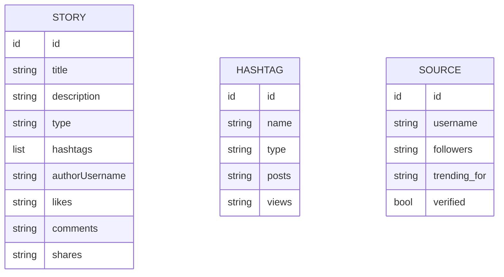

# tektak - Data model

## Store

The browser's local storage, in whichever profile the curation page was opened in. Three
keys, each holding a serialised list.

This is worth being blunt about. The store is one browser profile on one machine. It does
not sync, it is not backed up, and clearing site data destroys everything with no warning
and no recovery. The entire published site is a few kilobytes in one browser.

| Key | Holds |
| --- | --- |
| `tektakDrama` | Stories |
| `tektakHashtags` | Trending hashtags |
| `tektakInfluencers` | Featured source accounts |

Each key is read independently. A key that is missing, or holds an empty list, causes the
reader page to fall back to its embedded sample content for that section only.

## Entity relationships

There are no relationships. Three independent lists, no foreign keys, nothing joined.

A story carries hashtag names as free text and a source account as a handle typed by hand.
Neither is linked to the hashtag list or the source list. Renaming a hashtag in the trending
list does not change the stories that mention it, and there is nothing that could notice.
For a site this size that is the right trade; it stops being right the moment anyone wants
to click a hashtag and see its stories.

## Entries

### Story

| Field | Type | Notes |
| --- | --- | --- |
| `id` | identifier | Assigned on creation. Used only for deletion |
| `title` | string | The headline |
| `description` | string | Two or three sentences. The whole product is this field |
| `type` | string | One of drama, scandal, feud, controversy, response, legal |
| `hashtags` | list of strings | Typed as a comma-separated line and split on entry |
| `authorUsername` | string | The account that broke or spread it, typed by hand |
| `likes` | string | Rough engagement, kept as text |
| `comments` | string | Rough engagement, kept as text |
| `shares` | string | Rough engagement, kept as text |

The engagement figures are strings, not numbers, and they are stored the way they are
typed. They are shorthand for scale, they are estimated by the curator anyway, and nothing
sorts or sums them. Storing them as text costs nothing and saves parsing a value nobody
computes with. If anything ever needs to sort by them, this decision is the thing to
revisit first.

### Hashtag

| Field | Type | Notes |
| --- | --- | --- |
| `id` | identifier | Assigned on creation |
| `name` | string | Including the leading hash |
| `type` | string | The same category list as stories |
| `posts` | string | Rough scale, as text |
| `views` | string | Rough scale, as text |

### Source account

| Field | Type | Notes |
| --- | --- | --- |
| `id` | identifier | Assigned on creation |
| `username` | string | The handle |
| `followers` | string | Rough scale, as text |
| `trending_for` | string | One line on what this account is known for |
| `verified` | boolean | Whether the platform verifies it |

## Sample content

The reader page carries a set of sample stories, hashtags and accounts inside it. They are
not stored, not editable, and never mix with curated content within a section.

They exist so that the site never looks broken. A curation-driven site with nothing curated
yet is an empty page, and an empty page reads as a failure rather than as a beginning.

## Constraints worth stating

- Nothing validates anything. A story with an empty title will be stored and rendered.
- Nothing enforces the category list beyond the form offering a fixed set of choices.
- Identifiers are unique enough to delete by and are not used for anything else.
- The two pages agree on the key names and the field names by convention only. Nothing
  checks, and a mismatch fails silently.
- There is no schema version. Adding a field to a story leaves every previously stored
  story without it.

## What is deliberately not stored

- Anything about the reader. No accounts, no sessions, no analytics, nothing.
- Any video, thumbnail, or link to a clip.
- Any content fetched from the platform. Every word was typed by the curator.
- Any record of when a story was published, which means nothing can be sorted by date and
  order depends entirely on insertion order.

That last absence is a gap rather than a decision. A news site with no timestamps cannot
say how old anything is, and it is listed in the plan.
