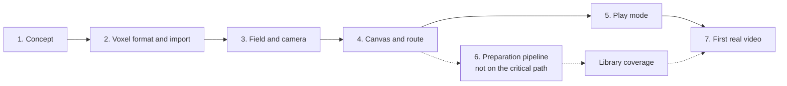

# Trail - Build plan

## Objective

Give a written, spoken narration a place to happen: one diorama built from small cubes, on one
canvas, with a camera that walks a route through it and pulls back at the end to reveal the
whole thing. Cheap enough to redo, consistent enough to be a visual identity, repeatable enough
that a retake is free, and containing no artificial intelligence of any kind at runtime.

**The app is built, running, and has a library of everything on disk.** The renderer, the
camera, the route, the weather, the picking, the canvas file and the pen all exist, with 477
tests behind them, and 367 models load when the page opens - four recipes and 363 meshes read
as OBJ, glTF or `.glb`. Nothing is held back for licence, nothing in it is off-subject, and
everything in it is a placeable object rather than a part of one.

**184 of those models are painted from their own textures**, as of 2026-08-07, rather than from
a guess at a material name. That is what turned the Zombie kit's four named characters from one
flat colour each into four recognisable people.

**Reading the script was built and then cancelled**, on 2026-08-07. The script is a document
beside the app now, not an input to it: objects are placed by hand from the library, and a step
carries only a note saying what happens in it. The reasoning is in `06-context.md` under
"Reading the script was cancelled" - **it should not be rebuilt without the user saying so.**

**What is left before a first video is a canvas built from a real script, and watching it.**
Nothing in that sentence is code any more.

The question this plan was framed around, whether a camera tour of a static voxel world holds
attention, has had a soft yes on a first look and has not been tested properly on a real
canvas. It cannot be, until there is one.

## Order of work

| Stage | Goal | Done when | Status |
| --- | --- | --- | --- |
| 1 | Concept | The workflow, the look and the boundary are settled, and the rejected designs are recorded | Done |
| 2 | Voxel format and import | The recipe voxeliser, the `.vox` reader, and a library that loads on open | **Done, and past it.** 367 models load from a manifest: the figure, three recipes, and 363 meshes in three formats. Every mesh has been checked all the way to a grid, and every one that keeps its colour in a texture is painted from it. The medieval voxel pack was retired as off-subject, and 101 facade parts of the Downtown kit were excluded as parts rather than objects |
| 3 | Field and camera | Sky, shiny floor, 16:9 frame, a rectangle plus a pitch producing a correct framing | **Done**, and past it: free roaming, picking, dragging, a smooth surface, occlusion and contact shadows. Frame rate at full budget is still untested |
| 4 | Canvas and route | Place objects, cut the notes into stages, draw a frame per stage | **Done, without the plan, and without the script.** Place, pose and tint objects; add a step, frame it from the view, split its note into stages, set hold and weather. **There is still no top-down plan** - placing is done in the 3D view and framing by roaming to it, which has turned out to be enough. Reading a script was built and cancelled |
| 5 | Play mode | Ghosting, flying, weather cross-fade, scars, motion, name tags, the sync flash, and no interface at all | **Done**, apart from snow and motion in the cube path |
| 6 | Preparation pipeline | A Colab notebook that turns CC0 packs into `library.js` and `lookup.js`. **Not on the critical path** | Not started. Survey and licence rules done, in `07-pipeline.md` |
| 7 | First real video | A narration of yours, built, recorded, cut against your voice, published | Not started. Blocked on content, not on code |

### Why shapes come first, and in what order

The `.vox` reader was moved ahead of everything because it is about 150 lines and it removes
the Colab pipeline from the critical path entirely. The renderer then gets built and judged
against real content rather than against placeholder cubes.

Within the stage, the order runs from least effort upward, because the goal is a running app
rather than a finished library:

| Step | Effort | What it buys |
| --- | --- | --- |
| Three primitive recipes | About ten lines of JSON each, no downloads, no new format | The app runs and the renderer is testable, today |
| The `.vox` reader and a CC0 pack | 150 lines, plus finding a pack | Content good enough that the sixty-second test can be trusted |
| The figure, hand-authored | A day | Tintable per character and able to sway, which no import can be |
| MagicaVoxel | Installed, waiting | Anything specific that is still missing |

The split matters because the two tests are different. Primitives answer "does the renderer
work". They do not answer "is this watchable", and a crude house could produce a false negative
about the format itself. That judgement needs models that are at least as good as the ones a
finished video would use.

This also de-risks the pipeline: by the time the notebook is written it will be obvious what a
good Trail model looks like, which is not obvious now and cannot be worked out from a
specification.

### The test that matters, and it has only half happened

The question was: **is a camera flying between three objects on a voxel diorama something a
person would watch?**

It was built and looked at, and the verdict was *"it looks pretty good for a first run"*. That
is encouraging and it is not the test. The test is a full run on a canvas built for a real
script, and that is finally possible: there is a library of 220 named models and a figure.

**What has never been tried is the thing the app is for** - taking a real script, cutting it
into stages, building a canvas for it, and watching the result. **Nothing stands in the way of
it any longer.** The script panel reads a narration, steps can be added and framed and split
from the panel, and the library holds 220 models. The next move is not a feature.

## Decisions already made

Every one came out of the two conversations recorded in `06-context.md`. Where a decision had
alternatives, the alternatives are named, because knowing what was rejected is most of the
value.

### From the second conversation, which revised the design

| Decision | Reason |
| --- | --- |
| One canvas holding the whole story, toured by a camera | The user's own design. It replaced a beat-by-beat stage where objects appeared and transformed. It converts a timing problem into a spatial one and gives the format an ending |
| **No morphing, no transitions between objects** | Cancelled outright. It was the single largest risk in the project and it bought a gimmick repeated sixty times where the pull-back is a payoff that lands once |
| One page, two modes, not two windows | The user's own instruction. It also removes the entire opaque-origin problem that the two-window design had to work around |
| Steps are framings drawn on the plan | A rectangle and a pitch is the whole camera language. A close-up on a face and the final reveal are the same mechanism at different sizes |
| The plan is the flowchart | Layout and story order are one picture, so they cannot drift apart. Chosen over a separate node graph, a plain ordered list, and a branching graph |
| Linear steps, no branching | One narration, one route. Branching would complicate playback, recording and the reveal for a case that does not exist |
| Fly between framings, cut when chosen | Chosen over always flying, always cutting, and a fast high arc. The flight is free motion and it makes the canvas read as one place before the reveal confirms it |
| Ghost the unvisited canvas, solidify on arrival | Chosen over building on arrival, everything solid from the first frame, and building just off-camera. The viewer senses the scale of the world early without being shown what happens in it |
| Global weather that cross-fades, and leaves marks on the ground | Chosen over cross-fading alone, fully localised weather, and one mood per video. Localised weather needs volumetrics; scars give most of the payoff for a texture and a few lines of shader |
| **No generative AI, anywhere, ever** | The user's correction, stated flatly. This is a hard rule and not a preference |
| Shapes come from a preprocessed dataset, by lookup | The user's actual intent, which the first conversation misread as generation. Retrieval is what delivers "give it a word, get a shape" without inventing anything |
| The machine learning is an offline embedding step whose output is a dictionary | The only ML in the project. It runs once in a notebook. At runtime, resolving a word is a hash lookup |
| No language model in the authoring loop either | Chosen over keeping it for the step list. The user splits their own script into stages, which is the part a model was going to help with, so it had nothing left to do |
| Four sources of motion, all chosen | Ambient cube shimmer, weather particles, looped object motion and a constant camera drift. A static world with a moving camera is a sculpture tour, and this is what prevents it |
| Looped motion is a per-cube pivot, not a skeleton | A cube knows one point to move about and one way to move. Enough for arms, wheels, trees and water; not enough for a walk cycle, which is not wanted |
| Edit mode is a top-down plan with a live 3D preview | Chosen over a plan alone, a free 3D viewport, and a plan with a numeric panel. Placement is a 2D problem and shot-checking is a 3D one, so both are present |
| Roaming is free, but it moves the framing rather than the eye | The user asked to drag and move freely. A framing already has exactly an orbit camera's degrees of freedom - centre, distance, yaw, pitch - so roaming needs no second camera model, and **every angle roamed to is a valid step that can be saved**. The cost is that the camera always orbits a point on the ground and cannot fly and look upward, which is the right constraint for a diorama |
| **The look is illustrated, not voxel.** Coarse cubes are the construction; a clean smooth surface is the result | The user's decision after seeing both: *"the field of cubes isnt look great, it looks like an ancient 8 bit game rather than an illustration."* This replaces the original visual identity. Objects are still blocked out as chunky voxel solids, and Surface Nets draws them as one smooth surface with roundness on a dial. **Authoring does not change**: recipes still describe solids and the voxeliser still produces a grid. Cubes remain available behind a key for comparison |
| Occlusion is baked per vertex when a model is meshed | A smooth low-poly form with flat lighting reads as a silhouette rather than an object. Darkening the creases is what gives it weight, and it costs nothing at runtime because it is computed once from the voxel grid the mesh came from |
| Every object gets a soft contact shadow | Without one, everything hovers slightly and no amount of shading on the object itself fixes it. A radial patch multiplied onto the ground, not a shadow map, which for a diorama under one high sun reads the same for a fraction of the work |
| **Flat facet normals, and no relaxation by default** | Smoothing the geometry *and* averaging the normals produced something the user described as playdoh. Averaged normals are the larger cause: they make every flat plane read as curved, so nothing has an edge. Normals are now taken per-pixel from how the surface changes across the screen, which keeps a face a face. Both remain dials, and both default to off |
| Lighting is wrapped rather than cut | A hard terminator between lit and unlit is what makes low-poly look rendered. Softening it and letting the sky fill the shadow side is most of the difference between a render and an illustration |
| Cube edges doubled after the first build was seen | The fine grain was chosen for the cancelled morph, where it was what made the flow read. Nothing else needed it. Chunkier objects read better and cost a quarter as much. The page carries a live multiplier, so this is judged by eye rather than argued |
| Cube edge scales with object size | A house at a figure's resolution is a hundred thousand cubes and reads as noise. Coarser cubes on bigger things is how the picture stays legible |
| The script goes into the app, and the app finds the objects in it | The user's clarification: paste a script, Trail finds the nouns and offers them, the user drags them into place. It needs no language processing at all, because **the lookup dictionary is the noun detector** - a word that resolves to a model is buildable, and one that does not could not have been built anyway |
| Finding is automatic, placing is manual | The user's words: *"that way its not too automated."* Trail never places, composes or decides what a shot contains |
| The script lives split across the steps | Pasting creates one step holding everything, and splitting it creates the stages. The script is exactly the concatenation of the steps' text, so it cannot drift out of sync with the structure, and no character offsets are stored to be invalidated by an edit |
| Names are detected by a heuristic and offered, never assumed | Capitalised, not sentence-initial, not in the dictionary, not a common capitalised word. Reliable on prose, and its failures - a place name offered as a character, a character missed because they always start a sentence - are both visible in a list and fixed by clicking |
| Person-words are extras, names are cast | `man`, `woman` and `lady` are ordinary dictionary hits giving an unnamed figure. Only confirmed names get a colour and a tag |
| Import `.vox` files, and build the reader before anything else | Chosen over modelling everything by hand with no pipeline, splitting hand-made hero objects from imported bulk, and sticking to the pipeline alone. The `.vox` format is already Trail's format - indexed cells on a grid with a 256-colour palette - so a reader is about 150 lines and skips normalisation, voxelisation and quantisation entirely. It takes the Colab notebook off the critical path |
| **CC0 only, permanently** | The user's choice with the alternatives understood. No attribution is ever owed, no credits block is needed, no bookkeeping exists, and no licence question can arise about a published video. Rules out Google Scanned Objects, Toys4K and most of Objaverse. The accepted cost is a library of a few thousand rather than a hundred thousand, with hand-authored recipes filling the gaps |
| Cap3D is not used | Under CC0-only it became unnecessary. Kenney and Poly Pizza models carry real names and tags written by humans who intended them to be searched, which is better text than a generated caption. It is also ODC-By, which would have owed an attribution for the derived lookup |
| Real ES modules, served locally, no build step | The user's choice when SOLID module boundaries were put against the file protocol. Reverses the inherited "opens from disk" property, which mattered for a resume that strangers open and does not matter for a private production tool. Keeps no build step: the files served are the files written, and the pure modules are tested in Node |
| Built to last, and extended by data rather than by code | The user's requirement: best practices, SOLID, live as long as possible, updateable on the fly. Translated into module boundaries, pure testable logic, versioned file formats and a hard rule that new content is never new code. See the engineering standards section of `03-architecture.md`, which is honest about where SOLID applies literally and where it does not |
| A step range per object, so a person can be in two places | Chosen over objects that move between steps, visible duplicates, and a composition rule forbidding it. Two placements of the same person, adjacent ranges, one fading out as the other solidifies. It costs one instance attribute and one comparison, where moving objects would have destroyed the static-field property the renderer rests on |

### From the third conversation, which filled the library

| Decision | Reason |
| --- | --- |
| **Read glTF and `.glb`, not only OBJ** | The packs shipped since about 2019 are glTF, and two of them sat on disk contributing nothing while `npm run scan` reported success. The reader emits the same `{triangles, colours}` the OBJ reader does, so the voxeliser, the palette, the hollowing and the mesher were all reused unchanged - which is the module boundary earning its keep |
| **A licence is established from its source, with the evidence recorded** | Three 2017 Quaternius packs shipped with no licence file, holding back 51 models. `quaternius.com/faq.html` states that all models are CC0, and that statement is now quoted in the manifest against each pack. Chosen over marking them CC0 on the author's reputation alone, which is probably right and leaves nothing a later reader can check. **A test refuses a CC0 claim that has neither a licence file nor an evidence note**, so the difference between establishing and assuming cannot quietly disappear |
| **`scan.js` keeps what was written by hand** | It preserved pack and download notes but rewrote every mesh entry, so a corrected licence would have been silently undone by the next scan. The tool that rediscovers files must not also discard judgements |
| **Real height per model, as manifest data** | The animals pack normalised every model before export, so a shiba inu arrived as tall as a bull. Chosen over one multiplier per pack, which cannot express a per-model error, and over editing the meshes, which a re-download would undo. Consistent with the standard the project already holds: new content is data, never code |
| **Material names are matched longest-first** | Names used to be tried in written order, so a general word shadowed a specific one and every chair in the furniture pack came out the colour of hair. It also lets the table grow without the author having to reason about position |
| **A model is painted from its texture, and where that texture lives is manifest data** | 184 models keep their colour only in an image. The plan of record said the OBJ path could not reach them - 88 of the references are absolute paths from an artist's own machine - and that texture support would therefore have to flip the OBJ-over-glTF preference. Measured: taking the filename off the end of the path resolves all 184, so the preference was left alone and the rigged-model question stays separate. A browser cannot search a folder, so `npm run scan` resolves each reference once and writes it down, which keeps judgement in a tool and data in the page |
| **Measure the library rather than reasoning about it** | Both of this session's surprises were things these documents asserted confidently: that the library lacked modern subjects, while a pack of characters, cars and streets sat in it unread; and that mesh normalisation would be the hard part, when ten packs of eleven already agreed to within a few per cent. One script answered each |

### From the fourth conversation, which added the clock and the moves

| Decision | Reason |
| --- | --- |
| **The time of day is a number, and it is not the weather** | The hour says where the light comes from and what colour it is; the weather says how much of it gets through, how far you can see and what is left on the ground. Before this, `dusk` and `night` were presets, so the time of day was a fixed choice from a list of six. A preset now carries `dull`, saying how far it pulls the sky back toward its own colours: clear lets the hour through untouched, a storm is a storm at any hour. Ambient light multiplies rather than mixing, so overcast at midnight is darker than either alone |
| **A step with no hour behaves exactly as it always did** | Absent is not midnight. It is the line that keeps every canvas built before the clock existed looking identical, and it is why the migration to version 4 rewrites nothing |
| **A flight interpolates the hour, not the sun** | Two hours are two directions, and at six against eighteen they are exactly opposite - the midpoint of the vectors has no direction at all. Interpolating the hour round the clock and asking the sky again is the only thing that produces a sun that travels |
| **The sky is given the camera's axes** | It was a gradient with a glow painted at a fixed place on the screen, so the sun could not move: there was nothing for it to move relative to. Turning each pixel into a direction in the world is what makes a sun, a moon and stars possible at all |
| **A place is not an object** | A labelled rectangle of ground - the bar, the golf course - has no model, no cubes and no height. Making it a placement with a flag would have pushed it through the voxeliser, the mesher, the box builder and the picker for something that is a wash of colour on the floor. It is its own list, one instanced quad each, with a step range like everything else |
| **A camera move is a framing, like every other camera decision** | Orbiting turns the yaw and pushing in shrinks the rectangle, so every intermediate state is a framing somebody could have drawn and the camera can never end up underground. A sway rather than a circuit, because the back of a low-poly model is not what it was made for. Saved on the step, because play mode carries no interface and a take has to play the same way twice |
| **An object can walk a line, and the field is still static** | This looks like the design that was cancelled and is not it. The cancelled one gave every object a position per step and interpolated on the processor. This is one line per object, three numbers per vertex uploaded with everything else, and an offset added in the vertex shader - so the field is still built once and uploaded once, and nothing runs per frame over the cubes. Its shadow and its name tag are offset by the same amount; its picking box is not, which only shows while the route is playing |

### Carried forward from the first conversation

| Decision | Reason |
| --- | --- |
| The narration is written and recorded by the user, outside Trail | Trail's job starts once the stages are known |
| Screen capture, no export | Nothing in the app knows what a video is. Chosen over an in-app recorder and frame export |
| No audio in the app | The user's choice. Timings are set by feel and the picture is cut against the voice afterwards |
| A single white sync frame at the start | The fix for the weakness the previous decision creates. Turns alignment into a one-second job for about four lines |
| Fixed 16:9, composed at 1920x1080 | The frame does not change when the window does, so what is composed is what is captured |
| Generic figures with name tags | Chosen over unlabelled figures, per-person builds, and tags only on introduction. Readable for any name, no likeness question |
| No narration text on screen | Captions belong in a video editor. Name tags are the only text |
| Raw WebGL2, no library | Consistent with every other app here. Three.js would be a dependency carried for three draw calls |
| Recipes as the hand-authored form | Legible, diffable, adjustable by changing one number, and the only format that can carry pivots for motion |
| Everything prepared when the canvas loads | A hitch during a take is in the recording permanently |

## Open questions

| Question | Blocks | Notes |
| --- | --- | --- |
| ~~How much of a real script does a CC0-only library resolve?~~ | Answered | **62 per cent of the placeable nouns**, measured on a written paragraph against the library's own names. The licence rule is not what bites: model names are literal and scripts are not, so the lookup needs a synonym layer. Three words were abstract and five genuinely absent |
| How long a script can a canvas hold? | Stage 7 | **Nothing caps a video's duration.** Holds are arbitrary and the route has no length limit. The ceiling is spatial: 400,000 cubes, 60 to 100 objects, 120 by 120 units. So the constraint is how many distinct places a narration visits, not how long it runs. At roughly 30 seconds a step, twenty minutes is about 40 steps introducing a couple of objects each, which lands at the edge of the budget - so one canvas probably carries 15 to 20 minutes, and a longer story uses a second canvas with a hard cut. Untested. Too crowded and the reveal is mush; too sparse and the flights are long and empty |
| What do abstract nouns look like? | Stage 4 | "Reputation", "a rumour", "the internet" have no object. Options are a neutral abstract form, a symbol, or simply not staging them and letting the camera hold on something else. It will come up in the first script |
| How is a crowd handled? | Stage 4 | Twenty figures is eighty thousand cubes. A crowd probably needs a coarser figure at a larger cube edge, which the format allows but nothing currently authors |
| Which dataset? | Stage 6 | Low-poly curated sources such as Poly Pizza and Kenney voxelise far better than scanned or CAD data, but cover fewer things. Objaverse covers almost everything at very variable quality. Probably curated first, broad later |
| How is attribution handled? | Stage 6 | Much of what makes free models free is a credit requirement. The library carries a licence and author per entry; what is not decided is where that credit appears in a finished video |
| Should Trail be linked from the portfolio front door? | Delivery | It is a production tool with no interface, which makes it a strange thing to link to. A short recorded clip of the output is probably the better artefact |
| Does edit mode need undo? | Stage 4 | The canvas file is plain text under git, which may be enough |

## Risks

| Risk | Effect if it happens | Response |
| --- | --- | --- |
| A camera tour of a static world is dull | The format does not hold for the length of a video and the whole thing needs rethinking | The sixty-second test at stage 2, before any editor exists. Four motion sources were chosen specifically against this, and the reveal is the structural answer |
| Shapes do not read as what they are | The viewer is confused rather than impressed and the narration carries the whole video alone | Cube edge scales with object size for exactly this reason. Test every model at the framing it will be seen at, never up close in an editor |
| ~~Dataset models arrive unusable~~ | The library never fills and the promise of "type a word" does not land | **Happened, and it was mild.** Measured across 317 meshes: ten packs of eleven agree at one unit to the metre and agree with the hand-authored figure, the up-axis assumption held everywhere, and nothing arrived on its side. One pack had been normalised before export and is corrected by twelve numbers of data. The response - start with curated low-poly sources by few artists - is what made the difference |
| The word lookup is confidently wrong | A script names something and gets a plausible but wrong object, silently | Edit mode shows what a word resolved to before it is placed. A wrong match is a visible wrong object, never a silent substitution |
| The reveal is mush | The payoff shot, which the whole format is built around, does not land | Compose for it from the first object. Cube edge, spacing and canvas size all answer to the reveal rather than to the close-ups |
| The cube budget is exceeded | Dropped frames, permanently, in the recording | A hard cap of 400,000 with a running total while building, and a warning before a take rather than after |
| The mode toggle is hit during a take | An editor appears in the video | A two-key gesture, refused while the route is running |
| Ghosted objects spoil what is coming | A flight over the canvas gives away the pool before the story reaches it | Ghosts are faint, desaturated and smaller. If it still spoils, the fallback is building on arrival, which was the runner-up option |
| Timings drift against the voice | The picture lands late and the video looks broken | The sync flash, and holds stated per step so a fix is local rather than a renumbering |
| The canvas becomes a chore to build | Making videos turns into level design and stops being worth it | The plan is a 2D drag and the camera language is a rectangle. If placing a scene takes longer than writing the narration did, simplify rather than adding tools |
| It becomes a 3D editor | The work moves from making videos to building tooling, permanently | Edit mode holds a plan, a step strip, a preview and a few panels. Anything more is a signal to stop |
| A non-CC0 model gets into the library | A published video carries an obligation that the whole licence rule exists to avoid | The CC0 filter runs before download, not after. Anything whose licence cannot be established is treated as not CC0. Provenance is recorded per entry so a mislabelled source can be found and purged in one query rather than from memory |
| The CC0 rule bites constantly | Every script needs several recipes written before it can be built, and making videos becomes modelling | Measure it on the first real narration rather than predicting it. The response order is in `07-pipeline.md`, and reconsidering the rule is the last resort rather than the first |
