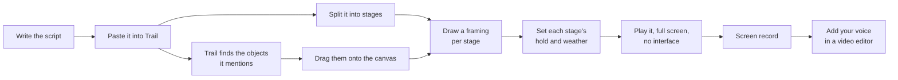

# Trail - Overview

Public document. Behaviour only.

## What this is

Trail turns a written script into a place.

You build one diorama out of small cubes - a house, the people, the pool behind them, all of
it sitting on a single canvas. Then you write the route: the camera starts close on the
house, moves to the people, pushes into one face and then another, drifts back to take in the
pool. When the story ends, the camera pulls all the way out and the viewer sees, for the first
time, that everything they have been watching was one object.

Nothing transforms into anything. There is no trick. The world is built once and the story is
told by moving through it, which is how a stage play works and why it holds up.

While you are close on the house, the rest of the canvas is there but faint, a ghost of a
world not yet arrived at. It solidifies as you reach it. The weather moves with the story, and
it leaves marks: the ground stays wet where it rained, so at the final reveal you can read the
whole story written across the canvas.

## The problem it addresses

Narration-driven video has a picture problem. The words are the work, and the visuals are
usually stock footage, still photographs with a slow zoom, or a video generator that charges
per attempt and returns something different every time you ask.

Trail takes the opposite position. The picture is cheap, instant, repeatable and yours. The
same canvas plays the same way every time, so a retake costs nothing and a fix is a fix rather
than another roll of the dice. Because everything is built from the same cubes, every video
you make looks like it came from the same place without any effort spent maintaining that.

And because the whole story occupies one canvas, you get an ending for free. The pull-back is
a payoff that lands once and recontextualises everything the viewer just watched.

## What it does

| Capability | Description |
| --- | --- |
| Read your script | Paste it in. Trail finds every object it talks about and offers them, ready to place |
| Notice the people | Character names are spotted and offered as cast, each with their own colour and tag |
| Show you the gaps | Words it has no shape for are listed, so a missing thing is never a surprise |
| Hold a whole story in one place | A single canvas carrying every object in the script at once |
| Build things out of cubes | Objects are voxel solids, assembled from a library rather than modelled per video |
| Find a shape from a word | Say house and there is a house, resolved from a prepared library by an offline lookup |
| Take shapes you drew yourself | Anything made in a voxel editor drops straight in, because it is already the format Trail uses |
| Follow a route | The story is a numbered sequence of framings drawn on the canvas, and the camera walks it |
| Fly or cut | Moves between framings travel across the world by default, or jump when a beat needs it |
| Reveal as it goes | Unvisited parts of the canvas are ghosted, and solidify as the camera arrives |
| Change the weather | Each step carries its own sky, light and rain, cross-fading as the story moves |
| Leave marks | Rain leaves the ground wet, fog leaves it pale. The canvas remembers what happened on it |
| Stay alive | Ambient cube shimmer, drifting weather, small looped motion and a constant camera drift |
| End on the whole thing | A final framing that takes in the entire canvas at once |
| Compose to a fixed frame | Always 16:9, whatever the window is doing, so what you compose is what you capture |
| Run on nothing | No key, no account, no dependency, no network call. It is served from your own machine |

## How it is used

Trail reads the script for what is in it, and you decide where everything goes. The finding is
automatic because it is tedious; the placing is manual because it is the part that makes the
video yours.

You split the script into stages yourself, because you wrote it and you know where they fall.

## What it does not do

- It does not generate anything. No video generation, no image generation, no text generation,
  and no machine learning of any kind while it is running.
- It does not listen. No microphone, no transcription, no speech recognition.
- It does not play your voice. Audio is laid under the footage afterwards, in a video editor.
- It does not put words on screen beyond name tags. There is no caption track.
- It does not export video. You record the window.
- It does not call anything at runtime. No key, no service, no account, no analytics. The
  local static server that serves the files answers only to your own browser.
- It does not aim for realism. It is a field of cubes and it looks like one deliberately.

## Requirements to run it

A browser with WebGL2, a screen recorder, and a machine with a discrete or reasonably modern
integrated graphics chip. The files are served locally by one command, `npx serve .` or
`python -m http.server`, because the code is written as real modules. Nothing is installed,
nothing is built, and no account exists.
