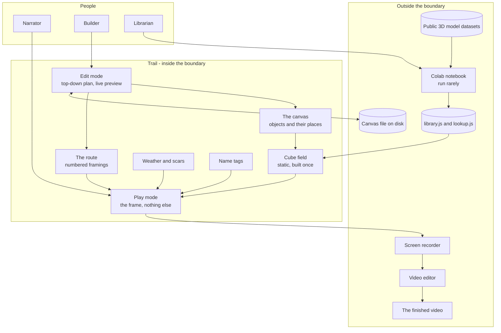

# Trail - Interaction and system boundary

## Actors

| Actor | Type | What they want |
| --- | --- | --- |
| Writer | Human | To get a picture for a script they have already written |
| Builder | Human, the same person in a different job | To lay out a canvas and draw a route through it |
| Librarian | Human, occasionally | To grow the shape library when a script names something that is not in it |
| Preparation pipeline | Machine, offline, run rarely | To turn a public 3D model dataset into a voxel library and a word lookup |
| Screen recorder | Machine, outside the app | To capture the window and nothing else |
| Video editor | Machine, outside the app | To carry the voice track and the final cut |
| Viewer | Human, never present | To follow a story on a screen without being told who is who |

The writer and the builder are the same person doing different jobs, and they must not be
doing them in the same view. Building is a plan with controls on it. Narrating is a frame that
a recorder is pointed at. That is why there are two modes and why the boundary between them is
absolute.

The preparation pipeline runs when the library needs growing and at no other time. It is a
notebook, not a service, and nothing in Trail can call it.

The viewer never touches Trail. They are still an actor, because every readability decision
answers to them: cubes coarse enough to read at speed, figures labelled by name, a camera that
travels rather than jumping at random.

## Interaction diagram

Nothing crosses the boundary inward while Trail is running. The library and the lookup are
files that were prepared once. The canvas file is on disk. There is no request, no key and no
service.

## What the system is in the business of

- Giving an existing script a place to happen. The words came first and are not the app's
  business to improve.
- Making a story legible as geography. Where a thing sits on the canvas is a storytelling
  decision, not a layout chore.
- Being repeatable. The same canvas plays the same way, so a retake is free and a fix is a fix.
- Being readable at a glance. A viewer is mostly listening and gets a few seconds per shot.
- Keeping the recorded frame clean. Nothing that helps the builder may ever reach the camera.
- Costing nothing to run, forever. No key, no request, no service, no dependency.
- Earning its ending. The final pull-back has to be worth the wait, which is a composition
  constraint on everything before it.

## What the system does not care about

- Generating anything. No video, no images, no text, no shapes. Machine learning happens once,
  offline, and produces a static file.
- Objects transforming into other objects. That design was considered at length and cancelled.
- The audio. It never hears the voice, never plays it and never aligns to it.
- Speech recognition of any kind.
- Writing or improving the script, or having an opinion about it.
- Understanding the script. It matches words against a dictionary. It does not parse grammar,
  infer meaning, or know what a sentence is about.
- Captions and subtitles. That is the video editor's job.
- Realism, likeness and detail. Every shape is an impression of a thing, drawn cleanly.
- Being a general 3D editor. Placement is a drag on a plan and a number in a box.
- Physics, collision, pathfinding or simulation. Objects sit where they are put.
- Accounts, sharing, viewers, analytics or telemetry.
- Mobile, touch and small screens. It is a desktop production tool.

## Main use cases

| ID | Actor | Goal | Trigger | Result |
| --- | --- | --- | --- | --- |
| UC-1 | Builder | Start a canvas | Paste a script into a new canvas | One step holding the whole script, an object tray filled from it, and an empty plan |
| UC-2 | Builder | Put a thing in the world | Drag it from the tray onto the plan | That object appears where it was dropped, as cubes |
| UC-3 | Builder | Place a person | Confirm a detected name, then drag it on | A jointed figure with that person's colour and name tag, reusable across the canvas |
| UC-4 | Builder | Define a stage of the story | Split the script where the stage ends, then draw its frame | A numbered step carrying its own words, which the camera fills exactly with that rectangle |
| UC-5 | Builder | See what is missing | Read the gap list after pasting | Every word with no shape, so nothing is discovered late |
| UC-6 | Builder | Add a thing the script never named | Search the tray for it | The library match, placeable like anything else. The script is a starting point, not a cage |
| UC-7 | Builder | Push into a face | Draw a small frame at a low pitch | A close shot. Faces are steps like any other, not a special mechanism |
| UC-8 | Builder | Set how the story moves | Reorder the numbered frames | The route changes. The plan is the flowchart |
| UC-9 | Builder | Give a stage its weather | Set the weather on that step | The sky, light and rain cross-fade into it on arrival, and the ground keeps the mark |
| UC-10 | Builder | Check a shot | Select a step | The live preview shows exactly what the camera will see |
| UC-11 | Builder | Time the story | Set a hold per step | Total running time is shown, so it can be matched against how long the script takes to read |
| UC-12 | Librarian | Add a missing thing | Draw it, or run the notebook | The library grows and the word resolves from then on, in this canvas and every later one |
| UC-13 | Narrator | Record a take | Enter play mode and start | One continuous run from the first framing to the final pull-back, with nothing on screen but the world |
| UC-14 | Narrator | Line the picture up with a voice track | Cut the capture in a video editor | The sync flash at the head of the take makes it a one-second job |
| UC-15 | Builder | Keep a canvas | Save | A plain file on disk carrying the script, the world and the route, readable without Trail |
| UC-16 | Builder | Reuse a world | Open an old canvas, paste a new script | The same place tells a different story |

## Constraints that come from the actors

- **The script is offered, never obeyed.** Trail finds what a script mentions. It never places
  anything, never composes anything, and never decides what a shot contains. The user's words:
  *"that way its not too automated."*
- A word the library cannot match must be visible as a gap. Silently ignoring it is the one
  failure that is invisible until the video is being built.
- Keys move the camera and drive the take. Anything with a value or a choice - roundness,
  block size, shading, weather - is a control in the panel with its number beside it. A
  legend of two-dozen keys is a thing to memorise, and the panel is a thing to read.
- Play mode carries no interface at all. Not a control, not a counter, not a hint. If it can be
  seen, it is in the video permanently.
- The mode toggle must be impossible to hit by accident during a take.
- Every step must be reachable directly. Waiting through four minutes to check one shot is not
  a workflow.
- Shapes must read at the framing they will actually be seen at, not up close in an editor.
- People must be identifiable. Six generic figures with no labels is six anonymous figures.
- The final pull-back must be composed for, from the first object placed. A canvas that only
  works close up throws away the ending.
- The canvas file is the whole state. There is nothing else to back up and nothing else to lose.
- Frame rate is a feature, not a nicety. A dropped frame is in the recording permanently.
- The library must be able to grow without the app changing. A new word is new data, never new
  code.
