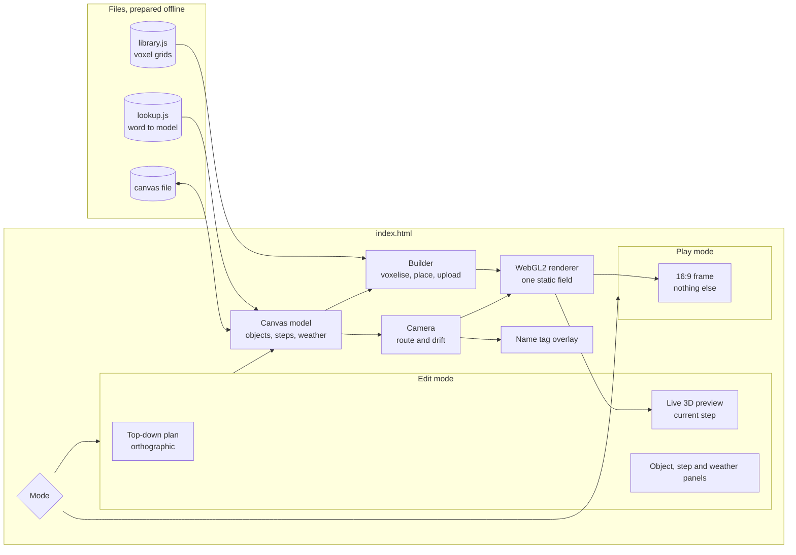
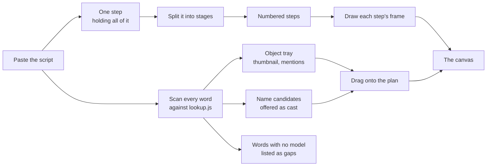
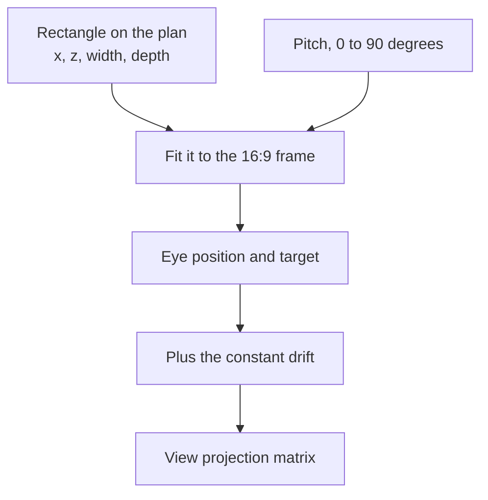
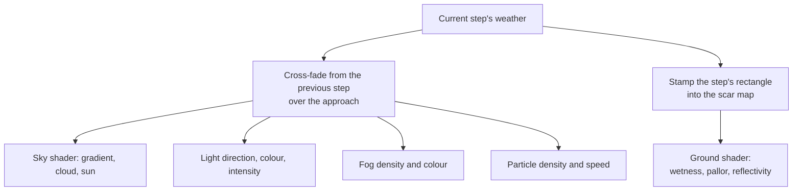
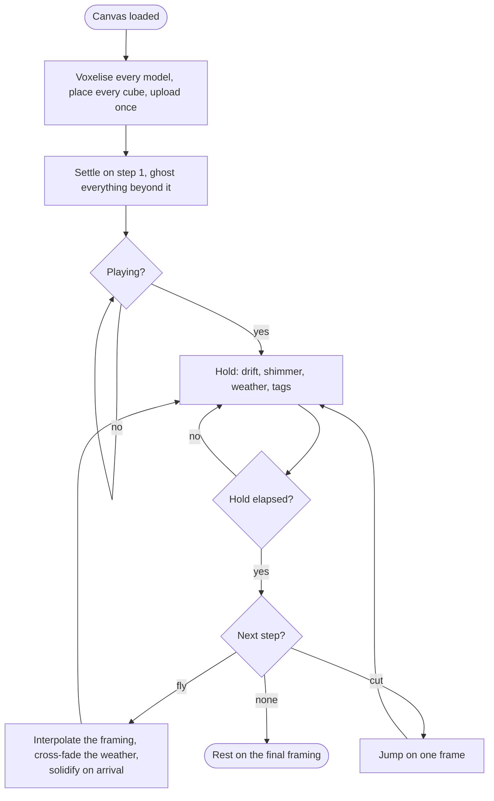
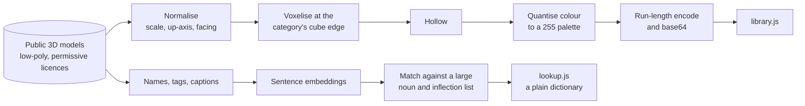

# Trail - Architecture

Internal document.

## Shape of the thing

One page. Two modes. No framework, no build step, no library, no network call at runtime, and
no machine learning anywhere near the browser. The graphics are written directly against
WebGL2.

There is one renderer and both modes use it. Edit mode points it straight down with an
orthographic projection and draws interface over the top; play mode points it along the route
and draws nothing over the top.

**The single page is what the second conversation bought.** An earlier design had a stage
window and an editor window talking over a `window.open` handle, because under the `file:`
protocol every document gets its own opaque origin and `BroadcastChannel`, shared storage and
`fetch` of a neighbouring file are all unavailable. One page has none of those problems. The
only surviving consequence is that the library and the lookup are **script files that assign a
global**, not JSON that gets fetched, because fetching a local file is still refused.

## The two modes

| | Edit mode | Play mode |
| --- | --- | --- |
| Camera | Orthographic, straight down at the whole canvas | The route, perspective, 16:9 |
| Interface | Script panel, object tray, plan, step strip, live preview inset | None. Not one pixel |
| Cube field | The same field, ghosting disabled so everything is visible | The same field, ghosting driven by the current step |
| Weather | Shown flat, as scar overlays on the plan | Live, cross-fading, with particles |
| Purpose | Compose the world and the route | Be recorded |

The toggle is a deliberate two-key gesture rather than a single key, because hitting it during
a take puts an editor in the video. Play mode also refuses the toggle while the route is
running; it has to be stopped first.

## Edit mode: the script drives everything

The script is not reference material sitting beside the work. It is the spine of edit mode.

Three panels and the plan. The script panel holds the text and is where stages are cut; the
tray holds every object the script mentions, ready to drag; the step strip holds the route. All
three are views of one canvas file.

**Nothing is placed automatically.** The app finds what the script talks about and offers it.
Where a thing stands, which way it faces, and what the camera does about it are decisions the
builder makes, because that is the part worth doing by hand.

## The canvas and the route

The canvas is a fixed square of world, 120 by 120 units, with a ground plane and objects
standing on it. A person is about 1.8 units tall, so the canvas is roughly a small village.

A **step** is a framing drawn on the plan: a rectangle, a pitch and a hold.

Drawing a rectangle and giving it a pitch is the whole camera language. The rectangle is what
fills the frame, so composition is done on the plan rather than by nudging an eye position.
A tight rectangle at a low pitch on a figure's head is a close-up; the canvas-sized rectangle
at a high pitch is the final reveal. There is no separate mechanism for either.

| Step field | Effect |
| --- | --- |
| Rectangle | What fills the 16:9 frame |
| Pitch | How low the camera sits. Low is dramatic, high is a map |
| Hold | How long the camera stays once it has arrived |
| Approach | `fly` or `cut`. Fly is the default and travels across the world |
| Approach time | How long the flight takes. Ignored on a cut |
| Weather | The sky, light and rain this step arrives into |

Steps are numbered and linear. The plan showing them, with arrows between them in order, **is
the flowchart** - the layout and the story structure are the same picture, which is what stops
them drifting apart.

### Flying

A flight interpolates the framing rather than the eye: the rectangle slides and scales toward
the next one, the pitch eases, and the eye follows from the fit. That means a flight never
passes through the ground or ends up somewhere the composition did not ask for, which is the
usual failure of interpolating camera positions directly.

Flights arc upward slightly in the middle, so a move between two close shots lifts to show the
ground between them. That is where a lot of the free motion comes from, and it is the thing
that makes the canvas feel like one place before the reveal confirms it.

## The cube field

**Built once. Uploaded once. Never touched again.**

Every object on the canvas is voxelised, placed, and appended to one instance buffer. That
buffer is uploaded when the canvas loads and after any edit, and never during playback.
Playback changes uniforms and nothing else.

Each cube carries:

| Attribute | Purpose |
| --- | --- |
| `aPos` | Where it sits in the world. Never changes |
| `aColor` | Palette colour |
| `aFrom`, `aUntil` | The range of steps across which it is solid. Outside it, a ghost |
| `aPivot` | The point it rotates about, for looped motion |
| `aMotion` | Motion type and amplitude, packed |
| `aSeed` | Per-cube randomness for shimmer phase and colour jitter |

One instanced draw for the field, a second for its reflection in the floor, a third for
weather particles. Three draw calls carry the whole picture.

### Ghosting, which is one comparison

An object is solid across a range of steps and a ghost outside it. In the shader:

- `uStep < aFrom` or `uStep > aUntil` - ghost. Low alpha, desaturated, drawn slightly smaller.
- `uStep == aFrom` - solidifying. Interpolate on `uStepT` over about half a second.
- `uStep == aUntil + 1` - fading back out, on the same `uStepT`.
- Otherwise - solid.

That is the entire mechanism. No CPU work, no per-object state, no timers. The whole world is
present in the buffer from the first frame and the shader decides what it currently looks like.

`aFrom` is assigned in edit mode by whichever step's rectangle first contains the object, and
both ends can be overridden per object when the automatic answer is wrong.

**The range is also how a person is in two places.** Objects never move, so someone who is at
the house early and at the pool later is two placements of the same cast member with adjacent
ranges. One fades out exactly as the other solidifies, across the flight between them, which
reads as the story moving rather than as two separate events. See `04-data-model.md`. Giving
objects a position per step and interpolating it was the alternative, and it would have
destroyed the static-field property this whole renderer rests on.

### Motion, without a skeleton

Four sources, all chosen, all cheap.

| Source | Mechanism |
| --- | --- |
| Ambient shimmer | Every cube offset by a small sine of time and `aSeed`. One line in the vertex shader. Stops the world feeling frozen without anyone noticing why |
| Camera drift | A slow sway layered under every framing, including a hold. No shot is ever perfectly still |
| Weather particles | A separate instanced draw of falling elongated cubes, density and speed from the current weather |
| Looped object motion | `aPivot` and `aMotion` per cube: rotate about a pivot, bob, or sway, driven by time and phase |

**There is no rig and no skeleton.** A cube knows one point to move about and one way to move,
and that is enough for an arm swaying, a wheel turning, a tree moving in wind and water
rippling. It is not enough for a walk cycle, and a walk cycle is not wanted; the goal is
ambient life, not animation.

This has one honest consequence. **Models imported from a dataset arrive as single unrigged
meshes and get motion type `none`.** Only hand-authored recipes carry pivots. The jointed
figure is therefore hand-authored once and reused for every person in every video, which is
fine, because the figure is the most-used object by an enormous margin.

Water is a special case handled the same way: cubes flagged as liquid bob with a phase derived
from their world position, which produces a travelling wave across a pool surface for free.

## Weather

Global at any instant, cross-fading between steps, and it leaves marks.

**The scar map** is a low-resolution texture, 256 by 256, covering the canvas. When a step with
rain becomes current, its rectangle is stamped into the map with a soft edge. The ground shader
samples it for reflectivity and colour, so a region that was rained on stays dark and wet and
mirror-like for the rest of the video.

This is what makes the final pull-back worth composing for. The sky is one sky, but the ground
reads as a record of everything that happened: wet where the argument was, pale where the fog
came down, bright where it started. Cheap - one texture and a few lines in the ground shader -
and it is the payoff shot's whole content.

Weather presets are starting points that resolve to plain numbers in the canvas file, so a
scene can be nudged without inventing a preset.

## The shiny floor

A planar reflection, which is the honest way to do it: the field is drawn a second time with
the view mirrored through the ground plane, and the ground is blended over the result with a
reflectivity that falls off with distance and comes partly from the scar map. Plus a specular
highlight from the sun direction. No render target and no screen-space trickery.

## Name tags

The one piece of text. Drawn on a 2D canvas layered over the WebGL canvas, positioned by
projecting each named figure's anchor through the same view projection matrix. Tags fade with
distance and are suppressed entirely beyond a threshold, so the final pull-back is not a cloud
of labels. There is no caption track and no narration text.

## Resolution, and why it varies by object

A cube edge is a per-model property, not a global constant, and it scales with the size of the
thing.

| Kind | Cube edge | Example | Cubes after hollowing |
| --- | --- | --- | --- |
| Figures | 0.07 | A person, about 26 cubes tall | 700 to 1,400 |
| Props | 0.12 | A car, a bench, a bicycle | 1,200 to 2,500 |
| Architecture | 0.24 | A house, a pool, a wall | 2,000 to 6,000 |
| Terrain and vegetation | 0.20 | A tree, a hedge | 300 to 900 |

These doubled after the first build was looked at. The original figures were
chosen when cubes had to **morph** between shapes, where a fine grain was what made
the flow read; that design was cancelled, and nothing else required the resolution.
Chunkier cubes read better as objects, cost a quarter as much, and look more
deliberate. The page carries a live multiplier so the grain can be judged by eye
rather than argued about.

A house built at a figure's resolution would be a hundred thousand cubes and would read as a
wall of noise rather than as a house. Coarser cubes on bigger things is not a compromise; it
is how the picture stays legible.

**The budget is 400,000 cubes for a whole canvas**, which at these figures is roughly sixty to
a hundred objects. Edit mode shows the running total and warns before it is exceeded, because
the failure is a dropped frame during a take and that is permanent.

## The player

The clock runs off the render loop rather than a timer, so the picture and the time cannot
drift apart.

Everything is prepared when the canvas loads, never during playback. A hitch mid-take is in
the recording forever and there is no reason to risk one.

## The sync flash

There is no audio anywhere in Trail, so the picture is lined up against the voice by hand in a
video editor. To make that a one-second job rather than a hunt, play mode emits a single white
frame at the instant the route starts. It is unmistakable on a timeline and it is trimmed off
with the head of the clip.

## The preparation pipeline

Runs in Colab, rarely, and produces two files. Nothing in the browser knows it exists.

**The embedding step is the only machine learning in the project, and its output is a
dictionary.** Words are matched to models offline, once, across a large vocabulary; what ships
is a static word-to-model table. At runtime, resolving a word is a hash lookup. No model, no
inference, no library, nothing loaded.

The genuinely hard part of this pipeline is normalisation. Public datasets disagree about
scale, up-axis and which way a thing faces, and a car that arrives lying on its side and forty
times too large is the common case rather than the exception. That is a risk in `00-plan.md`
rather than a solved problem here.

## Degradation and failure

| Condition | Behaviour |
| --- | --- |
| No WebGL2 | A plain message saying so. There is no fallback and there should not be one |
| Over the cube budget | Refused in edit mode with the number, before a take rather than after |
| The frame rate cannot hold | Frame time shown in edit mode, and a warning on the step that costs the most |
| A word with no match | A visible placeholder block in a signal colour, listed as a warning. Never a silent gap |
| A canvas file that is not one | Refused with the reason. Nothing partial is loaded |
| Storage refused | The convenience reload is lost and nothing else |
| The window is not 16:9 | The frame letterboxes. Composition never changes with the window |

## Engineering standards

The user's requirement, stated directly: build this to the best software development standards,
SOLID principles included; make it live as long as possible; make it updateable on the fly.

### SOLID, translated honestly

SOLID is a framework for designing classes in an object-oriented system. Trail is a
data-oriented rendering application with almost no objects in it, and applying SOLID literally -
interfaces, injection containers, a class per concept - would produce ceremony rather than
quality, and would fight the longevity goal rather than serve it.

The principles underneath it do apply, and this is what each one means here:

| Principle | What it means in Trail |
| --- | --- |
| Single responsibility | One module, one job. The voxeliser knows nothing about WebGL. The renderer knows nothing about canvas files. The camera knows nothing about steps, only about rectangles |
| Open for extension, closed for modification | **Extended by data, never by editing code.** A new word, model, weather preset or solid type is a table entry or a file. This is already a rule elsewhere in this document and it is the same rule |
| Substitution | Any voxel grid is interchangeable regardless of origin. This is why a hand-authored recipe and a dataset import converge on one grid format before anything downstream sees them |
| Interface segregation | The renderer is handed buffers and uniforms, not the canvas model. It cannot reach back into things it should not know about, because it was never given them |
| Dependency inversion | The player depends on a clock and a render target, not on concrete ones. Which is why edit mode's live preview and play mode are the same player with different dependencies rather than two code paths that drift apart |

### Module boundaries

Pure means it touches no DOM, no WebGL and no global state, takes data in and returns data
out. Pure modules can be unit tested outside a browser, and that is the concrete payoff of all
of the above rather than the theory of it.

| Module | Responsibility | Pure |
| --- | --- | --- |
| `voxel` | Recipes to voxel grids. Solids, hollowing, encoding | Yes |
| `vox` | Reads `.vox` files to the same grid format. `SIZE`, `XYZI`, `RGBA`, everything else skipped | Yes |
| `library` | Holds the library and the lookup. Resolves a word to a grid | Yes |
| `script` | Tokenising, resolving words to models, detecting names, splitting and merging stages | Yes |
| `canvas` | The canvas model. Validation, defaults, version migration | Yes |
| `build` | Canvas plus library to instance buffers | Yes |
| `camera` | Rectangle and pitch to matrices. Framing interpolation | Yes |
| `weather` | Presets to numbers. Cross-fade. Scar stamping | Yes |
| `render` | WebGL2. Buffers, shaders, uniforms, draw calls | No |
| `player` | Walks the route against a clock | No |
| `ui/*` | Plan, panels, step strip. Edit mode only | No |
| `app` | Wiring, and nothing else | No |

Eight of the twelve are pure. The interesting logic - voxelising, hollowing, framing,
cross-fading, budget arithmetic - is all in the pure half, which means it is all testable
without a browser, a screen or a GPU.

### Longevity

| Property | How |
| --- | --- |
| No dependencies | Nothing to rot, nothing to update, no supply chain, no version conflict in five years |
| Plain data | Recipes, canvas files and the library are readable text. They outlive the app that reads them |
| Versioned formats | Every canvas file carries `trail: 2`. Migrations run one version at a time, forward only, and old files keep opening |
| No hidden state | The canvas file is the whole state of a video. There is nothing else to lose |
| Standard platform only | WebGL2 and plain JavaScript. No framework whose fashion can pass |

### Updateable on the fly

Three different things, all wanted, all supported:

| Meaning | Mechanism |
| --- | --- |
| New content without touching code | A word, a model, a weather preset and a solid type are all data. Regenerate `library.js` and the app knows more things without a line changing |
| New code without breaking old work | The canvas format is versioned and migrated. A canvas built today opens in a Trail built in three years |
| Live changes while building | Edit mode rebuilds and re-uploads on any edit rather than reloading. The preview reflects a change immediately, and the same player drives it |

### Modules, and what they cost

Proper module boundaries want ES modules, and **ES module imports are refused under the `file:`
protocol**. Trail therefore runs from a local static server rather than being opened by
double-clicking.

| Property | Decision |
| --- | --- |
| Modules | Real ES modules. One file per module, genuine imports and exports |
| Running it | One command, `npx serve .` or `python -m http.server`. No build, no bundler, no install |
| Build step | **Still none.** The files that are served are the files that were written |
| Tests | Node's own test runner against the seven pure modules. No browser, no harness, no framework |
| Opening from disk | Given up, deliberately. It was inherited from the resume, where strangers open the file. Trail is a private production tool and the person running it can run a command |

This reverses the earlier "opens from disk" decision and keeps the "no build step" one. It was
the user's choice when the conflict was put to them.

## Rules this architecture is meant to protect

- Play mode shows the world and nothing else. Ever.
- No machine learning, no inference and no generation in the browser. The pipeline is offline
  and its output is data.
- No network call, no key, no service, no dependency, no build step.
- The cube field is static. Built once, uploaded once.
- Nothing per frame on the CPU over the cubes. Ghosting, shimmer and motion are shader
  comparisons against uniforms.
- Objects never transform into other objects. That design was cancelled.
- The camera language is a rectangle and a pitch. There are no eye coordinates to author.
- The plan is the flowchart. Layout and story order are one picture.
- Recipes are the authored form; voxel grids are derived and are never a source of truth.
- A new word is new data, never new code.
