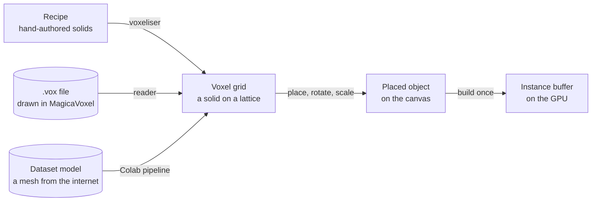
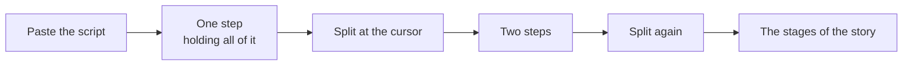

# Trail - Data model

Internal document. Nothing here is a database. There are three files prepared offline, one
file per video, and one buffer on the graphics card that is the only thing that has to be
fast.

## The five kinds of data



Three sources feed one format. Everything downstream of the grid is identical whether the shape
was written as a recipe, drawn in a voxel editor, or imported from a dataset, which is what
keeps the app from caring where a thing came from.

## The recipe

A recipe is a hand-authored thing: a short list of solids, small enough to read and to edit by
changing one number. This is the format for anything that needs to be exactly right, and for
anything that needs to move.

```json
{
  "id": "person",
  "unit": 0.035,
  "anchor": "base",
  "tint": "primary",
  "parts": [
    { "solid": "capsule",  "at": [0, 0.45, 0],    "size": [0.42, 0.9, 0.28], "color": "#primary" },
    { "solid": "sphere",   "at": [0, 1.08, 0],    "size": [0.34, 0.38, 0.32], "color": "#skin" },
    { "solid": "capsule",  "at": [0.3, 0.62, 0],  "size": [0.14, 0.62, 0.14], "color": "#primary",
      "pivot": [0.3, 0.88, 0], "motion": { "type": "sway", "axis": "x", "amp": 6, "phase": 0.0 } },
    { "solid": "capsule",  "at": [-0.3, 0.62, 0], "size": [0.14, 0.62, 0.14], "color": "#primary",
      "pivot": [-0.3, 0.88, 0], "motion": { "type": "sway", "axis": "x", "amp": 6, "phase": 0.5 } }
  ],
  "tags": ["head", "torso", "arm", "arm"]
}
```

| Field | Meaning |
| --- | --- |
| `id` | The name the library knows it by |
| `unit` | Cube edge in world units. This is what sets how chunky the thing is, and it scales with the size of the object |
| `anchor` | `base` for things that stand on the ground, `center` otherwise |
| `tint` | Which colours are replaced per instance. A figure's `#primary` becomes that person's signature colour |
| `parts` | The solids, in order. Later parts overwrite earlier ones, so detail is painted over bulk |
| `pivot` | The point this part's cubes rotate about. Absent means the part does not move |
| `motion` | `sway`, `spin`, `bob` or `liquid`, with an axis, an amplitude in degrees, and a phase so two arms are not in step |

Supported solids: `box`, `sphere`, `cylinder`, `cone`, `capsule`, `wedge`. Each takes `at`,
`size`, an optional `axis` and `rot`, a `color`, and an optional `hollow` flag that keeps only
the shell.

**Why recipes still exist now that there is a dataset.** Two reasons, and both matter. Dataset
models arrive as single unrigged meshes, so **anything that needs to move has to be a recipe**.
And the figure - by far the most-used object in any video - needs to be exactly right, tintable
per person, and consistent across every video ever made. Hand-authoring one good figure is a
day's work that pays out forever.

## The voxel grid

The common format. Produced by the voxeliser from a recipe, or by the Colab pipeline from a
mesh.

| Property | Value |
| --- | --- |
| Storage | One byte per cell, palette index, `0` meaning empty |
| Palette | Up to 255 colours |
| Motion | A parallel byte array: motion type and part index per cell, absent for imported models |
| Pivots | A short list of points, referenced by the motion array |
| Encoding | Run-length pairs over each array, base64 |
| Typical size | 4 to 7 KB per model, measured |

**Hollowing.** Cells with six occupied neighbours are never visible and are dropped. Measured
on the first three models, this removes 76 to 86 per cent of the cubes and the result looks
identical. It is the single largest saving in the project and it is not optional.

**Store the solid grid; hollow at load.** This reverses what an earlier draft said, and it was
settled by measurement rather than argument:

| Model | Solid, encoded | Hollowed, encoded |
| --- | --- | --- |
| house | 6.3 KB | 19.5 KB |
| car | 5.4 KB | 7.0 KB |
| tree | 4.1 KB | 5.6 KB |

Hollowing breaks long runs of identical cells into short ones, so it makes run-length encoding
worse - three times worse for a house. Since hollowing is a single cheap pass, it belongs at
load rather than in storage. A test asserts this relationship so the decision cannot be
quietly reversed.

## Drawn models, and why the format was already right

A `.vox` file from MagicaVoxel or Goxel stores voxels as indexed cells on a grid plus an RGBA
chunk of 256 colours, where indices 0 to 254 map to palette entries 1 to 255. Trail's grid is
one byte per cell, palette index, `0` meaning empty, up to 255 colours.

**That is the same design.** Reading a `.vox` file is therefore a format translation rather
than a conversion, and it skips the three hardest stages of the import pipeline outright.

| Stage | From a dataset mesh | From a `.vox` file |
| --- | --- | --- |
| Normalise scale, up-axis, facing | The hard part. Models arrive sideways and mis-scaled | You drew it facing the right way |
| Voxelise | Surface then fill, with resolution guessed per category | Already voxels |
| Quantise colour | Sample materials and textures, reduce to 255 | Already an indexed palette |
| Hollow, encode | The same | The same |

The format is chunked and skippable, so a reader handles `SIZE`, `XYZI` and `RGBA` and ignores
everything else. Roughly 150 lines.

### Pivots, for drawn models

A `.vox` file carries no rig, so a drawn model cannot express motion on its own. Anything that
needs to move is drawn as **separate files per moving part**, composed by a small wrapper that
assigns the pivots.

```json
{
  "id": "person",
  "unit": 0.035,
  "anchor": "base",
  "compose": [
    { "vox": "person-body.vox", "at": [0, 0, 0] },
    { "vox": "person-arm.vox", "at": [0.3, 0.62, 0],
      "pivot": [0.3, 0.88, 0], "motion": { "type": "sway", "axis": "x", "amp": 6, "phase": 0.0 } },
    { "vox": "person-arm.vox", "at": [-0.3, 0.62, 0], "mirror": true,
      "pivot": [-0.3, 0.88, 0], "motion": { "type": "sway", "axis": "x", "amp": 6, "phase": 0.5 } }
  ]
}
```

A composition is the same shape as a recipe with `vox` references in place of solids, and the
two can be mixed: a drawn body with a recipe-generated wheel is legal, because both produce
cells on the same lattice. Static models need no wrapper at all and are read straight from the
file.

## The library

`library.js`, a script that assigns a global, because `fetch` of a local file is refused when
a page is opened from disk.

```javascript
window.TRAIL_LIBRARY = {
  person: { unit: 0.035, dims: [12, 51, 9], palette: [...], rle: "...", pivots: [...], motion: "..." },
  house:  { unit: 0.12,  dims: [66, 40, 54], palette: [...], rle: "...", source: "polypizza:abc123",
            licence: "CC0", author: "Kenney" },
  ...
}
```

**Every entry is CC0.** No attribution is owed and no credits feature exists. Source, author
and licence are recorded anyway as an audit trail: if a source is later found to have
mislabelled something, the affected entries can be found and purged in one query rather than
from memory. See `07-pipeline.md`.

## Reading a script

The script is the source of what gets built. Two passes over it, both trivial, neither
involving natural language processing or a model of any kind.

### Finding the objects

**The lookup dictionary is the noun detector.** Split on whitespace, lowercase, strip
punctuation, and test each word against `lookup.js`. A word that resolves is a buildable
object; a word that does not resolve could not have been built anyway, so nothing is lost by
ignoring it.

| Step | Detail |
| --- | --- |
| Tokenise | Whitespace and punctuation. No stemming; the lookup already carries inflections |
| Resolve | A dictionary hit. `pool`, `man`, `gun`, `stick` all land on models |
| Group | One entry per model, not per mention. Ten mentions of a car offer one car |
| Count | Mentions are shown, because a thing named eight times probably matters |
| Order | By first appearance, which is the order the story introduces things |
| Miss | Listed separately as a gap, with the word that failed. **Never silently dropped** |

No part-of-speech tagging, no stopword list, no grammar. Roughly twenty lines, and it works
because the dictionary was built to contain exactly the words that mean something here.

### Finding the people

Person-words like `man`, `woman` and `lady` are ordinary dictionary hits and resolve to the
figure with a default colour. They are extras and they are not named.

Names are found by a separate heuristic, which is a heuristic and not intelligence:

| Rule | Purpose |
| --- | --- |
| Capitalised, and not the first word of a sentence | The basic signal in ordinary prose |
| Not in the lookup dictionary | So a capitalised `Pool` is still a pool |
| Not in a short list of common capitalised words | Days, months, countries, `I` |
| Appears more than once, or once with high confidence | A recurring capitalised token is almost always a character |

Each candidate is **offered**, not assumed. The builder confirms it as a cast member, gives it a
colour, and the figure gets that person's name tag from then on.

Its failure modes are known and acceptable: a place name is offered as a character, and a
character who only ever appears at the start of a sentence is missed. Both are visible in a
list the builder is reading anyway, and both are fixed by clicking.

## The word lookup

`lookup.js`, also a script assigning a global. A plain dictionary from word to model id, built
offline by embedding model names and captions and matching them against a large noun and
inflection list.

```javascript
window.TRAIL_LOOKUP = {
  house: "house", houses: "house", home: "house", mansion: "mansion",
  car: "car", cars: "car", sedan: "car", vehicle: "car", drove: "car",
  ...
}
```

**At runtime this is a hash lookup and nothing else.** No embedding model is loaded, no
inference runs, no library is involved. The machine learning happened once in a notebook and
what it produced was a dictionary. This is the whole answer to "give it a word and get a
shape" under a hard no-AI-at-runtime rule.

A word with no entry produces a visible placeholder and a warning in edit mode. It never fails
silently and it never guesses.

## The canvas file

The only thing authored per video, the only thing saved, and the whole state of a project.

```json
{
  "trail": 3,
  "title": "the fallout, part one",
  "size": 120,
  "cast": [
    { "id": "a", "name": "Marla", "primary": "#e08a3c" },
    { "id": "b", "name": "Devon", "primary": "#3c7ae0" }
  ],
  "objects": [
    { "id": "o1", "model": "house", "at": [-32, 0, -28], "rot": 15, "scale": 1.0, "from": 1 },
    { "id": "o2", "model": "person", "cast": "a", "at": [-4, 0, 2], "rot": 200, "from": 2, "until": 3 },
    { "id": "o3", "model": "person", "cast": "b", "at": [-1.4, 0, 2.6], "rot": 20, "from": 2, "until": 3 },
    { "id": "o4", "model": "pool", "at": [26, 0, 30], "rot": 0, "scale": 1.4, "from": 3 },
    { "id": "o5", "model": "person", "cast": "a", "at": [22, 0, 27], "rot": 340, "from": 4 },
    { "id": "o6", "model": "person", "cast": "b", "at": [24.6, 0, 28], "rot": 250, "from": 4 }
  ],
  "steps": [
    { "id": "s1",
      "text": "It started, like most of these things do, in a car park at two in the morning.",
      "frame": [-40, -36, 22, 14], "pitch": 22,
      "hold": 9000, "approach": "cut", "weather": "clear" },
    { "id": "s2",
      "text": "Marla got out first. Devon stayed where he was.",
      "frame": [-8, -1, 10, 6], "pitch": 14,
      "hold": 7000, "approach": "fly", "approachTime": 2600, "weather": "clear" },
    { "id": "s3",
      "text": "She had been rehearsing this for a week and it still came out wrong.",
      "frame": [-4.6, 1.4, 1.2, 0.8], "pitch": 8,
      "hold": 11000, "approach": "fly", "approachTime": 1800, "weather": "overcast" },
    { "id": "s4",
      "text": "By the time they reached the pool, neither of them was pretending any more.",
      "frame": [18, 22, 26, 16], "pitch": 30,
      "hold": 14000, "approach": "fly", "approachTime": 3400, "weather": "storm" },
    { "id": "s5",
      "text": "And that is how a Tuesday ended a fourteen-year friendship.",
      "frame": [-60, -60, 120, 120], "pitch": 62,
      "hold": 12000, "approach": "fly", "approachTime": 6000, "weather": "dusk" }
  ]
}
```

## The script

**The script lives in the canvas file, split across the steps.** There is no separate script
field, because there does not need to be one: the script is exactly the concatenation of every
step's `text`, in order, and cannot drift out of sync with the structure because it *is* the
structure.

The gesture that creates structure is **splitting**:



Pasting a script creates a single step containing the whole thing. You split it where the
stages fall, and each fragment becomes a step you then draw a frame for. Merging is the
inverse. Nothing is duplicated and no character offsets are stored, so editing the words inside
a stage cannot break anything.

`text` is **never rendered.** It exists so the builder knows what a shot is for, so objects can
be found, and so the video's structure is legible six months later.

### Object fields

| Field | Meaning |
| --- | --- |
| `model` | A library id, or a word that the lookup resolves to one |
| `cast` | Optional. Makes this a named person, taking their colour and their tag |
| `at`, `rot`, `scale` | Where it stands, which way it faces, how big |
| `from` | The step at which it stops being a ghost. Defaults to **the first step whose text mentions it**, falling back to the first step whose frame contains it. Can be overridden |
| `until` | The last step at which it is solid. Absent means it stays solid to the end of the route |
| `label` | A name that floats over it. This is how a figure becomes a person |
| `path` | `{ to: [x, z], step }` - where it walks to, and the step it arrives at. See below |

### An object that walks somewhere

**Objects still never move, and this does not change that.** What is stored is a
line: the object stands at its `at` and walks to `path.to` across the flight into
`path.step`. The buffers hold one fixed position per vertex exactly as before;
the vertex shader adds an offset from three numbers that were uploaded with
everything else. So the field is still built once and uploaded once, nothing runs
per frame on the processor, and the whole thing costs one instance attribute -
the same trick the looped motion already uses, pointed at a longer distance.

This is **not** the design that was cancelled. That one gave every object a
position per step and interpolated them on the processor, which would have
destroyed the static field. A line is one journey, authored once.

Its contact shadow and its name tag are offset by the same amount, or they stand
still while the object walks out from under them. Its picking box is not: a box
is measured from the buffers, so clicking a travelling object mid-flight picks
where it started. Picking is an edit-mode act and the object is at the start of
its line whenever the route is not playing.

### The same person in two places

Objects never move. A person who is at the house early and at the pool later is **two
placements of the same cast member**, each with its own step range, and never both solid at
once. In the example above, Marla is `o2` from step 2 until step 3, and `o5` from step 4
onward. When step 4 arrives, `o2` fades back to a ghost as `o5` solidifies.

| Rule | Effect |
| --- | --- |
| A placement outside its range is a ghost | Faint, desaturated, slightly smaller. The same state as somewhere not yet visited |
| Fading out takes the same half second as solidifying | So the two happen together across a flight and read as one movement rather than two events |
| The last placement of a cast member carries no `until` by default | So at the final reveal each person is solid exactly once, in the place the story left them |
| Edit mode warns if two placements of one cast member overlap | Two of the same person solid at once is always a mistake, and it is invisible until the reveal |

This was chosen over giving objects a position per step and interpolating between them. That
would have been truer to a story and it would have broken the static-field property the entire
renderer is built on. A range costs one instance attribute and one comparison.

### Step fields

| Field | Meaning |
| --- | --- |
| `text` | This stage of the script. **Never rendered.** The script is the concatenation of these |
| `frame` | `[x, z, width, depth]` on the plan. This rectangle fills the 16:9 frame exactly |
| `pitch` | Degrees above the horizontal. Low is dramatic, high is a map |
| `y` | How far the point being looked at is lifted off the ground. Absent means zero. This is how a shot climbs without tilting further downward, and it is what the ascend and descend controls change |
| `hold` | Milliseconds to stay once arrived |
| `approach` | `fly` or `cut` |
| `approachTime` | Milliseconds of flight. Ignored on a cut |
| `weather` | A preset name, or the numbers directly |
| `hour` | The time of day, 0 to 24. **Absent is not midnight**: it means the step takes whatever light its weather carries, which is what every canvas did before the clock existed |
| `orbit`, `push` | A move the camera makes by itself while it holds here. See below |

### The time of day

**The hour and the weather are separate, and they answer different questions.**
The hour says where the light comes from and what colour it is; the weather says
how much of it gets through, how far you can see, whether it is raining and what
that leaves on the ground. A storm at nine in the morning and a storm at nine at
night are the same weather at two different hours, and before the clock existed
there was no way to say so - `dusk` and `night` were presets, so the time of day
was a fixed choice from a list of six.

| Hour | Where the sun is |
| --- | --- |
| 6 | Rising, on the horizon |
| 12 | Overhead |
| 18 | Setting, on the horizon opposite |
| 0 | Well under the world, with the moon up and the stars out |

A day at an equinox rather than at a latitude: the point is a sun that moves and
an hour that means something, not a model of the Earth. The moon is exactly
opposite the sun, so it is a full moon every night; a phase would be one more
number for a shape a viewer sees for two seconds at a time. Both fade across the
horizon rather than switching, which is what makes dusk a shot rather than an
instant, and the stars arrive after the moon does, because a sky with the sun
just under it is still bright.

Each weather preset carries `dull`, saying how far it pulls the sky back toward
its own colours. Clear lets the hour through untouched; a storm is a storm at any
hour. **Ambient light multiplies rather than mixing**, because the two are saying
different things: overcast at midnight is darker than either on its own.

Across a flight the **hour** is interpolated round the clock and the sky is then
asked again, rather than the sun's direction being interpolated. Two hours are
two directions, and at six against eighteen they are exactly opposite, so the
midpoint of the vectors has no direction at all.

### Steps are ordered by position and named by the clock

A step's place in the route is what orders it, and what everything else refers
to. Its `hour` is what it is **called**: the strip reads 09:00, 13:30, 18:15
rather than 1, 2, 3, and a step with no hour falls back to its number.

**The two are deliberately not the same thing.** Sorting the route by time would
decide something that belongs to whoever is writing the story: a narration can
double back to an earlier hour, or hold two shots at the same one. So the order
is moved by hand, and adding a step lands half an hour after the one it follows.

**A step is referred to by its position in four places** - an object's `from`,
its `until`, the step it walks its line on, and a place's range - so rearranging
the route has to carry all four with it. That is what `reorder` is for, and
nothing should splice the route without it: moving a step and leaving the
references behind does not fail or warn, it silently re-times the video.

| Case | What happens |
| --- | --- |
| The step moved | The reference follows it |
| The step was dropped | Falls back to the nearest surviving step **before** it, which keeps an object on screen rather than making it vanish or arrive early |
| `until` is open-ended | Left alone. 9999 means "to the end of the route" rather than naming a step |

### Camera moves

A move the camera makes by itself while it holds on a step. Drift already runs
under every shot at an amplitude meant to be felt rather than noticed; these are
the same idea at a size that reads as a move.

| Field | Effect |
| --- | --- |
| `orbit` | Swings the framing's yaw slowly either side of where it started. A sway, not a circuit: a camera that orbits all the way round shows the back of everything |
| `push` | Closes the rectangle in steadily, with a floor, so a long take cannot end up inside an object |

Both are expressed in the camera language - a rectangle and a pitch - rather
than as eye positions, so every intermediate state is a framing somebody could
have drawn and the camera can never end up underground. They live on the step
rather than being a switch somebody holds down, because play mode carries no
interface and a take has to play the same way twice.

## Places

A named rectangle of ground: the bar, the car park, the golf course.

```json
{ "at": [12, -8], "size": [20, 14], "label": "the bar", "from": 2 }
```

**A place is not an object.** It has no model, no cubes and no height, and it is
drawn into the ground rather than standing on it - so it is its own list rather
than a placement with a flag on it, and it never goes near the voxeliser, the
mesher, the box builder or the picker. It carries a step range like everything
else, so a place arrives with the part of the story that happens in it, and its
name is drawn by the same layer that names people.

**Why a rectangle rather than a camera position.** A rectangle is composed on the plan, is
readable at a glance, cannot end up underground, and makes a close-up and the final reveal the
same mechanism at different sizes. An eye position and a target is three times the numbers and
none of them mean anything when you read them back six months later.

The last step is conventionally the whole canvas at a high pitch. Nothing enforces that,
because a story might want to end somewhere small, but it is the shape the format is built for.

## Weather

| Preset | Sky | Cloud | Light | Ground scar |
| --- | --- | --- | --- | --- |
| `clear` | Sky blue, bright horizon | None | High, warm, short shadows | Dry, bright, sharp reflection |
| `overcast` | Flat grey-blue | Heavy, low, slow | Diffuse, no direction | Dulled, soft reflection |
| `storm` | Dark slate | Heavy, fast, low, with rain | Low and cold | **Wet.** Dark, mirror-like, permanent |
| `fog` | Pale, no horizon | Ground fog | Flat, very short range | **Pale.** Bleached and matte, permanent |
| `dusk` | Orange to violet gradient | Thin, high | Low, long, warm | Dry, a low sun streak |
| `night` | Deep blue, stars | Thin | Very low, cold, blue | Dry, one hard highlight |

Presets resolve to plain numbers in the canvas file, so a step can be nudged without inventing
a new preset. The two that leave marks - `storm` and `fog` - stamp their step's rectangle into
the scar map when they become current, and that mark stays for the rest of the video.

## The scar map

| Property | Value |
| --- | --- |
| Resolution | 256 by 256 over the whole canvas, so about half a world unit per cell |
| Channels | Wetness, pallor, and one spare |
| Written | Once, when a marking step becomes current. Soft-edged stamp of that step's rectangle |
| Read | By the ground shader, for reflectivity and colour |
| Persisted | No. Derived from the steps, so it rebuilds identically every play |

Deriving it rather than saving it matters: the final reveal looks the same whether you play the
whole video or jump to the last step in edit mode, which would not be true if it accumulated.

## What is stored, and where

| Thing | Where | Why |
| --- | --- | --- |
| Recipes | `library/` in the repository, as source | Hand-authored, versioned, reviewed |
| `library.js`, `lookup.js` | Next to the page | Built offline. Regenerated, never edited by hand |
| Canvas files | On disk, next to the narration they belong to | The whole state of a video |
| Voxel grids in memory | Rebuilt at load | Derived. Never a source of truth |
| The current canvas | One browser storage key | So a reload during building is not a loss. A convenience, not a store |
| The cube field | GPU buffers | The only performance-critical structure |

Nothing about a viewer is stored, because there is no viewer. No analytics, no accounts, no
telemetry.

## Sizes worth knowing

| Quantity | Figure | Note |
| --- | --- | --- |
| Canvas | 120 by 120 world units | A person is 1.8 units tall |
| Cube budget | 400,000 | Hard cap. Shown as a running total while building |
| Objects on a canvas | 60 to 100 | At the resolutions in `03-architecture.md` |
| A figure | 3,000 to 5,000 cubes | After hollowing |
| A house | 12,000 to 25,000 cubes | Coarser cubes, because it is bigger |
| A recipe | 300 to 1,200 bytes | Small enough to read |
| A library entry | 4 to 7 KB | Run-length encoded and base64, over the **solid** grid |
| A canvas file, four minutes | 8 to 20 KB | Roughly twenty to thirty steps |
| Draw calls per frame | 3 | Field, reflection, weather particles |
| Per-frame CPU work over cubes | None | Ghosting, shimmer and motion are shader comparisons |
