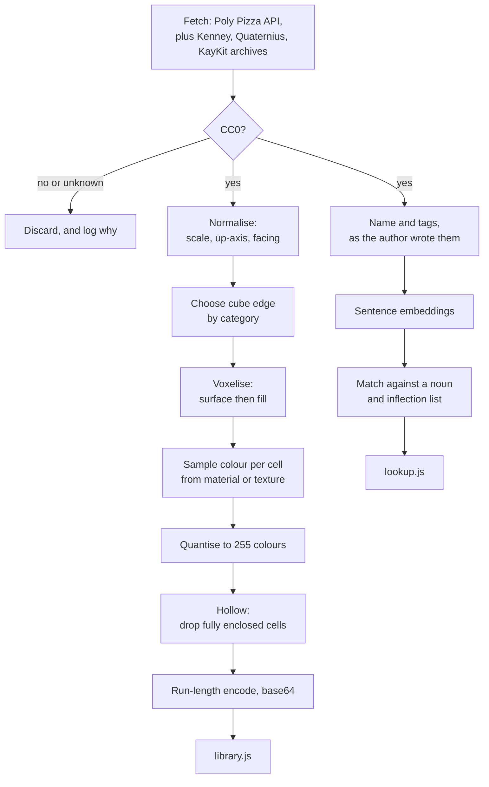

# Trail - The preparation pipeline

Internal document. This describes the Colab notebook that produces Trail's data. It is not
part of the app, it is not shipped with the app, and the app cannot call it. It runs rarely
and its output is two files.

**This is where every piece of machine learning in the project lives**, and it produces a
dictionary. Nothing is learned, inferred or generated at runtime.

**It is not on the critical path.** Shapes drawn in a voxel editor land in Trail natively
through the `.vox` reader described in `04-data-model.md`, which is about 150 lines and skips
normalisation, voxelisation and colour quantisation entirely. The pipeline exists to fill a
library in bulk, and it should be written once hand-drawing everything starts to feel slow
rather than before the app can run.

## What it produces

| File | Contents | Regenerated |
| --- | --- | --- |
| `library.js` | Voxel grids, palettes and provenance, as a script assigning a global | When models are added |
| `lookup.js` | A plain word-to-model dictionary | When models are added, or the vocabulary grows |

## The licence rule

**CC0 only. Permanently.**

The user's decision, taken with the alternatives in front of them. Trail's output is published
and monetised video, and the CC0 rule means no attribution is ever owed, no credits block is
ever needed, no per-model bookkeeping exists, and no licence question can ever arise about a
published video.

The cost is accepted and it is real: the library will be a few thousand models rather than a
hundred thousand, and the gaps get hand-authored recipes instead.

| Licence | Status | Why |
| --- | --- | --- |
| CC0 | **The only one accepted** | Public domain dedication. No conditions of any kind |
| CC-BY | Rejected | Free and commercial-safe, but owes a credit per model used. Rejected in favour of never thinking about it |
| CC-BY-SA | Rejected | Copyleft. A voxelised model is a derivative, so one SA model could oblige the library to be SA |
| CC-BY-NC | Rejected | Forbids commercial use outright |

A model whose licence cannot be established is **not CC0** and is discarded. The filter runs
before anything is downloaded, not after.

## Datasets ruled out

Checked 2026-07-30. Verify before relying on any of it; licences change.

| Dataset | Size | Licence | Why it is out |
| --- | --- | --- | --- |
| ShapeNet, ShapeNetCore | 51,162 models, 55 classes | Non-commercial research and education only | Licence |
| ModelNet40, ModelNet10 | 12,311 CAD models, 40 categories | Princeton, research-restricted | Licence, **and untextured CAD has no colour** |
| Amazon Berkeley Objects | 7,953 glTF | CC BY-NC 4.0 | Licence |
| OmniObject3D | 6,000 objects, 190 categories | Non-commercial research | Licence |
| Google Scanned Objects | 1,030 household items | CC-BY 4.0 | Would be usable. Out under the CC0-only rule |
| Toys4K | 4,179 objects, 105 categories | Creative Commons and royalty-free mix | Per-object licences, mostly not CC0. Not worth the checking |
| Thingi10K | 10,000 models | Mixed | No colour, mixed licences |

Those first four are the ones most likely to be suggested by anyone who has read a 3D machine
learning paper, and all four are out. Recording them here saves rediscovering it.

**Kaggle is a poor source for this**, which is worth saying plainly. Its 3D collections are
largely academic mirrors carrying the research licences above. The sources that work are Poly
Pizza's API, Kenney's site directly, and Hugging Face.

## Why there is no free 3D dataset, and where free 3D actually lives

This question will be asked again by anyone picking this up, so here is the answer once.

**The research datasets cannot be free, because their authors do not own the models.**
ShapeNet's own documentation states that copyright rests with the original creators rather than
with ShapeNet. It was assembled by scraping Trimble 3D Warehouse, which holds 2.4 million
user-uploaded models, and Yobi3D for 350,000 more. Non-commercial research use is the most they
are able to offer, because it is the most they ever had. ModelNet is the same story, and
Objaverse is the modern version of it: scraped from Sketchfab, arriving with every individual
creator's licence attached and mixed together.

**A Kaggle re-upload launders nothing.** ModelNet40 sitting on Kaggle looks like a free
download and is not one; the original terms still apply, because the uploader had no more right
to grant than Princeton did.

There is also a structural reason. Text and images can be scraped by the billion. A 3D model is
hours of skilled human labour per asset, so no equivalent of "crawl the web for clean 3D"
exists. Objaverse is the attempt, and it returned with the licensing mess intact.

**Free 3D is made by individual artists who choose CC0 deliberately, for game developers.** It
is not packaged as machine learning data because its audience is not researchers, so it is
distributed as ZIPs and web pages rather than as parquet files, and dataset indexes never see
it. The search term is "CC0 game assets", never "3D dataset".

### This is a better position than one large dataset

Not a consolation. Three real advantages:

- **Style consistency for free.** Kenney's whole catalogue shares one art direction, so a
  library built from it is visually coherent without any effort spent on making it so. Trail
  wants exactly this, and it is the thing a scraped dataset can never provide.
- **Already the right input.** Low-poly with flat colours is precisely what palette
  quantisation wants. Research datasets are CAD or photogrammetry, which are the two worst
  inputs available.
- **No audit.** CC0 with no exceptions means there is nothing to check, per model or ever.

The only cost is that fetching becomes downloading and unzipping packs rather than one call.
Poly Pizza has an API that covers part of it; the rest is a handful of archives fetched once.

## The sources that survive

All CC0, all made by people who release CC0 on purpose.

### Sources that are already voxels

These matter most in the short term, because a `.vox` file needs no pipeline at all. They are
scattered small packs rather than one collection, so coverage is patchy and styles disagree,
which is fine for testing and not fine for a finished library.

| Source | Notes |
| --- | --- |
| **Medieval Theme Voxels**, by FuzzyManStudios on OpenGameArt | **Verified, used, and retired 2026-08-03.** CC0, 363 models in a single 800 KB `.vox`, all of which parse. *"Credit is not necessary, but highly appreciated"*. Removed from the library for being the wrong subject - it is barrels and anvils, and the videos are modern. Kept here because the verification stands if it is ever wanted |
| itch.io, voxel and magicavoxel tags | Several genuinely CC0 packs. Check each pack's own page; free and CC0 are not the same thing |
| OpenGameArt, CC0 filter | Carries `.vox` files alongside mesh exports |

**Two that look right and are not:**

| Do not use | Why |
| --- | --- |
| MagicaVoxel's bundled sample files | The application is free to use, but there is no explicit CC0 grant covering the samples. Unclear means out |
| `enkisoftware/voxel-models` | Ranks first in searches for free voxel models. It is CC-BY 4.0, not CC0 |
| Kenney's "Voxel Pack" | CC0, and **it is 197 PNG sprites rather than 3D models**. Several guides describe it as "190 voxel models". It is isometric 2D art |

| Source | What | Role |
| --- | --- | --- |
| Kenney | Thousands of game assets in one consistent art style, all CC0, no exceptions | **Primary.** Style consistency for free, and the licence needs no checking |
| Poly Pizza, CC0 filter | 10,400+ hand-picked low-poly with a download API, filterable to CC0 | **Primary.** The easiest to automate, having an actual API |
| Quaternius | Thousands of CC0 models, many of them rigged | **Primary.** Characters and vehicles, where Kenney is thinner |
| KayKit, by Kay Lousberg | Dozens of themed low-poly packs, most free and CC0 | Secondary. Fills between Kenney and Quaternius. Strong on characters and props |
| itch.io, CC0 tag | A large browsable pool of indie packs | Opportunistic. Style varies by author, so take whole packs rather than single models |
| Poly Haven | 500+ models, all CC0 | **Avoid.** Photorealistic PBR, which is the wrong input for palette quantisation |
| Objaverse, CC0 subset only | 800,000 objects from Sketchfab, a minority of them CC0 | The long tail, once the core exists. Variable quality, needs its own filtering pass |
| Hand-authored recipes | The figure, anything that moves, anything that has to be right | **Fills every gap.** See `04-data-model.md` |

Quaternius models being rigged is not directly useful, since Trail has no skeleton. It is
indirectly useful: a rig says where a model's joints are, which is exactly where a hand-written
recipe would put its pivots. Worth reading rather than importing.

### Why the colour gate points the same way

Trail stores a palette of at most 255 colours per model and one index per cube. That works
beautifully for flat-shaded low-poly, where the source already is a small set of solid colours.
It works badly for photogrammetry, whose colour is a texture with lighting baked in at capture
time, and not at all for CAD, which has no colour.

| Source kind | Voxelises to | Verdict |
| --- | --- | --- |
| Flat-shaded low-poly | Clean, readable, already stylised | Ideal |
| Textured game assets | Good, once the texture is sampled per cell | Good |
| Photogrammetry scans | Noisy, with baked-in shadows that fight Trail's lighting | Poor |
| Untextured CAD | Grey blobs | Useless |

The licence rule and the colour requirement select the same sources, which is a convenient
accident. Kenney and Poly Pizza are both CC0-heavy **and** the best-looking input available.

### Cap3D is no longer needed

An earlier draft of this document had Cap3D, a set of 1,002,422 machine-written captions for
Objaverse and ABO, as the source text for the word lookup. **Under the CC0 rule it is
unnecessary**, and dropping it costs almost nothing.

Cap3D exists because Objaverse filenames are frequently `model_final_v3.glb` and carry no
meaning. Kenney and Poly Pizza models arrive with real names and real tags - "Suburban House",
"Sedan", tagged `vehicle`, `car`, `transport` - written by a human who intended them to be
searched. For a few thousand curated models, that is better text than a generated caption, and
it comes with the model.

It is also ODC-By licensed, which would have owed an attribution for the derived lookup. Not a
problem worth having when the alternative is free and better.

## The notebook

### Normalisation is the hard part

Not the machine learning. **Normalisation.** Public 3D models disagree about everything that
matters, and a car arriving on its side at forty times the intended size is the common case
rather than the exception.

| Problem | Approach |
| --- | --- |
| Scale | Normalise to the bounding box, then scale to a per-category real-world size. A car is about 4.2 units long because cars are, not because the file said so |
| Up-axis | Y-up and Z-up are both common and the file often does not say. Assume the axis ordering typical of the category, and fall back to the flattest axis being the ground |
| Facing | The genuinely unreliable one. No metadata exists for it, and it matters for anything a viewer will recognise the front of |
| Origin | Recentre on the base for anything that stands on the ground |

**The facing problem has no clean automatic answer**, so the pipeline should not pretend
otherwise. Render each model to a thumbnail contact sheet and correct facing by eye in a batch:
minutes per hundred models, and it produces a correct library rather than a plausible one.

Kenney's sets help here more than anywhere else, because a single author's models are
internally consistent. Normalising one Kenney pack tends to normalise all of it.

### The lookup build

The only machine learning step. Embed each model's name and tags with a sentence-transformer;
embed a large list of English nouns and their inflections; match each word to its nearest model
above a similarity threshold; write the result out as a plain object.

| Property | Decision |
| --- | --- |
| Runs | Offline, in the notebook, once per library build |
| Ships | A dictionary. No vectors, no model, no inference code |
| Threshold | A word with no confident match gets **no entry**, and resolves to a visible placeholder in the app |
| Ambiguity | Where two models match closely, keep the one from the more consistent source, and log the collision |
| Verification | Spot-check by eye. A confidently wrong match is worse than a missing one |

**Never guess quietly.** A word with no good match must produce a placeholder the builder can
see, not the nearest vaguely-related object. This is the most important rule in the pipeline,
because a silent wrong match is invisible until the video is published.

The threshold matters more under CC0-only than it would with a hundred thousand models, because
with a few thousand there is a real temptation to lower it until everything resolves to
something. Resist that. A missing model is a five-minute recipe; a wrong one is a re-shoot.

## Gaps are now a first-class part of the workflow

CC0-only means the library will not cover everything, and that is an accepted cost rather than
a problem to engineer around. The response to a gap, in order:

1. **Check whether a near neighbour will do.** A narration saying "she left the building" does
   not need a specific building.
2. **Write a recipe.** A recognisable object is eight to fifteen lines of solids. This is the
   designed answer, and it is why the recipe format exists at all.
3. **Reword the narration.** Legitimate, and cheap, and available because the same person
   writes both.
4. **Reconsider the licence rule.** Only if it turns out to bite constantly. It was chosen with
   the alternatives understood, and it should not be quietly eroded one model at a time.

## Provenance is still recorded

CC0 owes no attribution, so nothing is required. The library records `source`, `author` and
`licence` per entry anyway, because the value is an audit: if a source is later found to have
mislabelled something, the affected entries can be found and removed in one query rather than
by memory.

No credits feature is needed in the app, and none is planned.

## Start small

The first run should be about fifty models across ten categories, not ten thousand. The whole
pipeline can be wrong in ways that only show up as voxels, and finding that out on fifty models
takes an afternoon where finding it out on ten thousand takes a week and a lot of disk.

Ten categories a celebrity-drama narration will actually name: house, car, person (hand
authored), tree, pool, chair, table, phone, bag, door.

## Open questions

| Question | Notes |
| --- | --- |
| How much of a real script does CC0-only actually resolve? | The number that decides whether the rule is comfortable or painful. Not knowable until a real narration is run against a real library. **Measure it before drawing conclusions** |
| Is the Objaverse CC0 subset worth the trouble? | Variable quality and needs its own filtering pass. Only worth it once Kenney and Poly Pizza are exhausted |
| Which sentence-transformer, and what threshold? | A small model is likely fine; the task is noun-to-object rather than anything subtle. The threshold matters more than the model |
| Where does the noun list come from? | A frequency list of English nouns with inflections. Its size sets how much of a real script can resolve |
| Do cube edges need setting per category by hand? | Probably, at first. A house and a phone cannot share a resolution, and category is the only signal available |
| How many recipes will the gaps need? | Unknown, and it is the real cost of the CC0 decision. Worth counting after the first video rather than guessing now |
