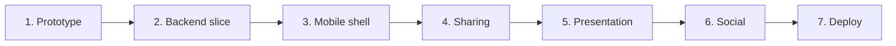

# whereyago - Build plan

## Objective

Ship a mobile app where a person can log a day out as an ordered list of stops, share it,
and where another person can browse shared days by vibe and follow one. The system is
finished for version one when both of those journeys work end to end against a real server,
on a real phone, with an account.

Everything else - social features, ranking, generated itineraries - is after version one
and must not be allowed to delay it.

## Order of work

| Stage | Goal | Done when | Status |
| --- | --- | --- | --- |
| 1 | Prove the idea in a browser with no server | A single-file page shows a day on a map with weather and directions links | Done. Kept as a design reference |
| 2 | A backend vertical slice | Register, log in, read the current user, create, list, read, delete and discover adventures, all against PostgreSQL, with tests, lint and strict typing green | Done |
| 3 | A mobile shell on the real API | Login and register screens, a tab shell, a log form that writes a real adventure, a profile that lists them | Done |
| 4 | Sharing | A logged day can be marked shared and appears in another account's Discover feed | Not started. This is the gap that stops version one |
| 5 | Presentation | Map pins for every day including geocoded ones, day detail with ordered stops and directions, and the app wearing its own theme rather than defaults | Partly done. Map and detail exist; the theme is still placeholder |
| 6 | Social | Likes, comments and ratings wired to the tables that already exist, plus a Discover order better than newest-first | Not started |
| 7 | Deploy | The API and database run somewhere permanent, and the app points at it through configuration rather than a hard-coded address | Not started |

### Stage 4 in detail

This is the next piece of work and the only thing between the project and a usable version
one. It needs, in order:

1. An endpoint that updates an adventure the caller owns, including the shared flag.
2. Authorisation on that endpoint proving ownership in the service layer.
3. A control on the day detail screen for days the user owns.
4. A check that a shared day appears in a second account's Discover feed and an unshared
   one does not.

## Decisions already made

| Decision | Reason |
| --- | --- |
| Python and FastAPI on the server | Typed request and response models, and it is what the author is fastest in |
| PostgreSQL rather than SQLite | Enums, JSON columns and real cascade behaviour, and it matches the eventual deployment |
| React Native with Expo for mobile | One codebase for both platforms and no native build toolchain to maintain |
| The map is a web view over open tiles, not a native map SDK | The native SDKs want a billed API key. The web view is free and runs inside the standard Expo client |
| Directions are a deep link, not an in-app route | Routing is a solved problem owned by other apps, and building it would add cost and no value |
| Weather and geocoding come from keyless services | The project must stay free to run |
| Day renamed to Adventure in schema v2 | Day read as a calendar date in half the code. Adventure is unambiguous |
| Weather split out of the adventure JSON column into its own table | It was being queried and it is a fixed shape. A JSON blob was the wrong home |
| The social tables were created before the social features | Adding them later would mean migrating the core tables again for no benefit |
| Session tokens live in the platform secure store | The device should hold nothing an attacker could reuse from a plain file |
| The API base URL comes from an environment variable | Pointing the app at a different server must not require a code change |

## Open questions

| Question | Blocks | Notes |
| --- | --- | --- |
| How does Discover order results once there is more than a handful of content? | Stage 6 | Newest-first is fine for now and obviously wrong at scale |
| Should geocoding move to the server? | Stage 5 | Doing it on the device means every client repeats the same lookups. Server-side would let the result be cached against the adventure |
| What is the Friends tab actually for? | Stage 6 | It is a placeholder with no defined behaviour. Either define it or remove it |
| Is the Videos tab a real feature or an idea? | Stage 6 | Currently a placeholder. It should not ship as an empty tab |
| Where does the API get deployed, and what does the database cost there? | Stage 7 | The project constraint is free hosting; a managed Postgres may not be |

## Risks

| Risk | Effect if it happens | Response |
| --- | --- | --- |
| Empty tabs ship to a user | The app looks unfinished and the good parts get judged by the placeholders | Hide any tab with no behaviour behind a flag until it does something |
| A third-party service starts rate limiting or requiring a key | Maps, weather or geocoding stop working for everyone at once | Every one of them is already optional at the screen level; keep it that way, and cache what can be cached |
| The empty social tables stay empty indefinitely | Dead schema that confuses the next reader | The status table in the data model doc names them explicitly. Either build stage 6 or drop the tables |
| The mobile toolchain drifts ahead of the installed runtime | The app stops building on the development machine | Keep the SDK version and the local Node version recorded, and upgrade them together |
| Logging fills the log table | The database grows without bound from operational noise | The threshold is configurable. Add retention before deploying |
