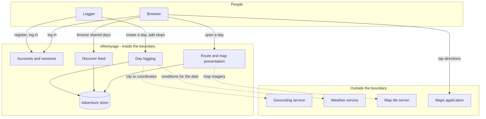

# whereyago - Interaction and system boundary

## Actors

| Actor | Type | What they want |
| --- | --- | --- |
| Logger | Human | To record a day they had, quickly, while they still remember it |
| Browser | Human | To find a day worth copying without doing any planning |
| Maps application | External system | Receives a deep link and gives turn-by-turn directions |
| Geocoding service | External system | Turns a city name into coordinates so a day can be pinned |
| Weather service | External system | Supplies the conditions attached to a logged day |
| Tile server | External system | Supplies the map imagery drawn behind the pins |

The same person is usually both Logger and Browser. They are separated here because their
goals pull the product in different directions, and the split is what the design has to
respect.

## Interaction diagram

## What the system is in the business of

- Capturing a day as an ordered sequence of stops, with as little friction as possible.
- Keeping days private by default and shared only on an explicit action.
- Presenting a day so its shape can be judged in a few seconds: order, distance, vibe,
  weather.
- Making a shared day findable by the mood someone is in, not by a category taxonomy.
- Handing off cleanly to whatever app the person already uses for directions.

## What the system does not care about

- Being a mapping engine. It draws pins and hands off routing to a maps app.
- Being a review site. There are no star ratings on individual venues and no venue
  database of its own.
- Being a booking or payments platform.
- Weather forecasting. It records what a service reported and stores it against the day.
- Real-time presence, messaging, or where a user is right now.
- Business listings, opening hours, menus, or any data that would need constant refreshing.

The consequence of that last point is worth stating plainly: whereyago holds no
authoritative facts about places. It holds one person's account of one day. Every screen
should read that way.

## Main use cases

| ID | Actor | Goal | Trigger | Result |
| --- | --- | --- | --- | --- |
| UC-1 | Logger | Get an account | First launch | Account created, session token held on the device |
| UC-2 | Logger | Record a day | Tap the centre button | A day with an ordered stop list is stored against their account |
| UC-3 | Logger | Share a day | Toggle sharing on a stored day | The day becomes visible in Discover |
| UC-4 | Browser | Find something to do | Open Home | The feed of shared days, newest first |
| UC-5 | Browser | Judge a day at a glance | Open a day | Stops in order, on a map, with the weather it was had in |
| UC-6 | Browser | Follow a day | Tap directions on a stop | The maps app opens at that stop |
| UC-7 | Logger | Review their history | Open the profile tab | Their own days, shared and unshared |
| UC-8 | Logger | Remove a day | Delete from a day they own | The day and its stops are gone |

This table is intent, not a claim that all of it is built. Current state: UC-3 is not built.
There is no endpoint or control to change the shared flag, so no day can reach Discover and
the feed is empty in practice - it is the Stage 4 gap named in the plan. The weather link in
the diagram above is exercised only by the browser prototype, not yet by the mobile log
flow. Discover is not filtered by vibe yet; the vibe is stored and shown, not queried.

## Constraints that come from the actors

- The external services chosen must stay free and keyless. This is a portfolio project and
  is not going to carry a per-request bill.
- Every external call is allowed to fail. A day with no weather and no coordinates is still
  a valid day, and every screen must render one.
