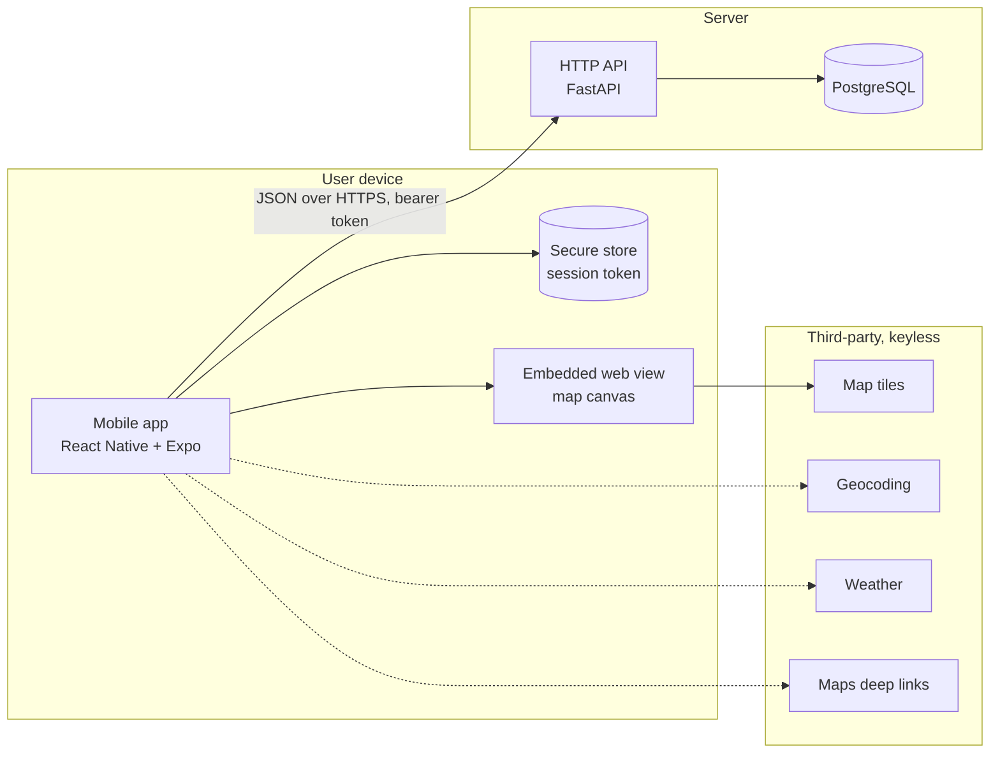
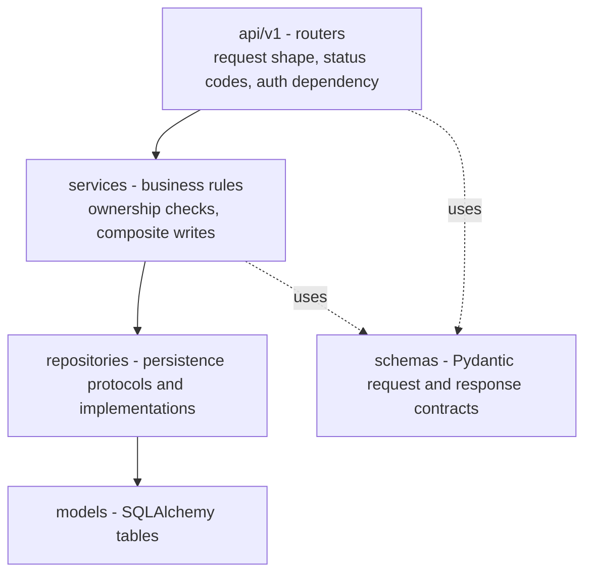
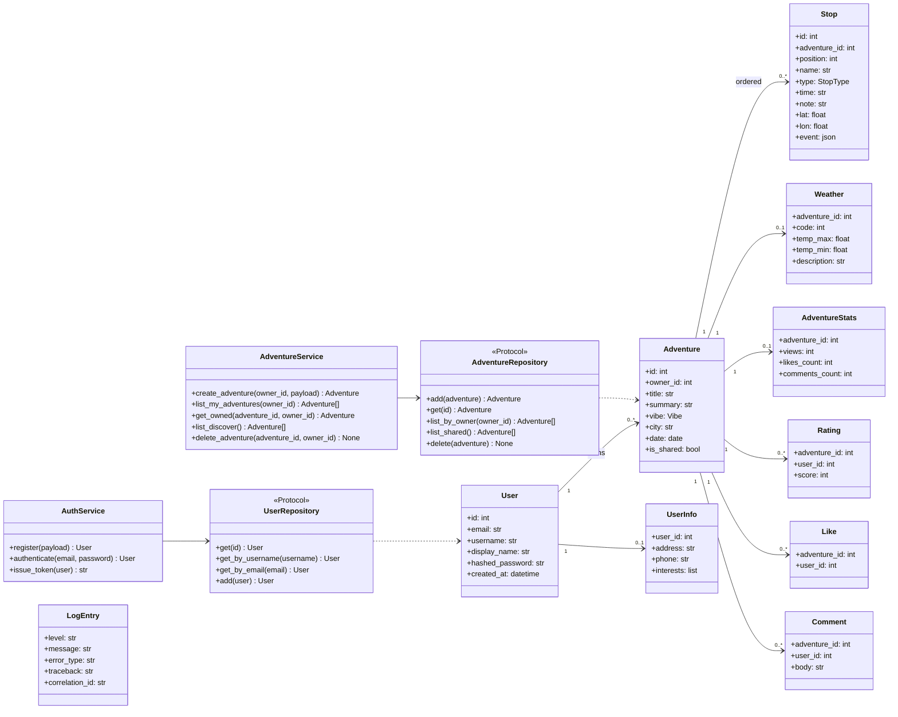
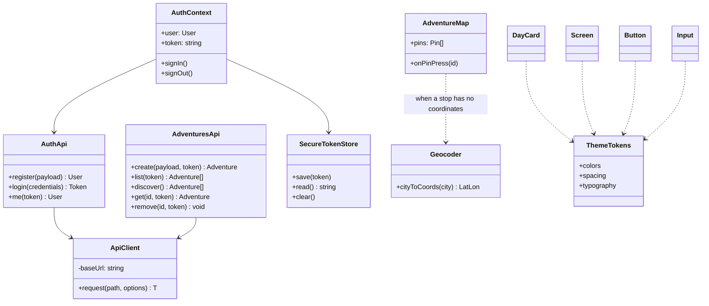
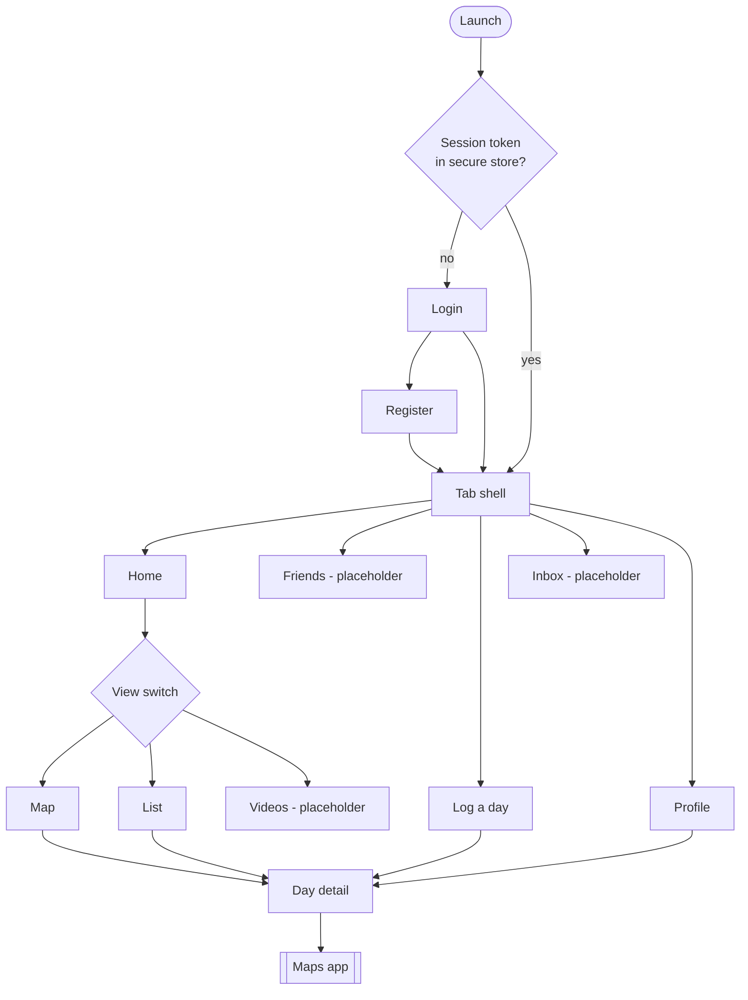
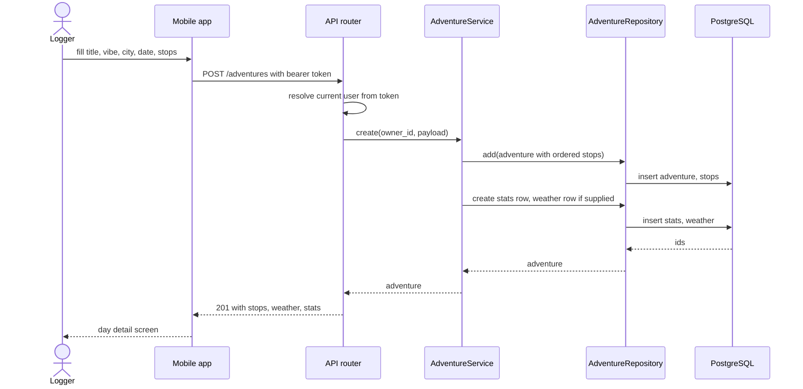
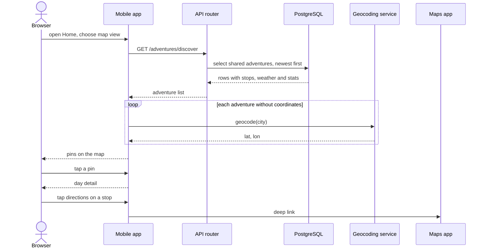

# whereyago - Architecture

Internal document. Secrets are referred to by the environment variable that supplies them,
never by value.

## Components

whereyago is distributed. Three processes plus a set of third-party services.

| Component | Runs where | Responsibility |
| --- | --- | --- |
| Mobile app | User's phone | All presentation, session handling, deep links to the maps app |
| Embedded web view | Inside the mobile app | Draws the map and pins; kept in a web view so the map needs no paid native SDK |
| HTTP API | Server | Authentication, authorisation, all reads and writes of adventures |
| PostgreSQL | Server, alongside the API | The only durable store |
| Third-party services | Public internet | Tiles, geocoding, weather, directions handoff |

The browser prototype at `whereyago/index.html` is a fourth, standalone artefact. It talks
to no API and stores nothing on a server. It exists as a design reference and is not part
of the production system.

### Why the split is where it is

The device holds no data it cannot lose. Deleting and reinstalling the app costs the user
their session token and nothing else. Every durable fact lives in PostgreSQL behind the
API, which means the API is the only place authorisation has to be enforced.

## Backend layers

The dependency rule is one way. A layer may call the layer directly below it and nothing
else. Nothing below the API layer knows that HTTP exists.

Repositories are defined as protocols first and implemented second, so a service can be
tested against a fake without a database. Settings come from pydantic-settings; the values
behind `SECRET_KEY` and `POSTGRES_PASSWORD` have no defaults, so a misconfigured deployment
fails at startup instead of running insecurely.

## Cross-cutting concerns

| Concern | Where it lives | Behaviour |
| --- | --- | --- |
| Correlation id | Middleware | A correlation id is attached to every request and carried into every log line for that request |
| Structured logging | structlog | Events, not sentences |
| Error persistence | Database sink | Warnings and above are written to a log table, in their own transaction so they survive the request rollback that caused them |
| Unhandled exceptions | Global handler | Logged with the traceback, returned as a generic 500 with no internal detail |
| Password storage | Auth service | Argon2 hash. The plain password never leaves the request handler |
| Session | Auth service | Bearer token, verified per request by a dependency |

## Class diagram - backend

`Rating`, `Like` and `Comment` are tables with no endpoints and no screens yet. They exist
so the schema does not have to be migrated again when those features are built.

## Class diagram - mobile

Every network call in the app goes through the single `request` wrapper, so error mapping
and the bearer header live in exactly one place. The token is passed into each call by the
screen, which reads it from the auth context; there is no automatic retry yet. `ThemeTokens`
is the single re-skin point; no component is allowed to hard-code a colour.

## Screen flow

## Key sequence - logging a day

## Key sequence - browsing and following a day

## Rules this architecture is meant to protect

- Authorisation is decided in the service layer, never in a component. A router asks who
  the caller is; the service decides what they may touch.
- No secret is ever written in source. `SECRET_KEY`, `POSTGRES_PASSWORD` and the API base
  URL all come from the environment and have no defaults where a default would be unsafe.
- The mobile app is a client. If it were deleted entirely, no data would be lost.
- Every third-party call is optional. A failure downgrades the screen; it does not break it.
- Colours, spacing and type live in one tokens file, so re-skinning the app is one edit.
- Repositories are protocols. A service must be testable without a database running.
