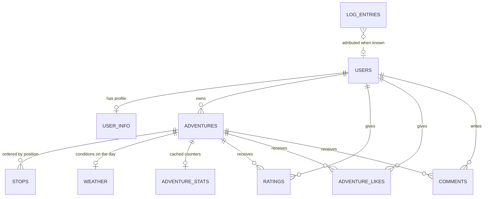

# whereyago - Data model

## Store

PostgreSQL, one database, schema managed by migrations. It is the only durable store in
the system. The mobile app persists exactly one thing on the device, the session token, in
the platform secure store, and that is not part of this model.

Migrations to date:

| Migration | Change |
| --- | --- |
| 0001 | Users and the original day and stop tables |
| 0002 | Log entries |
| 0003 | Day renamed to Adventure; weather moved out of a JSON column into its own table; stats, ratings, likes, comments and user info added |

## Entity relationships

## Tables

### `users`

An account. One row per person.

| Column | Type | Notes |
| --- | --- | --- |
| `id` | integer | Primary key |
| `email` | varchar(255) | Unique, indexed |
| `username` | varchar(50) | Unique, indexed |
| `display_name` | varchar(100) | Optional |
| `hashed_password` | varchar(255) | Argon2 hash. Never a plain password |
| `created_at` | timestamptz | Server default |

### `user_info`

Optional profile detail, one row per user at most. Kept separate from `users` so that
authentication never has to read personal data it does not need.

| Column | Type | Notes |
| --- | --- | --- |
| `id` | integer | Primary key |
| `user_id` | integer | Foreign key to `users`, unique, cascade on delete |
| `address` | varchar(300) | Optional |
| `phone` | varchar(40) | Optional |
| `interests` | json | List of free-text interests |

### `adventures`

One logged day. The central entity in the system.

| Column | Type | Notes |
| --- | --- | --- |
| `id` | integer | Primary key |
| `owner_id` | integer | Foreign key to `users`, indexed, cascade on delete |
| `title` | varchar(140) | Required |
| `summary` | text | Optional |
| `vibe` | enum | One of chill, foodie, family, adventure, night, culture, outdoors |
| `city` | varchar(140) | Optional. Used to place a pin when no stop has coordinates |
| `date` | date | Optional. The day it happened, not the day it was logged |
| `is_shared` | boolean | Default false. Only true rows appear in Discover |
| `created_at` | timestamptz | Server default |
| `updated_at` | timestamptz | Updated on write |

### `stops`

One place within a day. Meaningless outside its adventure.

| Column | Type | Notes |
| --- | --- | --- |
| `id` | integer | Primary key |
| `adventure_id` | integer | Foreign key to `adventures`, indexed, cascade on delete |
| `position` | integer | Order within the day, zero-based. The sequence is the point |
| `name` | varchar(200) | Required |
| `type` | enum | The kind of stop |
| `time` | varchar(5) | Optional, `HH:MM`. A rough time of day, not a timestamp |
| `note` | text | Optional |
| `lat` | float | Optional |
| `lon` | float | Optional |
| `event` | json | Optional loose detail for a stop that is an event rather than a venue |

`lat` and `lon` are nullable on purpose. A stop the user typed from memory has no
coordinates and is still a valid stop.

### `weather`

The conditions the day was had in. One row per adventure at most.

| Column | Type | Notes |
| --- | --- | --- |
| `id` | integer | Primary key |
| `adventure_id` | integer | Foreign key to `adventures`, unique, cascade on delete |
| `code` | integer | WMO weather code as reported by the weather service |
| `temp_max` | float | Optional |
| `temp_min` | float | Optional |
| `description` | varchar(100) | Human-readable summary |

This is a record of what was reported, not a forecast. It is never refreshed.

### `adventure_stats`

Cached counters so a feed can be rendered without aggregating on every read. Created with
the adventure.

| Column | Type | Notes |
| --- | --- | --- |
| `id` | integer | Primary key |
| `adventure_id` | integer | Foreign key to `adventures`, unique, cascade on delete |
| `views` | integer | Default 0 |
| `likes_count` | integer | Default 0 |
| `comments_count` | integer | Default 0 |

These are derived values. `adventure_likes` and `comments` are the truth; if the two ever
disagree, the counters are rebuilt from the rows.

### `ratings`

A score out of five, at most one per user per adventure.

| Column | Type | Notes |
| --- | --- | --- |
| `id` | integer | Primary key |
| `adventure_id` | integer | Foreign key to `adventures`, indexed, cascade on delete |
| `user_id` | integer | Foreign key to `users`, indexed, cascade on delete |
| `score` | integer | 1 to 5 |
| `created_at` | timestamptz | Server default |

Unique on (`adventure_id`, `user_id`).

### `adventure_likes`

Who liked what. At most one row per user per adventure.

| Column | Type | Notes |
| --- | --- | --- |
| `id` | integer | Primary key |
| `adventure_id` | integer | Foreign key to `adventures`, indexed, cascade on delete |
| `user_id` | integer | Foreign key to `users`, indexed, cascade on delete |
| `created_at` | timestamptz | Server default |

Unique on (`adventure_id`, `user_id`).

### `comments`

Free text against an adventure.

| Column | Type | Notes |
| --- | --- | --- |
| `id` | integer | Primary key |
| `adventure_id` | integer | Foreign key to `adventures`, indexed, cascade on delete |
| `user_id` | integer | Foreign key to `users`, indexed, cascade on delete |
| `body` | text | Required |
| `created_at` | timestamptz | Server default |

### `log_entries`

Operational record. Written by the logging sink, not by any feature.

| Column | Type | Notes |
| --- | --- | --- |
| `id` | integer | Primary key |
| `created_at` | timestamptz | Indexed |
| `level` | varchar(20) | Indexed. Warning and above by default |
| `logger` | varchar(100) | Optional |
| `message` | text | Required |
| `error_type` | varchar(200) | Optional |
| `error_message` | text | Optional |
| `module` | text | Source file |
| `function` | varchar(200) | Source function |
| `line` | integer | Source line |
| `traceback` | text | Optional |
| `user_id` | integer | Indexed, nullable. Not a foreign key, so a log row outlives the user |
| `correlation_id` | varchar(64) | Indexed. Ties every line from one request together |
| `method` | varchar(10) | HTTP method |
| `path` | varchar(500) | Request path |

Error rows are written in their own transaction, so the record of a failure survives the
rollback that the failure caused. The threshold is configurable through `DB_LOG_LEVEL`.

## Status

| Table | Written by a feature | Read by a screen |
| --- | --- | --- |
| `users` | Yes | Yes |
| `user_info` | No | No |
| `adventures` | Yes | Yes |
| `stops` | Yes | Yes |
| `weather` | On create if supplied; the mobile app does not supply it yet | No. The API returns it, but no screen shows it yet |
| `adventure_stats` | Created, never incremented | Not yet |
| `ratings` | No | No |
| `adventure_likes` | No | No |
| `comments` | No | No |
| `log_entries` | Yes, by the logging sink | Read manually |

The empty tables are not dead weight. They are the schema those features will need, landed
early so that adding the features does not require another migration of the core tables.

## Constraints worth stating

- Deleting a user cascades to their adventures, stops, likes, ratings, comments and
  profile. Their log entries remain, since `log_entries.user_id` is not a foreign key.
- Deleting an adventure cascades to everything hanging off it.
- A stop's `position` is the ordering. Nothing else in the model implies order.
- `is_shared` is the only thing separating a private day from a public one. Every read path
  that serves Discover must filter on it.
- Uniqueness on likes and ratings is enforced by the database, not by application code.

## What is deliberately not stored

- Venue records. There is no places table; a stop is a name typed by a person.
- Any live location, GPS trail, or check-in.
- Plain passwords, in any form, anywhere.
- Directions or routes. Those are computed by the maps app at the moment they are needed.
- Client analytics or device identifiers.
